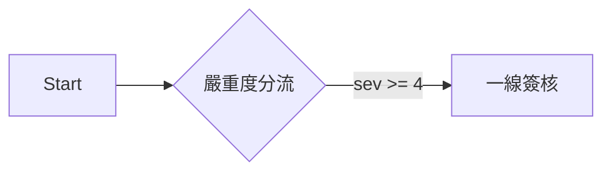

# 使用者文件撰寫規格（MkDocs）

> 對象：在本專案寫文件的人與 AI session
> 動筆前先讀完本文，尤其是「哪些寫進 docs/」與「frontmatter 規格」兩節。

2026-08-13 建立。定案背景：本專案要在 GitHub 公開，需要一套隨專案內建、
又能產出對外官方站的文件系統。評估後採用 MkDocs 1.6.1 + Material 9.7.7，
另補三個 MkDocs 沒有的能力（前置關係、資料流轉、版控影響分析）。

---

## 一、哪些寫進 docs/，哪些寫進 dev-notes/

**這是唯一的公開分界線。`docs/` 會推上 GitHub，`dev-notes/` 不會。**
`scripts/push_github.sh` 的 `EXCLUDE_DIRS` 只排除 `dev-notes`，
所以放錯目錄等於直接外流。

| 目錄 | 內容 | 讀者 |
|------|------|------|
| `docs/` | 使用者手冊、操作指南、作業流程、站內 help | 客戶、企業管理員、一般員工 |
| `dev-notes/` | 規格書、handoff、踩坑筆記、manifest、codex spec、架構設計 | 開發者、維護的 AI session |

判斷準則，任一項成立就放 `dev-notes/`：

- 內容提到內部主機、IP、帳號、埠號、資料庫名稱
- 內容描述「為什麼這樣寫」而非「怎麼操作」
- 內容是給下一個 session 的交接（handoff_*、HANDOFF_*）
- 內容是實作規格（*_SPEC.md）或模組清單（manifests/）
- 內容引用了尚未發行的功能或未定案的設計

**不確定時放 `dev-notes/`。** 從 dev-notes 搬進 docs 是零成本的，
反向則是已經外流了。

寫進 `docs/` 前逐項確認：

- [ ] 沒有內部 IP、主機名、路徑（`/opt/...`）、埠號
- [ ] 沒有帳號、密碼、Token、金鑰，即使是測試用的
- [ ] 沒有「開發中」「TODO」「待確認」等未定內容
- [ ] 描述的行為是目前版本真的做得到的
- [ ] 讀者換成不認識這個專案的客戶也看得懂

「目前版本真的做得到」以**跑起來的 UI 實際行為**為準。程式碼與 `dev-notes/` 的
規格書都可能領先或落後於實際部署，兩者衝突時以 UI 為準，並在 BBN 開一張卡記下落差。

### 新增一頁時的位置與命名

| 內容性質 | 放哪 |
|----------|------|
| 某個功能頁怎麼操作（使用者手冊本體） | `docs/manual/<章>/`，見第八節 |
| 作業流程、操作指南 | `docs/guides/` |
| 前置設定（部門、角色、帳號等一次性建置） | `docs/setup/` |
| 站內 [?] 按鈕素材（綁選單的 `menu_code`） | `docs/help/`，格式不同，見第六節 |

檔名沿用該目錄的既有慣例：`guides/` 用大寫底線（`OD_WORKFLOW_VARIANTS.md`），
`help/` 用小寫底線且必須等於 `menu_code`（`menu_manage.md`）。
新目錄從零開始時用小寫底線。**不要用中文檔名**，它會變成 URL。

**新增頁面後必須手動加進 `mkdocs.yml` 的 `nav`**，MkDocs 有 `nav` 就不自動收錄，
漏加的頁面 build 不會報錯、站上也點不到。`docs/index.md` 的 `<!-- DEP_GRAPH -->`
佔位符不用動，它會自己把新頁的關係畫進去。

---

## 二、frontmatter 規格

每份 `docs/` 下的 md 都要有 YAML frontmatter：

```yaml
---
title: 資安事件處置流程          # 必填。目錄與導覽顯示的名稱
audience: ORG_ADMIN             # 必填。SYSTEM_ADMIN / ORG_ADMIN / EMPLOYEE / EXTERNAL / ALL
requires:                       # 選填。本作業開始前必須先完成的頁（doc_id）
  - guides/OD_WORKFLOW_VARIANTS
produces:                       # 選填。本作業產出、供其他流程使用的資料
  - 封鎖決策紀錄
  - 案件處置紀錄
covers:                         # 選填但強烈建議。本頁對應的程式路徑
  - modules/open_defense/**
  - backend/app/api/roles.py
---
```

`docs/manual/` 底下的使用者手冊還有四個欄位，決定**站內 `/help/` 依帳號顯示什麼**，
規格見第八節：`nav_menu`、`visible_user_types`、`visible_roles`、`order`。

`doc_id` 是相對 `docs/` 的路徑去掉 `.md`，例如
`docs/guides/OD_WORKFLOW_VARIANTS.md` 的 doc_id 是 `guides/OD_WORKFLOW_VARIANTS`。

各欄位的取值判準：

- **`audience` 只填一個值**。同一件事對不同角色做法不同時，**用 content tabs 放同一頁**
  （見第三節），不要拆頁也不要填多值；`audience` 此時填最主要的那個角色。
  三種角色都適用且做法一致，才填 `ALL`
- **`requires` 只填「不先做完就會卡住」的頁**。純粹「先讀比較好懂」的關聯不填，
  那會讓依賴圖失去意義。判準：跳過它，本頁的操作會在中途失敗或找不到選項
- **`produces` 用使用者看得懂的業務名詞**（「封鎖決策紀錄」「部門清單」），
  不要用資料表名或程式物件名。它會直接印在讀者看到的方框與依賴圖上
- **`covers` 在描述「平台功能怎麼操作」時必填**。只有純觀念說明（術語表、選型建議）
  這種沒有對應實作的頁面可以省略。找不到對應程式時先查 `dev-notes/manifests/`
  的模組清單，那裡有模組與路徑的對照

### 這三個欄位各自換來什麼

| 欄位 | build 時自動產生的東西 |
|------|------------------------|
| `requires` | 頁首插入黃色「開始前必須先完成」方框，附前置頁連結與它的 `produces` |
| `produces` | 頁尾插入藍色「本頁完成後」方框；並成為依賴圖上的邊標籤 |
| 兩者合計 | `docs/index.md` 的 `<!-- DEP_GRAPH -->` 佔位符會展開成全站流程關係圖 |
| `covers` | `scripts/docs_impact.py` 據此回答「這次程式改動影響哪些文件」 |

實作在 `scripts/mkdocs_hooks/doc_relations.py`，**不要手工寫這些方框**，
手寫的不會隨關係變動而更新。

### covers 的粒度

用**檔案路徑 + glob**，不要細到函式或路由層級。
`**` 跨目錄、`*` 不跨目錄。目錄結尾加 `/` 等同 `/**`。

```yaml
covers:
  - modules/open_defense/**                    # 整個模組
  - backend/app/api/roles.py                   # 單一檔案
  - scripts/examples/*od_workflow*.py          # 同目錄下符合的檔案
```

太細會讓維護成本超過收益，太粗（例如 `backend/**`）會讓每次改動都命中、
淪為雜訊。以「這份文件描述的功能實作在哪」為準。

---

## 三、可以用的語法

Material 已啟用的擴充，**只用這些，不要引入新外掛**（引入前先看第五節）。

### 前置條件與警告

```markdown
!!! note "一般說明"
!!! warning "需要注意"
!!! danger "會造成事故"

??? note "預設摺疊的補充說明"
```

### 同頁切換不同模式

這是本專案最常用的結構——同一件事因編制/設定不同而有不同做法時，
**用 tabs 放同一頁，不要拆成多份文件**：

```markdown
=== "已建立部門與角色"

    內容縮排四個空格。

=== "尚未建組織架構"

    另一種情況的內容。
```

### 流程圖

用 Mermaid，**不要用 drawio 或外部圖檔**：

````markdown

````

理由：mermaid 是純文字，`git diff` 看得出改了什麼，AI 也能直接讀寫。
drawio 是二進位 XML，版控完全失去意義，而且它的 viewer 預設從
`viewer.diagrams.net` 載入，封閉網路會壞。

### 檢查清單

```markdown
- [ ] 確認偵測器送進來的來源位址是真實訪客
- [x] 已完成的項目
```

---

## 四、建置與驗收

```bash
cd /opt/BeakPlatform-dev

# 預覽（改檔案會自動重載）
./venv-docs/bin/mkdocs serve -a 192.168.0.16:8899

# 建置，--strict 讓警告變成錯誤
NO_MKDOCS_2_WARNING=1 ./venv-docs/bin/mkdocs build --strict

# 驗收 1：產出不得有任何外部資源請求（封閉網路要求）
grep -rhoE 'src="https?://[^"]+' site --include='*.html'
# 必須完全沒有輸出。有輸出就是有東西要連外，一律當成錯誤處理。
#
# href 另外看（連結不影響離線閱讀，只是點了會連外）：
grep -rhoE 'href="https?://[^"]+' site --include='*.html' | sort -u
# 唯一允許的是 Material 主題 footer 的 https://squidfunk.github.io/mkdocs-material/
# 其餘任何 host（unpkg / cdn.jsdelivr / fonts.googleapis / fonts.gstatic）
# 都代表設定被改壞了，回頭看第五節。

# 驗收 2：covers 宣告是否還對得到實際檔案
./venv-docs/bin/python scripts/docs_impact.py --verify-covers --docs docs

# 版控影響分析：這次改動影響哪些文件
./venv-docs/bin/python scripts/docs_impact.py --docs docs --base origin/main
./venv-docs/bin/python scripts/docs_impact.py --docs docs --base HEAD~1 --show-uncovered
```

`venv-docs/` 與 `site/` 都不入版控，版本鎖在 `requirements-docs.txt`。
換機器時 `python3 -m venv venv-docs && ./venv-docs/bin/pip install -r requirements-docs.txt`。

---

## 五、不可以動的設定

`mkdocs.yml` 有三處是踩過坑才這樣寫的，改之前先確認你知道後果：

1. **`theme.font: false`** —— 拿掉會讓 Material 去抓 Google Fonts，封閉網路直接壞
2. **mermaid 的 fence class 叫 `mermaid-diagram` 而不是 `mermaid`** ——
   Material 內建的 mermaid 支援會從 unpkg CDN 動態 import。改名是為了避開它，
   改由 `docs/javascripts/mermaid-init.js` 用本地 `docs/assets/mermaid.min.js` 接手
3. **`exclude_docs: help/`** —— `docs/help/` 是站內 help 的資料來源，
   內文包在 YAML 的 `sections[].body` 裡，MkDocs 直接渲染會是一片空白

引入任何新外掛前，先確認它不會產生外部請求（裝完 grep 套件目錄找 `http`）。

---

## 六、三個出口，一批來源

| 出口 | 來源 | 特性 |
|------|------|------|
| 站內使用者手冊（`/help/`） | `docs/manual/**` | **依登入者身分動態過濾**，即時 |
| 站內頁內 [?] 按鈕 | `docs/help/<menu_code>.md` | 依 `user_type` 過濾 sections，即時 |
| 官方站（MkDocs） | `docs/` 全部（`help/` 除外） | 靜態全集，build 當下的快照 |

**寫新頁時放哪？**

- 描述某個選單頁怎麼操作 → `docs/manual/` 對應章節，frontmatter 綁 `nav_menu`
- 想讓使用者在該功能頁點 [?] 就看到 → 另外寫一份 `docs/help/<menu_code>.md`
  （格式不同，見 `help_service.py` 的 docstring）
- 跨多個選單的作業流程 → `docs/guides/`

「即時資料」只有站內出口能提供（Flask 動態渲染）。官方站是靜態產物，
需要嵌入 DB 內容時只能靠 build 時查詢產生快照（`mkdocs-macros-plugin`），
而且租戶資料本來就不該出現在公開站上。

`docs/help/` 與 `docs/manual/` 尚未整併，兩邊格式不同。整併方向見 BBN #5159。

---

## 七、已知的長期風險

MkDocs 2.0 將移除 plugin 系統、配置改用 TOML，官方聲明無遷移路徑，
Material 團隊因此不跟進、改做 Zensical（2025-11-05 發布），
Material 9.7.5 起已把依賴鎖在 `mkdocs<2`。

對本專案的影響：現在這套完全可用且穩定，但不會再有新功能。
自訂邏輯只有 `doc_relations.py` 與 `docs_impact.py` 兩支薄薄的檔案，
內容本身是純 markdown，將來換底座的成本在 `mkdocs.yml`，不在文件內容。
**不要為了規避這個風險而把自訂邏輯寫進文件內容裡。**

---

## 八、使用者手冊的可見性宣告（`docs/manual/`）

2026-08-13 建立。站內 `/help/` 會依登入者身分決定顯示哪些標題，
**判定完全複用選單的雙鑰匙結果，不是另一套權限**。

### 這裡的「可見性」不是保密，唯一目的是降噪（用戶 2026-08-14 定調）

**`docs/` 的內容是操作說明，沒有機密。全部給所有人看、甚至整包公開到
Internet 都是可以接受的。** 之所以還要做 by 身分過濾，理由只有一個：

> 不讓使用者看見與自己無關的過多文件，因而產生困擾與誤解。

這條決定了後續所有取捨的方向，**不要把可見性當成安全機制來設計**：

- **不要**因為「這頁講管理功能」就往保密方向加碼——不需要登入牆、
  不需要加密、不需要把它移出 `docs/`
- **判斷一頁該不該過濾，問的是「這個人看到會不會困惑」，
  不是「這個人有沒有資格知道」**
- 漏掉一頁沒過濾，後果是某些人多看到一頁用不到的說明，**不是資安事件**。
  不必為此回頭補強
- 真正的機密屬於 `dev-notes/`（第一節的分界線），那條線是安全邊界；
  `docs/` 內部的可見性宣告不是

MkDocs 站是靜態全集、沒有權限機制，`docs/` 又會整包推上 GitHub——
**這兩件事都不是缺口，是預期行為**。看到「MkDocs 站沒有權限」時不要
把它當成待修的問題。

### 目錄結構

```
docs/manual/
  01_getting_started/   開始使用      （全體）
  02_platform_admin/    平台管理      （系統管理員）
  03_org_setup/         企業建置      （企業管理員）
  04_form_workflow/     表單與流程    （跨階：表單/流程設計師）
  05_security_ops/      資安作業      （跨階：資安人員）
  06_subsystem/         子系統開發    （跨階：子系統設計師）
  07_daily_work/        日常操作      （企業成員）
  08_external/          外部協作      （外部廠商）
```

每章一定要有 `index.md`（章總覽），其 frontmatter 多兩個欄位：

```yaml
---
title: 資安作業
audience: ORG_ADMIN
chapter_order: 5        # 章順序
chapter_index: true     # 標記這是章總覽
---
```

**章總覽的內容在站內是動態產生的**（列出該帳號在這章看得到的頁），
骨架裡寫的靜態清單只有 MkDocs 站會用到。

### 第三層：節（2026-08-14 起）

主題需要拆成多篇時，在章底下開一個子目錄當「節」：

```
docs/manual/05_security_ops/
  index.md                    章總覽
  security_cases.md           order: 10   ← 章的直屬頁
  soc_planning/               ← 節
    index.md                  節總覽（section_index: true, order: 5）
    workflow_variants.md      order: 10
    role_design.md            order: 20
```

doc_id 變成四段：`manual/05_security_ops/soc_planning/workflow_variants`。
**只支援三層，不要再往下開子目錄**（`_DOC_ID_RE` 最多認到這一層）。

節總覽的 frontmatter：

```yaml
---
title: 資安監控團隊規劃
audience: ORG_ADMIN
order: 5                # 與同章直屬頁的 order 混排，5 會排在 order 10 的頁之前
section_index: true     # 標記這是節總覽
nav_menu: open_defense.security_cases
---
```

四條會靜默失效的規則：

- **節一定要有 `index.md`**（或 frontmatter `section_index: true` 的檔）。
  缺了整個節不會出現在站內目錄上，只在 log 留一行 warning
- **節內所有頁都不可見時，整個節連同節總覽一起消失**（比照「章內沒有可見文件
  就整章不顯示」）。節總覽自己的 `nav_menu` 也要通過判定
- **節總覽與章總覽的動態內容規則不同**：章總覽是整段取代（md 裡的靜態清單站內看不到），
  **節總覽是保留 md 原文再把清單接在後面**——所以節總覽可以寫引言，
  但不要在裡面手寫主題清單，會和自動產生的那份重複
- 節與章的 `order` 是同一個排序空間，節用 `order`（不是 `chapter_order`）

`mkdocs.yml` 的 nav 要跟著多一層縮排，節總覽放該層第一項（不寫標題）。

### 頁與頁之間的連結

站內 `/help/` 會把 markdown 裡的相對 `.md` 連結改寫成
`/help/manual/<doc_id>`（`doc_catalog_service._rewrite_relative_md_links`），
所以**直接寫相對路徑即可**，兩個出口都會通：

```markdown
建議先讀[資安事件處置流程](workflow_variants.md)
```

- 解析基準是該文件自己所在的目錄，支援 `xxx.md`、`sub/xxx.md`、`../xxx.md`、錨點
- 解析不到對應 doc_id 時**保持原樣**（不會壞頁，但那個連結在站內點了會 404，
  所以 `mkdocs build --strict` 過不過仍是唯一的把關）
- **不要自己寫 `/beakplatform/help/manual/...` 絕對路徑**：MkDocs 站上會壞掉

### 流程圖

md 裡的 ```mermaid 區塊兩個出口都會渲染成圖：MkDocs 走
`docs/javascripts/mermaid-init.js`，站內走
`backend/app/static/js/manual-mermaid.js` + `static/vendor/mermaid.min.js`
（只在 `manual_doc.html` 載入，3.3MB 不進全站 base）。
兩份 mermaid.min.js 是同一個檔案的複本，升級時兩邊都要換。

### 一般頁的四個欄位

```yaml
---
title: 資安案件處置中心
audience: ORG_ADMIN                      # 既有欄位，MkDocs 顯示「適用對象」用
order: 10                                # 章內排序，10/20/30…
nav_menu: open_defense.security_cases    # 綁 menu_items.code
---
```

沒有對應選單的頁面改用靜態宣告：

```yaml
visible_user_types: [ORG_ADMIN, EMPLOYEE]
visible_roles: [SUBSYS_DESIGNER]         # 選填，Key2 語意
```

### 判定順序（唯一實作 `backend/app/services/doc_catalog_service.py`）

1. **有 `nav_menu` → 只看它**：該 code 在此帳號可見選單中就顯示，
   其餘欄位一律不參與判定
2. 否則看 `visible_user_types`（沒宣告則由 `audience` 推導，`ALL` = 四種都算）
3. 再看 `visible_roles`：沒宣告就通過；SYSTEM_ADMIN / ORG_ADMIN 一律 bypass；
   EMPLOYEE / EXTERNAL 必須持有其中一個角色

**優先用 `nav_menu`。** 它讓文件可見性自動跟著企業自己的角色設定走——
同一份「資安案件處置中心」，在把資安工作交給專責角色的企業由資安人員看到，
在企業管理員包辦的企業則由管理員看到，文件端一個字都不用改。
靜態宣告是給沒有選單可綁的頁面用的退路。

### 對應的選單 code 從哪查

```sql
SELECT code, title, link_type, link_target FROM menu_items
WHERE is_deleted = false AND is_active = true ORDER BY depth, code;
```

**綁錯 code 的症狀是「這頁誰都看不到」，而且不會報錯**。新增頁面後用
`/help/` 以該功能的實際使用者身分看一次，確認標題有出現。

### 章節歸屬與選單授權可能不一致

章節是依功能領域編排的，選單授權是各企業自己設定的，兩者不保證吻合。
例如「內部商場」放在「平台管理」章，但它的選單同時開給企業管理員，
於是企業管理員會看到一個只有一篇文章的「平台管理」章。
**這是預期行為，不是判定錯誤**——要改的是章節歸屬，不是可見性邏輯。

### 尚未做的兩件事（2026-08-13 用戶交辦，見 BBN #5162）

1. **統一的寫作風格規範**（章節骨架、句式、稱謂、術語、步驟編號慣例）——
   本文目前只規範格式與可見性，沒有規範文風
2. 內容一律以**最終操作人員**為讀者，不寫程式路徑、資料表名、API 端點、
   實作理由；那些留在 `dev-notes/`
