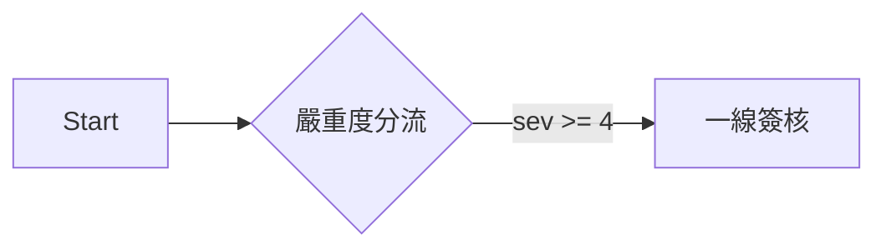

# 使用者文件撰寫規格（MkDocs）

> 對象：在本專案寫文件的人與 AI session
> 動筆前先讀完本文，尤其是「哪些寫進 docs/」與「frontmatter 規格」兩節。

2026-08-13 建立。定案背景：本專案要在 GitHub 公開，需要一套隨專案內建、
又能產出對外官方站的文件系統。評估後採用 MkDocs 1.6.1 + Material 9.7.7，
另補三個 MkDocs 沒有的能力（前置關係、資料流轉、版控影響分析）。

---

## 一、哪些寫進 docs/，哪些寫進 dev-notes/

**這是唯一的公開分界線。`docs/` 會推上 GitHub，`dev-notes/` 不會。**
`scripts/push_github.sh` 的 `EXCLUDE_DIRS` 只排除 `dev-notes`，
所以放錯目錄等於直接外流。

| 目錄 | 內容 | 讀者 |
|------|------|------|
| `docs/` | 使用者手冊、操作指南、作業流程、站內 help | 客戶、企業管理員、一般員工 |
| `dev-notes/` | 規格書、handoff、踩坑筆記、manifest、codex spec、架構設計 | 開發者、維護的 AI session |

判斷準則，任一項成立就放 `dev-notes/`：

- 內容提到內部主機、IP、帳號、埠號、資料庫名稱
- 內容描述「為什麼這樣寫」而非「怎麼操作」
- 內容是給下一個 session 的交接（handoff_*、HANDOFF_*）
- 內容是實作規格（*_SPEC.md）或模組清單（manifests/）
- 內容引用了尚未發行的功能或未定案的設計

**不確定時放 `dev-notes/`。** 從 dev-notes 搬進 docs 是零成本的，
反向則是已經外流了。

寫進 `docs/` 前逐項確認：

- [ ] 沒有內部 IP、主機名、路徑（`/opt/...`）、埠號
- [ ] 沒有帳號、密碼、Token、金鑰，即使是測試用的
- [ ] 沒有「開發中」「TODO」「待確認」等未定內容
- [ ] 描述的行為是目前版本真的做得到的
- [ ] 讀者換成不認識這個專案的客戶也看得懂

「目前版本真的做得到」以**跑起來的 UI 實際行為**為準。程式碼與 `dev-notes/` 的
規格書都可能領先或落後於實際部署，兩者衝突時以 UI 為準，並在 BBN 開一張卡記下落差。

### 新增一頁時的位置與命名

| 內容性質 | 放哪 |
|----------|------|
| 作業流程、操作指南 | `docs/guides/` |
| 前置設定（部門、角色、帳號等一次性建置） | `docs/setup/` |
| 站內 help 素材（綁選單的 `menu_code`） | `docs/help/`，格式不同，見第六節 |

檔名沿用該目錄的既有慣例：`guides/` 用大寫底線（`OD_WORKFLOW_VARIANTS.md`），
`help/` 用小寫底線且必須等於 `menu_code`（`menu_manage.md`）。
新目錄從零開始時用小寫底線。**不要用中文檔名**，它會變成 URL。

**新增頁面後必須手動加進 `mkdocs.yml` 的 `nav`**，MkDocs 有 `nav` 就不自動收錄，
漏加的頁面 build 不會報錯、站上也點不到。`docs/index.md` 的 `<!-- DEP_GRAPH -->`
佔位符不用動，它會自己把新頁的關係畫進去。

---

## 二、frontmatter 規格

每份 `docs/` 下的 md 都要有 YAML frontmatter：

```yaml
---
title: 資安事件處置流程          # 必填。目錄與導覽顯示的名稱
audience: ORG_ADMIN             # 必填。SYSTEM_ADMIN / ORG_ADMIN / EMPLOYEE / EXTERNAL / ALL
requires:                       # 選填。本作業開始前必須先完成的頁（doc_id）
  - guides/OD_WORKFLOW_VARIANTS
produces:                       # 選填。本作業產出、供其他流程使用的資料
  - 封鎖決策紀錄
  - 案件處置紀錄
covers:                         # 選填但強烈建議。本頁對應的程式路徑
  - modules/open_defense/**
  - backend/app/api/roles.py
---
```

`doc_id` 是相對 `docs/` 的路徑去掉 `.md`，例如
`docs/guides/OD_WORKFLOW_VARIANTS.md` 的 doc_id 是 `guides/OD_WORKFLOW_VARIANTS`。

各欄位的取值判準：

- **`audience` 只填一個值**。同一件事對不同角色做法不同時，**用 content tabs 放同一頁**
  （見第三節），不要拆頁也不要填多值；`audience` 此時填最主要的那個角色。
  三種角色都適用且做法一致，才填 `ALL`
- **`requires` 只填「不先做完就會卡住」的頁**。純粹「先讀比較好懂」的關聯不填，
  那會讓依賴圖失去意義。判準：跳過它，本頁的操作會在中途失敗或找不到選項
- **`produces` 用使用者看得懂的業務名詞**（「封鎖決策紀錄」「部門清單」），
  不要用資料表名或程式物件名。它會直接印在讀者看到的方框與依賴圖上
- **`covers` 在描述「平台功能怎麼操作」時必填**。只有純觀念說明（術語表、選型建議）
  這種沒有對應實作的頁面可以省略。找不到對應程式時先查 `dev-notes/manifests/`
  的模組清單，那裡有模組與路徑的對照

### 這三個欄位各自換來什麼

| 欄位 | build 時自動產生的東西 |
|------|------------------------|
| `requires` | 頁首插入黃色「開始前必須先完成」方框，附前置頁連結與它的 `produces` |
| `produces` | 頁尾插入藍色「本頁完成後」方框；並成為依賴圖上的邊標籤 |
| 兩者合計 | `docs/index.md` 的 `<!-- DEP_GRAPH -->` 佔位符會展開成全站流程關係圖 |
| `covers` | `scripts/docs_impact.py` 據此回答「這次程式改動影響哪些文件」 |

實作在 `scripts/mkdocs_hooks/doc_relations.py`，**不要手工寫這些方框**，
手寫的不會隨關係變動而更新。

### covers 的粒度

用**檔案路徑 + glob**，不要細到函式或路由層級。
`**` 跨目錄、`*` 不跨目錄。目錄結尾加 `/` 等同 `/**`。

```yaml
covers:
  - modules/open_defense/**                    # 整個模組
  - backend/app/api/roles.py                   # 單一檔案
  - scripts/examples/*od_workflow*.py          # 同目錄下符合的檔案
```

太細會讓維護成本超過收益，太粗（例如 `backend/**`）會讓每次改動都命中、
淪為雜訊。以「這份文件描述的功能實作在哪」為準。

---

## 三、可以用的語法

Material 已啟用的擴充，**只用這些，不要引入新外掛**（引入前先看第五節）。

### 前置條件與警告

```markdown
!!! note "一般說明"
!!! warning "需要注意"
!!! danger "會造成事故"

??? note "預設摺疊的補充說明"
```

### 同頁切換不同模式

這是本專案最常用的結構——同一件事因編制/設定不同而有不同做法時，
**用 tabs 放同一頁，不要拆成多份文件**：

```markdown
=== "已建立部門與角色"

    內容縮排四個空格。

=== "尚未建組織架構"

    另一種情況的內容。
```

### 流程圖

用 Mermaid，**不要用 drawio 或外部圖檔**：

````markdown

````

理由：mermaid 是純文字，`git diff` 看得出改了什麼，AI 也能直接讀寫。
drawio 是二進位 XML，版控完全失去意義，而且它的 viewer 預設從
`viewer.diagrams.net` 載入，封閉網路會壞。

### 檢查清單

```markdown
- [ ] 確認偵測器送進來的來源位址是真實訪客
- [x] 已完成的項目
```

---

## 四、建置與驗收

```bash
cd /opt/BeakPlatform-dev

# 預覽（改檔案會自動重載）
./venv-docs/bin/mkdocs serve -a 192.168.0.16:8899

# 建置，--strict 讓警告變成錯誤
NO_MKDOCS_2_WARNING=1 ./venv-docs/bin/mkdocs build --strict

# 驗收 1：產出不得有任何外部資源請求（封閉網路要求）
grep -rhoE 'src="https?://[^"]+' site --include='*.html'
# 必須完全沒有輸出。有輸出就是有東西要連外，一律當成錯誤處理。
#
# href 另外看（連結不影響離線閱讀，只是點了會連外）：
grep -rhoE 'href="https?://[^"]+' site --include='*.html' | sort -u
# 唯一允許的是 Material 主題 footer 的 https://squidfunk.github.io/mkdocs-material/
# 其餘任何 host（unpkg / cdn.jsdelivr / fonts.googleapis / fonts.gstatic）
# 都代表設定被改壞了，回頭看第五節。

# 驗收 2：covers 宣告是否還對得到實際檔案
./venv-docs/bin/python scripts/docs_impact.py --verify-covers --docs docs

# 版控影響分析：這次改動影響哪些文件
./venv-docs/bin/python scripts/docs_impact.py --docs docs --base origin/main
./venv-docs/bin/python scripts/docs_impact.py --docs docs --base HEAD~1 --show-uncovered
```

`venv-docs/` 與 `site/` 都不入版控，版本鎖在 `requirements-docs.txt`。
換機器時 `python3 -m venv venv-docs && ./venv-docs/bin/pip install -r requirements-docs.txt`。

---

## 五、不可以動的設定

`mkdocs.yml` 有三處是踩過坑才這樣寫的，改之前先確認你知道後果：

1. **`theme.font: false`** —— 拿掉會讓 Material 去抓 Google Fonts，封閉網路直接壞
2. **mermaid 的 fence class 叫 `mermaid-diagram` 而不是 `mermaid`** ——
   Material 內建的 mermaid 支援會從 unpkg CDN 動態 import。改名是為了避開它，
   改由 `docs/javascripts/mermaid-init.js` 用本地 `docs/assets/mermaid.min.js` 接手
3. **`exclude_docs: help/`** —— `docs/help/` 是站內 help 的資料來源，
   內文包在 YAML 的 `sections[].body` 裡，MkDocs 直接渲染會是一片空白

引入任何新外掛前，先確認它不會產生外部請求（裝完 grep 套件目錄找 `http`）。

---

## 六、與站內 help 的關係（未整併）

目前是兩套並存：

| 出口 | 來源 | 特性 |
|------|------|------|
| 站內 help（`help_service.py`） | `docs/help/<menu_code>.md` | 依登入者 `user_type` 過濾 sections，即時 |
| 官方站（MkDocs） | `docs/` 其餘檔案 | 靜態，build 當下的快照 |

**寫新頁時要不要同步做站內 help？** 判準是這頁有沒有對應的選單：
描述某個選單頁怎麼操作 → 兩邊都要（`docs/help/<menu_code>.md` 給站內、
`docs/guides/` 或 `docs/setup/` 給手冊）；描述跨多個選單的作業流程 → 只寫手冊。
兩邊格式不同，目前得各寫一份，這正是下面要整併的原因。

兩者格式不同，目前互不相通。整併方向（尚未實作）是寫一個 MkDocs hook
把 `help/` 的 `sections[].audience` 展開成 content tabs——同一份檔案，
站內 help 依角色只顯示該角色那段，官方站用 tabs 全部顯示。
要做時先評估 `help_service.py` 是否需要同步調整。

「即時資料」只有站內 help 能提供（Flask 動態渲染）。官方站是靜態產物，
需要嵌入 DB 內容時只能靠 build 時查詢產生快照（`mkdocs-macros-plugin`），
而且租戶資料本來就不該出現在公開站上。

---

## 七、已知的長期風險

MkDocs 2.0 將移除 plugin 系統、配置改用 TOML，官方聲明無遷移路徑，
Material 團隊因此不跟進、改做 Zensical（2025-11-05 發布），
Material 9.7.5 起已把依賴鎖在 `mkdocs<2`。

對本專案的影響：現在這套完全可用且穩定，但不會再有新功能。
自訂邏輯只有 `doc_relations.py` 與 `docs_impact.py` 兩支薄薄的檔案，
內容本身是純 markdown，將來換底座的成本在 `mkdocs.yml`，不在文件內容。
**不要為了規避這個風險而把自訂邏輯寫進文件內容裡。**
