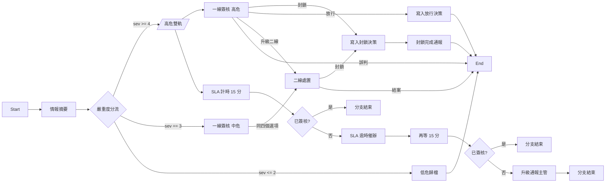
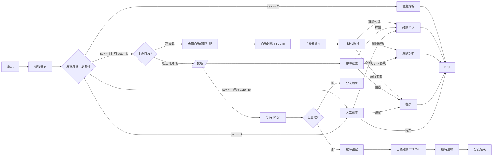

# 資安事件處置流程：兩個編制版本

> 對象：要導入開放防禦模組的組織
> 相關：`docs/guides/SOC_ROLE_DESIGN_GUIDE.md`（角色怎麼設計）、
> `docs/OPEN_DEFENSE_ARCHITECTURE.md`（平台側架構）

## 為什麼需要不只一個流程

處置流程的形狀，決定於「有沒有人在看」，而不是事件量。

模組內建的「資安事件處置流程」假設**有人會在 15 分鐘內看到案件**。這個假設對輪班的
監控中心成立，對只有一位資安人員、每天上班 8 小時的組織不成立——後者一天有 16 小時
沒有人能簽核，高危案件會靜靜掛著等到隔天上班。

因此另外提供兩個版本，安裝後可直接使用：

| 流程 | 適用編制 | 核心差異 |
|---|---|---|
| **SOC 團隊版** `SEC_IR_FLOW_SOC_TEAM` | 3~8 人、有輪班 | 高危案件開「簽核＋SLA 計時」雙軌，逾時催辦與升級通報，但不代替人做處置 |
| **小企業單人版** `SEC_IR_FLOW_SOLO` | 1 人、每天 8 小時、16 小時無人 | 非上班時段的高危案件先自動封鎖（TTL 24 小時）再等人複核；上班時段交人工，但逾時仍會自動封鎖 |

建置指令：

```bash
cd /opt/BeakPlatform-dev
set -a && source .env && set +a
venv/bin/python scripts/examples/provision_od_workflow_variants.py --org <企業sc> --apply
```

不加 `--apply` 是預演模式，只印出將要做的事。

---

## SOC 團隊版



設計取捨：

- **計時分支只催辦，不代人處置。** 3~8 人團隊的問題是「漏看」不是「沒人」，
  正確的介入強度是提醒，不是替人做決定。人的簽核任務不會被系統憑空取消。
- **二線指向「資安主管」而非企業管理員。** 原流程把升級派工丟給 ORG_ADMIN，
  該角色通常只有一人，會成為每日執行鏈上的單點瓶頸。
- **封鎖完成通報發角色、不強制簽收。** 原流程要 ORG_ADMIN 逐件 ack，封鎖頻率一高就塞住。
- **簽核意見至少 10 字。** 原流程設 2 字，打「ok」就算完成，當稽核證據沒有意義。

## 小企業單人版



設計取捨：

- **自動封鎖一律帶 TTL，而且是短的 24 小時。** 這是安全網不是懲罰：人沒來上班也會
  自動解封，誤封不會變成永久事故。攻擊若持續，會重複觸發、重複開案、重複封鎖，
  所以短 TTL 不留永久缺口。反過來說 72 小時（為了涵蓋週末）會讓一次誤判痛三天，
  而單人組織週末沒有人能手動解封。
- **上班時段也有等待期。** 只判時鐘會有兩個缺口：下班前 5 分鐘進案的案件、
  以及週末（`${t.time}` 沒有星期幾可判）。30 分鐘沒人處理就自動封鎖，兩個缺口一起補上。
- **逾時自動封鎖後，人的簽核任務仍然在。** 人回來可以直接改判「放行」，
  該選項會寫 `unblock` 解除。系統的自動處置永遠是可推翻的。
- **沒有 actor_ip 的高危案件走人工。** 沒有可封鎖的目標時，自動處置無事可做；
  硬走會讓決策節點失敗、流程卡住。

---

## 怎麼選、怎麼換

### 只用一個流程（多數組織）

一個組織通常只需要一個流程。三個流程各綁一張表單，intake 依照
`od_form_template_mappings` 的規則決定案件用哪張表單，也就決定了用哪個流程。

在 `/open-defense/event-routing/` 設一條 catch-all 規則指向你要的表單即可：

| 你要用的流程 | 規則指向的表單 |
|---|---|
| 原本的資安事件處置流程 | `SEC_INCIDENT_RESPONSE` |
| SOC 團隊版 | `SEC_IR_SOC_TEAM` |
| 小企業單人版 | `SEC_IR_SOLO` |

### 不同案件走不同流程（進階）

規則按 `priority` 評估，命中即停。例如「內部橫向移動交給團隊、外部掃描走單人版」：

```
priority 100  Summary.RuleId in [LM-001, LM-002]   -> SEC_IR_SOC_TEAM
priority 200  source_system == suricata            -> SEC_IR_SOLO
priority 999  (無條件)                              -> SEC_IR_SOLO
```

`--with-routing` 會建立兩條停用狀態的範例規則，確認條件符合貴組織的政策後再啟用。

### 換掉某個流程的內容

流程在設計器 `/forms/workflows/<流程sc>` 可以直接改，**但改完必須重新發行**：
intake 讀的是 `fw_published_form_workflows` 的最新 Published 快照，改模板不發行等於沒改。

---

## 可調參數

改這些值不需要動程式邏輯，位置都在 `scripts/examples/od_workflow_graphs.py` 頂端；
已經建置過的流程則直接在流程設計器上改對應節點。

| 參數 | 預設 | 說明 |
|---|---|---|
| `OFFICE_HOURS_UTC_REGEX` | `^0[1-9]:` | 上班時段。**這是 UTC**，預設對應 Asia/Taipei 09:00-18:00。換時區必改 |
| `AUTO_BLOCK_TTL_SECONDS` | 86400（24 小時） | 自動封鎖的存續時間 |
| `CONFIRMED_BLOCK_TTL_SECONDS` | 604800（7 天） | 人工確認後的封鎖時間 |
| `SOLO_DAYTIME_GRACE_MINUTES` | 30 | 單人版上班時段的等待期 |
| `SOC_SLA_WARN_MINUTES` | 15 | 團隊版第一次催辦的等待時間 |
| `SOC_SLA_ESCALATE_MINUTES` | 15 | 團隊版升級通報的再等待時間 |

嚴重度門檻（`sev >= 4` / `== 3` / `<= 2`）在各流程的分流節點上調整。
注意**同一個分流節點的規則必須互斥**：分支節點會展開所有命中的規則，
條件重疊會讓案件同時走多條路徑。

---

## 已知限制

以下都是平台目前的實作事實，不是這兩個流程特有的問題，但會影響你怎麼用它們。

1. **緊急廣播的代碼不做變數替換。** 同一個 `broadcast_code` 的廣播會覆蓋前一則並
   清掉已讀記錄，所以它的語意是「最新一則告警橫幅」，不是每案通知。
   要每案通知請改用 Email 或 Telegram 節點（需先設定 SMTP／Bot）。
2. **`${t.time}` 是 UTC，而且沒有星期幾的變數。** 上班時段判斷因此只能判時段、
   不能判平日假日。單人版靠等待期補這個缺口；如果貴組織週末完全不看，
   把 `SOLO_DAYTIME_GRACE_MINUTES` 調小會更貼近實情。
3. **流程模板的 `timeout_minutes` 沒有作用。** 該欄位只被寫入、沒有任何地方讀取，
   逾時控制請用流程內的延遲節點（兩個版本都已經這樣做）。
4. **`confidence` 欄位在實務上大量缺值**（開發環境的資料裡，嚴重度 4 的案件有
   93% 沒有這個值）。不要把它當作自動處置的必要條件，否則絕大多數高危案件
   會走不到自動處置那條路。
5. **通知節點不要放進必經路徑，除非已設定好外部服務。** Email 與 Telegram 節點
   需要 SMTP／Bot 設定，未設定時節點會失敗並卡住流程。兩個版本都只用平台內建的
   緊急廣播，安裝後即可運作。
