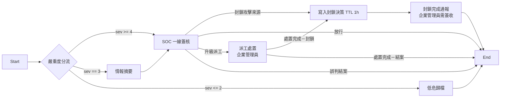
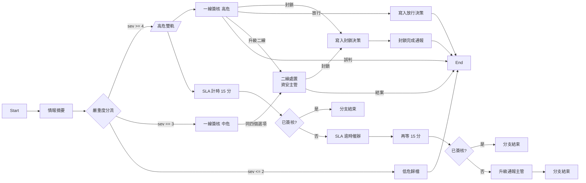
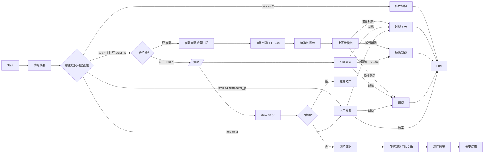

# 資安事件處置流程使用指南（三個編制版本）

> 對象：導入開放防禦模組的組織、負責設定處置流程的管理員
> 相關：[資安團隊角色設計](SOC_ROLE_DESIGN_GUIDE.md)（角色怎麼設計）

## 先問一個問題：你的組織有沒有人在看？

處置流程的形狀，決定於「有沒有人在看」，而不是事件量。

同樣是每天 100 件告警，一個三班輪值的監控中心和一個只有一位資安人員的小公司，
需要的流程完全不同——前者要的是「別讓案件被漏看」，後者要的是
「沒有人的那 16 小時該怎麼辦」。

平台提供三個流程，安裝後都可直接使用：

| 流程 | 流程 code | 表單 code | 適用編制 |
|---|---|---|---|
| 標準版 | `SEC_INCIDENT_FLOW` | `SEC_INCIDENT_RESPONSE` | 3~8 人、有人隨時在線 |
| SOC 團隊版 | `SEC_IR_FLOW_SOC_TEAM` | `SEC_IR_SOC_TEAM` | 3~8 人輪班，要 SLA 有牙齒 |
| 小企業單人版 | `SEC_IR_FLOW_SOLO` | `SEC_IR_SOLO` | 1 人、每天 8 小時、16 小時無人 |

三個流程各自綁一張表單，可以同時存在。選一個當預設，或依案件特徵分派給不同流程。

### 快速選擇

| 你的情況 | 建議 |
|---|---|
| 有輪班，人隨時在線，想先跑起來再說 | **標準版** |
| 有輪班，但常發生「案件掛在那沒人動」 | **SOC 團隊版**（逾時會催辦、會升級通報） |
| 只有一位資安人員，下班後沒人看 | **小企業單人版** |
| 一人身兼 IT 與資安，連上班時間也未必看得到告警 | **小企業單人版**，並把等待期從 30 分調短 |
| 有 L1／L2／L3 分工、10 人以上 | 三個都不完全合適，建議以 SOC 團隊版為基礎自行擴充二線、三線節點 |

---

## 一、標準版（`SEC_INCIDENT_FLOW`）

模組原本內建的流程。



**適用**：3~8 人的單層值班 SOC，一個班次 1~2 人在線，有一位主管兼企業管理員。

**設計上的前提**：它假設有人會在 15 分鐘內看到案件。處置中心清單會把
severity>=4 的案件標成 15 分鐘 SLA、severity==3 標成 60 分鐘，
但**這個 SLA 只是畫面上的顯示，不會驅動任何行為**——逾時完全靠人盯著清單。

**不適合**：

- 1~2 人或兼任資安：15 分鐘 SLA 沒人守得住，而且逾時沒有後援
- 10 人以上或有 L1-L2-L3 分工：簽核指派是「角色池內先到先得」，沒有值班表也沒有
  搶單鎖定，人一多就會出現漏接與重工

**已知的三個粗糙處**（另外兩個版本已改掉，你也可以自行修改標準版）：

1. 高危案件**沒有**情報摘要節點，只有中危有。最需要判斷依據的案件反而資訊最少
2. 升級派工指向「企業管理員」而非專責二線，該角色通常只有一人，會成為瓶頸
3. 簽核意見只要求 2 個字，打「ok」就算完成，當稽核證據沒有意義

---

## 二、SOC 團隊版（`SEC_IR_FLOW_SOC_TEAM`）



**與標準版的差異**：

| 項目 | 標準版 | SOC 團隊版 |
|---|---|---|
| SLA | 只在清單上顯示 | 15 分未簽核發催辦廣播，再 15 分升級通報主管 |
| 情報摘要 | 只有中危有 | 所有案件都有 |
| 二線 | 企業管理員 | 專責的「資安主管」角色 `SOC_SUPERVISOR` |
| 封鎖完成通報 | 發企業管理員，且要簽收 | 發資安人員＋資安主管，不強制簽收 |
| 簽核意見長度 | 2 字 | 10 字 |

**設計取捨——計時分支只催辦，不代替人做處置。**
3~8 人團隊的問題是「漏看」不是「沒人」，正確的介入強度是提醒而不是替人決定。
計時分支跑完自己的路就靜靜結束，值班人員的簽核任務從頭到尾不受影響；
反過來，人若在 15 分鐘內簽核完成，還在倒數的計時分支會被一併取消，
不會事後跳出一則沒有意義的催辦。

**新增角色的注意事項**：二線角色 `SOC_SUPERVISOR` 由建置腳本一併建立，
並且**已經加進資安案件處置中心的選單角色需求**。自行新增其他資安角色時務必比照辦理，
否則只持有新角色的同仁看不到處置中心選單，二線簽核任務會變成
「清單上看得到、卻點不進去」。

---

## 三、小企業單人版（`SEC_IR_FLOW_SOLO`）



核心是「先自動處置、人上班再複核」，用 TTL 當安全網。

**四個設計取捨**：

1. **自動封鎖一律帶 TTL，而且是短的 24 小時。**
   這是安全網不是懲罰：人沒來上班也會自動解封，誤封不會變成永久事故。
   攻擊若持續，會重複觸發、重複開案、重複封鎖，所以短 TTL 不留永久缺口。
   反過來 72 小時（為了涵蓋週末）會讓一次誤判痛三天，而單人組織週末沒有人能手動解封。

2. **上班時段也有等待期。**
   只看時鐘會有兩個缺口：下班前 5 分鐘進案的案件，以及週末——流程可用的時間變數
   沒有「星期幾」，週六日會被判成上班時段。30 分鐘沒人處理就自動封鎖，
   兩個缺口一起補上，而且不需要任何額外設定。

3. **逾時自動封鎖後，人的簽核任務仍然在。**
   人回來可以直接改判「放行」，該選項會寫解除封鎖。系統的自動處置永遠是可推翻的。

4. **沒有來源 IP、或來源是內網位址的高危案件走人工。**
   沒有可封鎖的目標時自動處置無事可做，硬走會讓決策節點失敗、流程卡住。
   內網位址則是更危險的情況，見下一段。

### 為什麼自動封鎖一定要排除內網來源

**偵測器通常架在流量出口的那台主機上，而外部訪客經反向代理進來時，
偵測器看到的來源會是代理自己的內網位址。**

這不是理論風險。實測環境近 200 筆真實 Suricata 告警裡，超過一成的來源位址
指向反向代理自己，而不是外部訪客。如果沒有排除規則，小企業版的自動封鎖
會反覆把自家基礎設施加進封鎖清單，而且因為是無人時段的自動處置，
**沒有人會發現**。

分流節點因此在「可自動封鎖」的條件裡要求來源位址不落在下列範圍：

```
10.0.0.0/8      127.0.0.0/8     0.0.0.0/8       169.254.0.0/16
192.168.0.0/16  172.16.0.0/12   ::1             fc00::/7
```

這些案件**不是被忽略**，而是改走人工路徑，由人判斷真正該封的是誰
（通常要從代理的存取紀錄回推真實訪客位址）。

導入時請一併檢查：你的偵測器送進來的 `actor.ip` 到底是真實訪客還是中間節點。
若絕大多數告警的來源都是同一個內網位址，代表偵測點的位置需要調整，
或需要讓偵測器解析 `X-Forwarded-For` / `CF-Connecting-IP`。

### 服務層還有一道保護，流程怎麼寫都繞不過

分流節點的排除只保護「小企業單人版」這一個流程。**寫決策這件事本身另有一道
服務層防線**（2026-08-13 起）：任何流程、任何人拉出來的「防禦決策」節點，
只要要寫的是「封鎖」而且目標是 IP／CIDR，都會先比對保護清單，命中就拒絕寫入。

保護清單有三層，由寬到窄：

| 層 | 內容 | 誰能改 |
|---|---|---|
| 內建 | RFC1918、回送、link-local、CGNAT、群播、保留網段，以及 IPv6 的 ULA 與 link-local | 不能改（程式內建） |
| 設定 | 環境變數 `OD_PROTECTED_EXTRA_NETWORKS`，以及平台的可信前置代理 `TRUSTED_PROXY_IPS` | 系統管理者改設定檔 |
| 自訂 | 企業自己維護的位址與網段（辦公室對外 IP、分公司、合作廠商） | 企業管理員，在 **開放防禦 → 封鎖保護清單** 頁面 |

**要封鎖的目標與保護網段只要有交集就會被擋**，不是只有「完全落在裡面」才擋——
所以拿 `0.0.0.0/0` 當目標一樣封不了。

真的需要封鎖某個內網位址時（最常見的情境是內部主機被入侵、要把它隔離），
有兩個正當做法：

1. 在「封鎖保護清單」頁面新增一筆**豁免**項目，指定那個位址或網段。
   豁免只在**封鎖目標完全落在豁免網段內**時才生效——豁免一台主機不會順帶
   讓整個網段變成可封。
2. 在流程的防禦決策節點上設定 `allow_protected_target`，明確允許覆寫。
   這種決策會在紀錄裡留下覆寫痕跡，事後查得到是誰、繞過了哪一條保護。

節點另有 `on_protected` 設定，決定命中保護清單時該停還是該跳過：預設是**停**
（節點回報錯誤、流程停在那裡等人處理），設成 `skip` 則是不寫決策但讓流程繼續走
（適合後面還接通知節點的設計）。

> **注意**：上述兩個節點設定目前**還不能在流程設計器的畫面上點選**——
> 防禦決策節點尚未有屬性面板，設定值要改流程的 graph JSON
> （建置腳本 `scripts/examples/od_workflow_graphs.py`，或流程 API）。
> 日常情境用「豁免」項目就夠了，那個在畫面上可以直接維護。

同一頁面提供**保護試算**：輸入一個位址就能知道它會不會被擋、被哪一條擋，
不需要真的送一筆事件進來試。

**複核時的三個選項對應三種現實**：確定是攻擊（延長至 7 天）、確定誤判（立即解除）、
還不確定（維持觀察，讓 24 小時自然到期）。不確定時什麼都不用做是刻意的設計。

---

## 四、怎麼切換目前使用的流程

事件進來時，`/open-defense/event-routing/` 的規則決定它用哪張表單，
也就決定了用哪個流程。規則按 **priority 由大到小**評估，**命中即停**。

最省事又可逆的做法是加一條高優先的 catch-all：

| 欄位 | 值 |
|---|---|
| 名稱 | 例如「【現行】全部案件走小企業單人版」 |
| 優先序 | 1000（高於所有既有規則） |
| 條件 | 留空（無條件即 catch-all） |
| 目標表單 | `SEC_IR_SOLO` / `SEC_IR_SOC_TEAM` / `SEC_INCIDENT_RESPONSE` 三選一 |

要換回原本的分派方式，**停用這條規則就好**，不必逐條改回。

> 切換後建議立刻用路由設定頁的試算功能確認會命中你預期的那條規則，
> 不要等到真實事件進來才發現沒切成功。

## 五、讓不同案件走不同流程

同一組規則可以依案件特徵分派。例如「內部橫向移動交給團隊處理、外部掃描走單人版」：

```
priority 300  Summary.RuleId in [LM-001, LM-002]  -> SEC_IR_SOC_TEAM
priority 200  source_system == suricata           -> SEC_IR_SOLO
priority 100  (無條件，catch-all)                  -> SEC_IR_SOLO
```

建置腳本的 `--with-routing` 參數會建立兩條**停用狀態**的範例規則，
確認條件符合貴組織的政策後再啟用。

支援的條件運算子：`eq` / `ne` / `in` / `not_in` / `gt` / `gte` / `lt` / `lte` /
`contains` / `startswith` / `endswith` / `exists`。

## 六、可調參數

改這些值不需要動程式。已建置的流程直接在流程設計器
`/forms/workflows/<流程 secure_code>` 改對應節點；要重新建置則改
`scripts/examples/od_workflow_graphs.py` 頂端的常數。

| 參數 | 預設 | 說明 |
|---|---|---|
| 上班時段判斷 | UTC `^0[1-9]:` | 對應 Asia/Taipei 09:00-18:00。**這是 UTC**，換時區必改 |
| 自動封鎖 TTL | 86400（24 小時） | 單人版夜間與逾時自動封鎖的存續時間 |
| 人工確認後 TTL | 604800（7 天） | 人工確認封鎖後的存續時間 |
| 單人版等待期 | 30 分 | 上班時段多久沒人處理就自動封鎖 |
| 團隊版催辦 | 15 分 | 第一次催辦的等待時間 |
| 團隊版升級 | 15 分 | 催辦後再等多久升級通報主管 |

嚴重度門檻（`sev >= 4` / `== 3` / `<= 2`）在各流程的分流節點上調整。

> **同一個分流節點的規則必須互斥。** 分支節點會展開所有命中的規則，
> 條件重疊會讓同一件案子同時走多條路徑。

## 七、改完流程一定要重新發行

流程在設計器改完之後，**必須重新發行**才會生效：事件進來時讀的是已發行的快照，
不是設計區的內容。改了不發行等於沒改。

發行的判斷依據是表單與流程的版本號，用 API 或 SQL 直接改流程內容時要記得
讓版本號遞增，否則發行會回報「版本未變更」並沿用舊快照。

---

## 八、已知限制

以下是平台目前的實作事實，不是這些流程特有的問題，但會影響你怎麼用它們。

1. **緊急廣播的代碼不做變數替換。** 同一個廣播代碼的訊息會覆蓋前一則並清掉已讀記錄，
   所以它的語意是「最新一則告警橫幅」，不是每案通知。要每案通知請改用
   Email 或 Telegram 節點（需先設定 SMTP／Bot）。
2. **流程可用的時間變數是 UTC，而且沒有星期幾。**
   上班時段判斷因此只能判時段、不能判平日假日。單人版靠等待期補這個缺口；
   如果貴組織週末完全不看，把等待期調小會更貼近實情。
3. **流程模板的「逾時分鐘」欄位沒有作用。** 該欄位只被寫入、沒有任何地方讀取，
   逾時控制請用流程內的延遲節點（後兩個版本都已經這樣做）。
4. **`confidence` 欄位在實務上大量缺值。** 開發環境的資料裡，嚴重度 4 的案件有 93%
   沒有這個值。不要把它當作自動處置的必要條件，否則絕大多數高危案件走不到自動處置。
5. **通知節點不要放進必經路徑，除非已設定好外部服務。** Email 與 Telegram 節點需要
   SMTP／Bot 設定，未設定時節點會失敗並卡住流程。三個流程都只用平台內建的緊急廣播，
   安裝後即可運作。
6. **聚合降噪會把「同規則 ID＋同來源 IP＋同目標主機」的事件併進既有案件。**
   自行測試流程時如果連續送出相同內容的事件，第二次之後不會開新案件，
   看到的會是第一張案件的軌跡。

---

## 附錄：建置指令

```bash
cd <平台安裝目錄>
set -a && source .env && set +a
venv/bin/python scripts/examples/provision_od_workflow_variants.py --org <企業sc> --apply
```

不加 `--apply` 是預演模式，只印出將要做的事。腳本冪等，重跑不會產生重複資料。
`--with-routing` 會一併建立停用狀態的路由規則範例，
`--supervisor <email>` 可指定由誰兼任資安主管。
