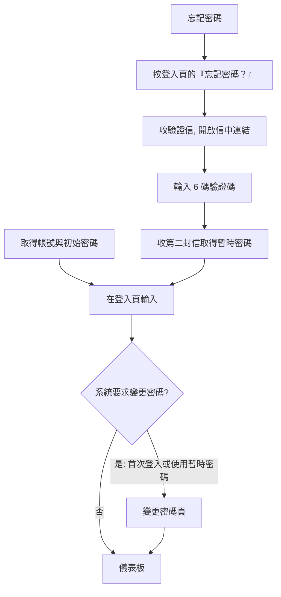

# 登入與登出

!!! abstract "作業：登入"
    **入口**：貴公司提供的登入網址（登入前沒有選單）

    1. 輸入帳號
    2. 在管理員指定的那一格「驗證碼」輸入密碼
    3. 按 [登入]

!!! abstract "作業：登出"
    **MENU**：畫面右上角 [登出]

    1. 按 [登出]

## 三個入口，帳號欄位填的東西不一樣

| 入口 | 網址 | 帳號欄位要填 |
|---|---|---|
| 共用登入頁 | `<平台網址>/auth/login` | `帳號@企業網域` |
| 企業專屬登入頁 | `<平台網址>/auth/org/<企業網域>/login` | 只填帳號（網域已固定在欄位下方） |
| 外部廠商登入頁 | `<平台網址>/auth/org/<企業網域>/public/login` | 完整 Email |

後兩者的網址由系統管理員在建立企業後提供。用錯入口的症狀是「帳號或密碼錯誤」，
不會提示你走錯門。**外部廠商只能走第三個入口**，用前兩個入口一定登入失敗。

## 為什麼有三格「驗證碼」

登入頁固定顯示三個外觀一致的欄位，**只有其中一格是密碼**，另外兩格各有用途，
由貴公司管理員在企業設定中指定（員工登入與廠商登入各自獨立設定）：

| 欄位角色 | 你該怎麼做 |
|---|---|
| 密碼欄位 | 輸入密碼 |
| 地雷欄位 | **保持空白**。只要填了任何字元，即使密碼正確也一律登入失敗 |
| 救助欄位 | 平常保持空白；在被脅迫登入時輸入管理員給你的救助關鍵字 |

!!! warning "第一次使用前先問清楚"
    哪一格是密碼欄位不會顯示在畫面上。**沒問到就開始猜，很容易連續踩到地雷欄位而被鎖定帳號。**

!!! danger "救助關鍵字的用法"
    輸入救助關鍵字後，畫面表現與一般登入失敗完全相同（不會有任何成功或提示畫面），
    但系統會立刻寄出警報信給貴公司全體管理員。這是為了在受脅迫時求援用的，**不要拿來測試**。

## 首次登入與密碼重設

忘記密碼流程的三個時限與去向，畫面上看不出來：

- **驗證碼 10 分鐘內有效**，逾時要從「忘記密碼？」重新申請
- **驗證連結只能用一次**，用過再開會顯示已使用
- **兩封信都寄到你在個人設定填的備用 Email**（備用 Email 1、2 都會收到）；
  兩個都空白時才寄到主要 Email。詳見[個人設定](personal_settings.md)
- 用暫時密碼登入後，系統會強制你變更密碼才能繼續

**外部廠商的登入頁沒有「忘記密碼？」**，忘記密碼請聯絡邀請你的企業窗口重設。

## 帳號被鎖定

密碼連續錯誤達到門檻後帳號會被鎖定，錯誤訊息會直接告訴你還要等幾分鐘。
預設是**連續錯 5 次鎖 15 分鐘**，之後每再觸發一次鎖定時間就加倍（最長 24 小時）；
實際門檻由貴公司的密碼政策決定，可能不同。

鎖定期間即使輸入正確密碼也無法登入，**等待期滿即自動解除**，不需要管理員處理。
急用時請聯絡管理員重設密碼。

## 常見問題

**按下登入要等好幾秒，是不是很慢？**
不是。登入回應有固定延遲，成功與失敗都一樣久，這是刻意的設計。

**畫面右上角顯示的名字不是我要的樣子？**
到[個人設定](personal_settings.md)調整「Navbar 顯示」。

**登入後放著沒動，過一陣子就要重新登入？**
作業階段有時效上限，逾時後會回到登入頁，重新登入即可。

**同一個瀏覽器可以同時登入兩個帳號嗎？**
不行，後登入的會取代前一個。要並用請開另一個瀏覽器或無痕視窗。

**離開座位前一定要按 [登出] 嗎？**
是。關掉分頁不等於登出，作業階段仍然有效。
