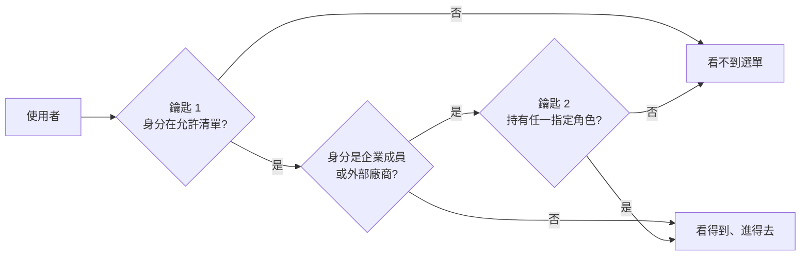

# 權限管理中心

系統管理員在這裡做三件事：決定每個選單**哪些身分看得到**、替**所有企業**一次設定
選單的角色門檻、以及維護 RBAC 的**出廠預設值**。企業管理員在自己的企業也有這一頁，
但少了跨企業的能力、多了「帳號配角色」分頁。

!!! abstract "作業：讓某種身分看得到某個選單"
    **MENU**：權限管理 ／ 權限管理中心 ／ [功能授權]

    1. 右上角「企業」下拉選任一企業（鑰匙 1 是全平台共用的，選哪家都一樣）
    2. 左側選單樹點選項目
    3. 「鑰匙1：可見身分」勾選身分，按 [儲存鑰匙1]

!!! abstract "作業：替所有企業設定某選單需要的角色"
    **MENU**：權限管理 ／ 權限管理中心 ／ [功能授權]

    1. 選企業、點選單項目
    2. 「鑰匙2：角色門檻」勾選角色，按 [儲存鑰匙2]
    3. 確認框會顯示將套用到幾家企業，按 [確定]

!!! abstract "作業：把某企業的角色權限設成出廠值"
    **MENU**：權限管理 ／ 權限管理中心 ／ [健檢]

    1. 「企業」下拉選作為範本的企業
    2. 按 [設定目前組態為出廠值]，兩次確認

## 雙鑰匙：兩把都符合才看得到、進得去

| 鑰匙 | 決定什麼 | 範圍 | 誰能改 |
|---|---|---|---|
| 鑰匙 1 | 四種身分（系統管理員／企業管理員／企業成員／外部廠商）各自能不能看到 | **全平台一份**，改一次所有企業都變 | 只有系統管理員 |
| 鑰匙 2 | 該選單還需要持有哪些角色 | **每家企業各一份** | 企業管理員改自己的；系統管理員一次改全部 |

- 鑰匙 2 只對**企業成員與外部廠商**生效。系統管理員、企業管理員與企業的原始管理員
  不看鑰匙 2，只看鑰匙 1
- 鑰匙 2 沒有設任何角色時，只看鑰匙 1
- 群組標題與分隔線這類結構項目沒有鑰匙 2 的區塊，它們不能被點擊，只有可見性
- 鑰匙 1 至少要留一種身分，全部取消會被擋下

## 系統管理員模式的鑰匙 2 與企業管理員不同

- 勾選清單列的是**系統預設角色**（依角色代碼去重），不含任何企業自訂的角色
- **儲存時以角色代碼套用到每一家啟用中的企業**：各企業用自己同代碼的那個角色；
  企業沒有該代碼的角色就跳過。這是全量替換，沒勾的角色會從所有企業的門檻移除
- 畫面上的勾選狀態是「任一企業有設」的聯集，看不出各企業之間的差異；
  要看或改單一企業，用該企業管理員的身分登入

!!! danger "儲存鑰匙 2 會覆蓋所有企業自己設好的門檻"
    客戶企業若在自己的權限管理中心替某選單加了自訂角色，系統管理員在這裡按一次
    [儲存鑰匙2]，那些自訂角色就會被清掉（因為系統模式的清單裡沒有它們）。
    這個動作適合出廠設定與初次佈建，不適合日常調整。

## 角色分頁

選定企業後管理該企業的角色，系統企業也在下拉清單裡。

- 角色標「系統」的是出廠角色：**只能改描述、排序、啟用**，不能改名、代碼、類型、範圍，也不能刪除
- 自訂角色可以刪除；已有持有人時會再問一次，確認後連同指派一起移除
- 「使用人數」點下去展開持有人清單
- 「互斥群組」三種：身分類型互斥（全企業只能持有一個）、部門職務互斥、社群職務互斥（同一單位只能持有一個）。
  它們在企業管理員指派角色時才會擋，改設定不會回頭檢查既有指派
- 「進階：API 權限」摺疊區是 RBAC 權限勾選，決定持有該角色的人能呼叫哪些功能；
  「範圍」為外部的角色只能指派給外部廠商，其他範圍只能指派給內部帳號，雙向都擋

## 健檢分頁

按 [重新偵測] 列出該企業權限配置的問題，共九類：

| 類型 | 等級 | 意思 |
|---|---|---|
| 選單指定的 RBAC 權限定義不存在 | 錯誤 | 選單要求的權限代碼在系統裡找不到 |
| 角色門檻使用停用角色 | 錯誤 | 鑰匙 2 指向已停用的角色，持有人進不去 |
| 選單可見身分沒有對應 RBAC 權限 | 警告 | 選單開給某身分，但沒有角色持有它要求的權限 |
| 角色門檻沒有持有人 | 警告 | 鑰匙 2 要求的角色在這家企業無人持有，等於沒人進得去 |
| 鑰匙1與鑰匙2沒有交集 | 警告 | 持有該角色的人全是鑰匙 1 沒開放的身分 |
| 角色沒有 RBAC 權限或功能門檻 | 警告 | 角色被指派了，但什麼都不能做 |
| 角色指派指向停用或刪除帳號 | 警告 | 殘留的指派記錄 |
| 選單沒有鑰匙1存取控制 | 警告 | 啟用中的選單沒有任何身分能看到（只有系統管理員會看到這類） |
| 孤兒 RBAC 權限 | 資訊 | 沒有角色引用、也不是任何選單門檻的權限（只有系統管理員會看到這類） |

每一項若對應到某個選單，[查看] 會跳到功能授權分頁並選中該選單。

### 三個按鈕動的都是「出廠預設值」

| 按鈕 | 做什麼 |
|---|---|
| 設定目前組態為出廠值 | 把**所選企業**系統角色目前的 RBAC 權限快照成出廠值，**全量替換**舊快照 |
| 匯出 RBAC | 下載的是**出廠預設值**，不是所選企業的現況（企業管理員按同一顆按鈕才是匯出自己企業的現況） |
| 匯入 RBAC | 貼上的 JSON 成為新的出廠預設值，全量替換；JSON 裡任何一個權限代碼不存在就整份拒絕 |

出廠預設值的用途只有一個：企業管理員在自己的健檢分頁按「恢復 RBAC 預設權限」時，
系統角色的權限會被重設成這份。它**不會**主動改變任何企業的現況。

- 還沒存過快照時 [匯出 RBAC] 會回「尚未設定出廠預設值」
- 匯入與設定出廠值都要兩次確認，且沒有復原功能；動手前先 [匯出 RBAC] 留一份

## 常見問題

**員工說選單看得到，點進去卻被登出。**
鑰匙 1 過了、鑰匙 2 沒過。以該企業管理員身分到功能授權分頁看該選單的角色門檻，
再到角色分頁確認他持有其中一個角色。健檢分頁的「角色門檻沒有持有人」通常會直接指出這一項。

**系統管理員自己看不到某個選單。**
鑰匙 1 沒勾「系統管理員」。四種身分是平行的，系統管理員並不自動看到所有選單。
若連權限管理中心本身都被取消了，直接在網址列開 `<平台網址>/access/` 仍可進入把它勾回來。

**「企業」下拉為什麼要選？鑰匙 1 不是全平台共用嗎？**
鑰匙 1 是共用的，但同一個分頁也顯示鑰匙 2，而鑰匙 2 的現況與角色清單依企業而異，
所以頁面要求先選企業才載入選單樹。
