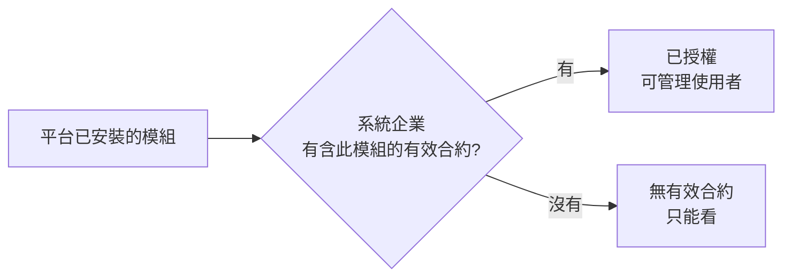

# 模組管理

這一頁回答兩個問題：**這套平台裝了哪些模組**，以及**系統企業自己能用哪些模組**。
它不能新增或移除模組，那是安裝時決定的。

!!! abstract "作業：確認平台有哪些模組"
    **MENU**：權限管理 ／ 模組管理

    1. 看「模組清單」的模組代碼與名稱
    2. 這份清單就是替客戶開合約時可以勾選的模組

!!! abstract "作業：讓系統企業內的某個角色能用某模組"
    **MENU**：權限管理 ／ 模組管理

    1. 在該模組列按 [管理使用者]
    2. 按 [新增指派]
    3. 選指派類型（角色／部門／群組／個人帳號），搜尋並點選對象
    4. 按 [確定新增]

## 這頁的「已授權」看的是系統企業自己的合約

模組能不能用是**逐企業**決定的，依據是該企業的有效合約。本頁以系統管理員身分開啟時，
看的是**系統企業**的合約，不是任何客戶的。

- **全新安裝的系統企業沒有任何合約**，所以每一列都顯示「無有效合約」、頁首「已授權模組」是 0。
  這是正常狀態，不是模組壞了；客戶企業能不能用模組與這裡無關
- 要讓系統企業自己也能用模組（例如在系統企業裡設計系統級流程），
  到[企業與合約管理](organizations.md)替系統企業開一份合約即可
- 要看**某家客戶**的模組授權與使用者指派，用該企業管理員的身分登入，
  它的「模組權限管理」頁與本頁是同一個畫面

## 使用權指派的規則

「已授權」只代表企業拿到了模組，**企業裡的誰能用**由使用權指派決定：

- 指派對象四種：角色、部門、群組、個人帳號。成員只要符合任一筆就能用
- **企業管理員永遠能用**，不需要指派
- **一筆指派都沒有時，只有企業管理員能用**。清空指派不會變成「大家都能用」，
  而是「只剩管理員能用」
- 合約建立時系統會自動帶入該模組的預設角色（例如表單流程模組帶入流程設計師與表單設計師），
  所以新企業通常不必手動設定
- **系統管理員帳號本身也受指派限制**。系統企業裡若已有指派記錄，
  系統管理員帳號沒有符合的角色就會被擋，症狀是開模組頁或呼叫模組功能時回「沒有權限」。
  把系統管理員持有的角色加進指派即可

## 常見問題

**清單裡的模組比合約設定頁少一個。**
合約設定頁勾選的來源就是這份清單，兩邊一定相同。若合約上有、這裡沒有，代表該模組已從主機上移除，
合約裡的授權對誰都不生效。

**移除一筆指派會立刻生效嗎？**
會，下一個請求就擋。正在填表單中途的使用者送出時會被拒絕。
