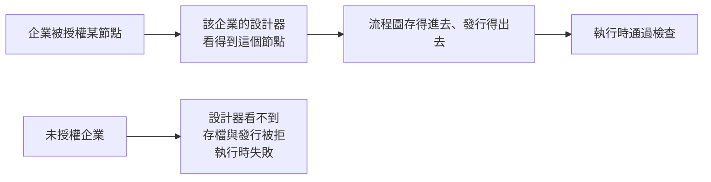

# 節點授權

流程設計器裡有幾種**受限節點**，例如在主機上執行命令、讀寫主機檔案、
用平台自己的 Telegram 或郵件通道發訊息。這些節點出廠只開放給系統預設企業，
其他企業要用得在這裡逐一授權。

!!! abstract "作業：授權某企業使用某節點"
    **MENU**：權限管理 ／ 節點授權

    1. 找到該企業那一列、該節點那一欄
    2. 勾選格子

!!! abstract "作業：收回授權"
    **MENU**：權限管理 ／ 節點授權

    1. 取消勾選格子
    2. 在確認框按 [確定]

批次列的 [全部授權]／[全部撤銷] 一次對所有企業操作同一種節點。

## 授權的判準是「企業」，不是帳號



- 授權掛在企業上。**系統管理員帳號本身沒有特權**：要設計用到受限節點的流程，
  得在系統預設企業（矩陣第一列，標「系統預設企業」）裡做
- 撤銷授權後，該企業**已經在跑的流程一走到這個節點就會失敗**，
  已發行的流程不會自動下架。撤銷前先確認沒有流程在用它

## 三道閘門要全開節點才會動

| 閘門 | 在哪裡設 | 誰管 |
|---|---|---|
| 主機開關 | 安裝目錄的 `.env`，只有碰作業系統的節點有（OS 命令、OS 檔案讀取、OS 檔案寫入） | 主機維運人員 |
| 平台層啟用 | 節點定義的啟用狀態，關著時本頁欄位標「總開關關閉」 | 主機維運人員 |
| 企業授權 | 本頁 | 系統管理員 |

- **「總開關關閉」的欄位仍然可以勾選**，授權會保留，等總開關打開就生效。
  但在打開之前，即使已授權的企業在設計器裡也看不到那個節點
- OS 類三個節點出廠三道全關；Telegram 與郵件類兩個沒有主機開關，平台層預設啟用，
  所以「企業授權」是它們唯一的閘門
- 主機開關與平台層啟用的設定步驟在安裝目錄的 `docs/install/os_node.md` 與
  `docs/install/os_file_write_node.md`

## 畫面上看不出來的規則

- 格子下方的小字是「誰在什麼時候授權的」，只顯示現行這一筆
- **撤銷不會刪掉記錄**，再次授權會新增一筆新的，所以資料庫裡留有完整歷史，
  但本頁不顯示歷史
- 停用中的企業仍會列出並標「停用」，可以先授權，企業啟用後直接生效
- 節點型別由平台程式定義，本頁不能新增節點；哪些節點算「受限」也是程式決定的
- 同一件事也能在主機上用指令做，結果與本頁完全相同：

```bash
# 在安裝目錄執行，先載入 .env
venv/bin/python scripts/node_grant.py list
venv/bin/python scripts/node_grant.py grant OsFileRead <企業代碼>
venv/bin/python scripts/node_grant.py revoke OsFileRead <企業代碼>
```

## 常見問題

**已經勾了，企業的設計器還是看不到節點。**
依序檢查：該欄位是否標「總開關關閉」；OS 類節點的主機開關是否打開並重啟流程執行服務；
該企業是否有表單流程模組的有效合約。三者缺一都看不到。

**授權了「OS 命令」節點，企業的流程設計者就能在主機上執行任何命令嗎？**
是。平台刻意不做命令黑白名單，這個節點等於把主機的執行能力交給該企業的流程設計者。
授權前請確認這是你要的，大多數「讀 log 判斷狀態」的需求用「OS 檔案讀取」就夠了。
