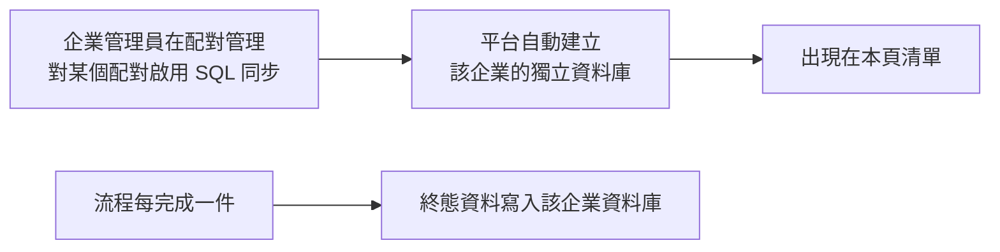

# 企業獨立資料庫管理

這一頁是**跨企業的唯讀總覽**：哪些企業已經有自己的獨立資料庫、各有多大、裡面有哪些表。
這裡不能刪表、不能看資料內容，那些操作在各企業管理員自己的「獨立資料庫」頁面。

!!! abstract "作業：查某家企業的資料庫用量"
    **MENU**：企業管理 ／ 企業獨立資料庫管理

    1. 左側清單點選企業（可用搜尋框輸入企業名稱或網域）
    2. 右側看總大小與資料表清單
    3. 點表頭「筆數」或「總大小」可依該欄排序

!!! abstract "作業：找出佔用空間最大的企業"
    **MENU**：企業管理 ／ 企業獨立資料庫管理

    1. 左側排序列按 [容量]
    2. 清單會依總大小由大到小排列，再按一次反向

## 企業什麼時候會出現在這裡



- **獨立資料庫不是在這裡建立的**。企業管理員（或持流程設計角色的人）第一次對某個表單配對
  啟用 SQL 同步時，平台自動替該企業建一個資料庫；本頁只是把已建好的列出來
- 因此**沒有啟用過 SQL 同步的企業不會出現**，清單空白不代表故障
- SQL 同步**一旦啟用就不能關閉**，所以資料庫建了就會一直留著
- 系統企業自己若也啟用過，同樣會列在這裡

## 畫面上看不出來的規則

- **筆數是估計值**。資料表清單的「筆數」取自資料庫的統計資訊，不是逐筆計算，
  剛寫入大量資料後可能與實際有落差；「總大小」與「索引大小」則是精確的
- **兩個帳號各有用途**：「DDL 帳號」負責建表改表，「DML 帳號」只做資料讀寫。
  流程同步資料時用的是 DML 帳號，平台自己管理結構時才用 DDL 帳號
- **「密碼輪換」顯示「尚未輪換」是正常狀態**。這兩組帳號的密碼由平台隨機產生並加密保存，
  輪換不在網頁上做，由維運人員在主機上用指令執行，預設只輪換超過 90 天沒換過的：

```bash
# 在安裝目錄執行，先載入 .env
venv/bin/python scripts/rotate_credentials.py --dry-run    # 預覽哪些會被輪換
venv/bin/python scripts/rotate_credentials.py              # 只輪換超過 90 天的
venv/bin/python scripts/rotate_credentials.py --force      # 全部輪換
```

- **停用的企業仍會列出**，名稱旁標「停用」；它的資料庫還在，資料也還在
- **只有一家企業時會自動選取**，不必點左側
- 左側每列右邊的數字是「表數 / 總大小」，頁面載入時會逐家查詢，
  企業多時會先顯示「...」，查完才能依表數或容量排序

## 硬刪除企業之後，資料庫不會跟著消失

[企業與合約管理](organizations.md)頁的「永久刪除已軟刪除的企業」會清掉該企業在平台
主資料庫裡的所有資料，**但刻意不刪除它的獨立資料庫**。刪除完成後：

- 該企業從本頁清單消失（因為企業記錄已經不在了）
- 實體資料庫仍留在資料庫伺服器上，佔的空間也還在

要回收空間，到[主機資料清理](data_maintenance.md)的「清理企業孤兒資料」，
「實體資源」區塊會列出這類資料庫與對應的刪除指令，由管理員自己在主機上執行。
平台不提供從網頁直接刪除資料庫的按鈕，這是刻意的。

## 常見問題

**右側顯示「憑證解密失敗，請檢查伺服器環境設定」。**
主機上負責解密資料庫密碼的環境變數遺失或被改過。在這種狀態下平台連不進任何企業的
獨立資料庫，流程同步也會失敗，屬於主機層設定問題，請維運人員檢查 `.env`。

**右側顯示「連線失敗」，其他企業正常。**
只有這一家連不上，通常是該資料庫被人在資料庫伺服器上手動刪除或改名。
平台這邊的記錄還在、實體卻不在，會一直顯示錯誤。

**企業管理員說他在「獨立資料庫」頁看到的表比這裡多或少。**
兩邊查的是同一個資料庫，差異多半是查詢時間點不同。按瀏覽器重新整理再比對一次。

**可以在這裡幫客戶刪掉不用的表嗎？**
不行。刪表會連動標記該企業的表單同步記錄與子系統資料檢視，
必須由該企業管理員在自己的「獨立資料庫」頁執行，那裡會先列出受影響的項目再讓他確認。
