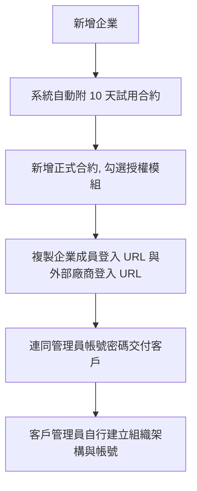

# 企業與合約管理

平台上的每一家客戶就是一個「企業」，資料彼此完全隔離。
本頁是開通新客戶、控管授權期限與功能模組的地方。

!!! abstract "作業：新增企業"
    **MENU**：企業管理 ／ 企業與合約管理 ／ [+ 新增]

    1. 填企業名稱與網域名稱
    2. 填管理員帳號與密碼
    3. 按 [建立企業]

!!! abstract "作業：新增合約、授權模組"
    **MENU**：企業管理 ／ 企業與合約管理

    1. 左側點選企業
    2. 按 [+ 新增合約]
    3. 填開始日期、結束日期，勾選要授權的模組
    4. 按 [新增]

!!! abstract "作業：把多家企業納入集團"
    **MENU**：企業管理 ／ 企業與合約管理 ／ [集團設定]

    1. 按 [集團設定]
    2. 勾選要納入的企業
    3. 輸入集團名稱，按 [建立]

## 一家新客戶從開通到能用

第 2 步是自動發生的：**建立企業後系統會附一份 10 天的試用合約，只授權「表單流程系統」**。
它讓客戶當天就能登入試用，但十天後會過期，正式開通仍要走第 3 步。

兩個登入 URL 在右側面板可直接複製，一個給企業員工、一個給外部廠商，**網址不同、不能混用**。

## 建立後就改不掉的兩個欄位

**企業代碼**與**網域名稱**建立後不可變更（編輯頁上是唯讀的）。
網域名稱是登入帳號的組成部分（`帳號@企業網域`），打錯只能刪除企業重建。

其他限制：

- 網域名稱只能用字母、數字、連字號、點，會自動轉小寫
- 不可使用公共信箱網域（例如 gmail.com）
- 管理員密碼至少 12 碼
- 企業代碼留空時會依企業名稱自動產生

## 模組授權完全由合約決定

平台在判斷某企業能不能看到某個模組時，取的是**該企業所有「狀態為有效、且今天落在起訖日之間」
的合約，把它們勾選的模組聯集起來**。

因此：

- 合約過期或被停用，對應模組的選單**當天就會從客戶畫面上消失**，不會有任何提醒
- 要加購模組不必動舊合約，**另開一份新合約勾選新模組即可**，兩份會疊加
- 系統企業（system.local）不受合約限制，永久有效、無需合約，也不可刪除

!!! warning "合約建立後不能修改，只能停用"
    這是稽核要求。開啟既有合約時只能檢視，唯一能做的動作是 [停用此合約]，
    而**停用之後不能再啟用**。日期或模組填錯，處理方式是停用它再開一份新的。

左側清單「合約」欄顯示的是 `有效份數／總份數`。右側合約清單的狀態有四種：

| 狀態 | 意思 |
|---|---|
| 有效 | 狀態為有效，且今天在起訖日之間 |
| 尚未生效 | 開始日期還沒到 |
| 已過期 | 結束日期已過 |
| 停用 | 被手動停用，不可復原 |

## 帳號上限

每家企業都有帳號上限。建立企業時可以指定，未指定時使用平台預設 **50**。

上限只計「企業成員」與「外部廠商」兩種帳號，企業管理員帳號不計入。企業管理員帳號會綁定一個企業成員帳號，若也計入上限，會把同一個人重複計算。

停用帳號會釋放名額，所以企業可以停用離職者，再把名額給新人。達到上限後，系統會擋下新增企業成員、新增外部廠商、批次匯入，以及重新啟用已停用的帳號。

批次匯入超過上限時會整批拒絕，一筆都不會匯入。錯誤訊息會告訴你本次要新增幾筆、還剩幾個名額。

已經超過上限的企業，例如上限被調低，不影響既有帳號繼續使用；只有上述會增加使用中人數的動作會被擋。

!!! abstract "作業：調整帳號上限"
    **MENU**：企業管理 ／ 企業與合約管理

    1. 左側點選企業
    2. 按 [編輯]
    3. 修改「帳號上限」
    4. 按 [儲存變更]

## 停用與刪除企業

刪除企業是**兩段式**的，兩段之間資料都還在：

| 動作 | 位置 | 後果 |
|---|---|---|
| 停用企業 | 編輯企業頁的「狀態」 | 該企業所有帳號立即無法登入，資料完全保留 |
| 刪除企業 | 編輯企業頁最下方 | 企業與其所有合約一併**標記刪除**，從清單消失、成員無法登入，但資料都還在，可以請開發人員救回 |
| 永久刪除 | 企業列表頁下方「永久刪除已軟刪除的企業」 | 資料真正消失，**無法復原** |

前兩者都會先跳出確認提示；企業還有未到期合約時，停用的提示會一併列出份數與最晚到期日。

## 永久刪除已軟刪除的企業

企業列表頁最下方有一個預設收合的「永久刪除已軟刪除的企業」區塊，展開後會列出
所有被標記刪除的企業、涉及的資料表筆數，以及會一併清掉的檔案與目錄。

這個動作清的東西比想像中多：企業在**所有**資料表裡的資料、企業本身、它上傳的
檔案、加密檔案目錄與 EDL 黑名單目錄，全部一次清掉。

!!! abstract "作業：永久刪除已停用的企業"
    **MENU**：企業管理 ／ 企業與合約管理

    1. 捲到頁面最下方，展開「永久刪除已軟刪除的企業」
    2. 看列出的待刪企業與涉及資料表，確認名單無誤
    3. 按 [執行硬刪除]，在確認視窗按 [確定]
    4. 看結果訊息：**綠色**代表全部刪除完成；**紅色**代表有資料表失敗

**結果要看顏色，不要只看有沒有跑完。** 刪除是逐張資料表處理的，單張失敗不會
中斷其他表，所以「跑完了」不等於「刪乾淨了」。出現紅色訊息與失敗資料表清單時，
該企業**可能還在系統裡**，把清單提供給開發人員，不要重複按執行試圖硬闖。

**它不挑企業。** 一次處理所有被標記刪除的企業，沒有逐一勾選的選項。
只想刪其中一家時，先確認其他企業不在待刪名單上。

**企業獨立資料庫不會自動刪除。** 畫面會列出資料庫名稱與建議指令，
但必須由系統管理員登入伺服器終端機自行執行——刪掉整個資料庫的風險等級
高於刪掉資料表記錄或檔案。

刪完之後如果想確認有沒有殘留，或要清掉更早以前刪企業時漏掉的東西，
到[主機資料清理](data_maintenance.md)。

## 客戶的管理員全部離職或忘記密碼

右側面板的 [管理員管理] 就是為這個情境設計的救援入口。

- 可以啟用／停用該企業的管理員帳號，但**必須至少保留一個啟用中的管理員**
- 重設密碼後，系統會通知該企業的**所有**管理員，包含已停用的帳號

## 集團

多家企業屬於同一個客戶集團時，可用 [集團設定] 把它們歸在一起：
按下按鈕後左側每列會出現勾選框，勾好企業再輸入名稱建立。
點選既有集團可以更新成員、解散集團，或替該集團建立共享資料庫。

集團只是企業的分群，**不會打破企業之間的資料隔離**。

## 常見問題

**客戶說某個功能的選單不見了。**
先看該企業的合約：多半是唯一一份含該模組的合約過期或被停用了。開一份新合約即可恢復。

**合約要延長期限怎麼做？**
不能改舊的，開一份新合約接續日期。舊合約留著即可，兩份的授權會自動聯集。

**新建的企業要用什麼網址登入？**
在左側點選該企業，右側面板的「企業成員登入 URL」與「外部廠商登入 URL」可直接複製。

**建立企業時自動產生的試用合約可以刪掉嗎？**
可以停用它。但客戶在正式合約生效前會失去「表單流程系統」，建議正式合約備妥後再停用。
