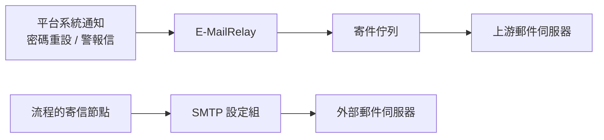

# 主機設定

這裡設定的是**整台平台共用的東西**，不屬於任何一家企業。
左側十個分類各自獨立，改一個不會動到其他。

!!! abstract "作業：設定系統寄信通道"
    **MENU**：主機設定

    1. 左側點 [E-MailRelay]
    2. 填 SMTP 認證的帳號與應用程式密碼，按 [儲存認證]
    3. 填發件人 Email 與名稱，按 [儲存設定]
    4. 在「測試發送」填收件人，按 [發送測試郵件]

!!! abstract "作業：調整登入嘗試的頻率上限"
    **MENU**：主機設定

    1. 左側點 [速率限制]
    2. 改成 `20 per 10 minutes` 這種格式
    3. 按 [儲存速率限制]

!!! abstract "作業：清除過期的稽核紀錄"
    **MENU**：主機設定

    1. 左側點 [稽核設定]
    2. 確認「保留天數」是要的值，改過就先按 [儲存稽核設定]
    3. 按 [清除過期紀錄]
    4. 在確認框看清楚筆數與時間界線，按 [確定]

!!! abstract "作業：檢查套件版本"
    **MENU**：主機設定

    1. 左側點 [套件版本]
    2. 按 [重新查詢]

## 十個分類各管什麼

| 分類 | 管什麼 | 企業能不能覆寫 |
|---|---|---|
| E-MailRelay | 平台自己的系統通知信（密碼重設、警報信）走的中繼服務 | 否，全平台一條 |
| SMTP 郵件 | 給流程「寄信節點」用的外部郵件伺服器設定組 | 可以，企業有自己的一組 |
| Telegram | 給流程「Telegram 節點」用的 Bot 與頻道 | 可以 |
| 收件人群組 | 批次通知用的收件人清單 | 可以 |
| 選單配色 | 各類選單的底色與文字色 | 否，全平台共用一組 |
| 稽核設定 | 操作記錄的詳細程度、保留天數與手動清除 | 否 |
| 速率限制 | 登入與密碼重設的嘗試頻率上限 | 三項可以，見下方 |
| 登入安全欄位 | 三格驗證碼的預設配置 | 可以 |
| 檔案儲存 | 加密附件的存放路徑與單一目錄檔案數上限 | 否 |
| 套件版本 | 版本檢視，沒有任何設定值 | 不適用 |

## 平台有兩條寄信路徑，設定的地方不同

兩條路互不相干：**E-MailRelay 停掉不會讓流程寄不出信，SMTP 設定組沒設也不會影響密碼重設信**。

寄信節點實際會用哪一組 SMTP，是這樣挑的：

1. 節點裡直接指定的那一組
2. 該企業自己標記為「預設」的那一組
3. 該企業其他啟用中的設定組，取優先順序數字最小的
4. 都沒有，才輪到這裡設定的系統級設定組，同樣取優先順序數字最小的

!!! warning "系統級這層不看「預設」勾選，只看優先順序"
    第 4 步取的是**啟用中、優先順序數字最小**的那一組。
    在系統級勾「設為預設」不會改變被挑中的順序，要換就改優先順序數字。

**Telegram 沒有這套自動挑選**：流程節點必須明確指定設定組與頻道，指不到就直接報錯。
反過來說，**建在這裡的 Telegram 設定組，所有企業的流程都選得到**——
只放共用的通知頻道，客戶專屬的頻道請讓客戶建在自己的企業設定裡。

## E-MailRelay 的三件事

- **[發送測試郵件] 成功只代表信已排進寄件佇列**，不代表對方收到。
  上游拒收、認證錯誤都要等實際投遞才知道，收不到就回頭檢查 SMTP 認證。
- **改安裝目錄會連帶改寫該服務的開機設定並重新載入**。
  路徑不合格（缺少投遞工具或佇列目錄）會直接擋下來不給存。
- **SMTP 認證存成主機上的獨立檔案**（僅限擁有者讀寫），不放在資料庫裡。
  換主機或重裝時這份要另外處理，不會跟著資料庫備份走。

## 速率限制：存過一次之後，環境變數就不再有效

每一列右邊會標來源：

| 標示 | 意思 |
|---|---|
| （目前使用預設值） | 沒設過，用內建值 |
| （目前使用環境變數） | 由安裝時的環境設定決定 |
| （DB 設定） | 在這個畫面存過，以這裡為準 |

**在這裡按過一次 [儲存速率限制]，該項就永遠變成「DB 設定」**，
之後再改環境變數不會有任何效果，也不會有提示。要回到環境變數的值只能手動改回來。

其他三點：

- 只計算 POST 的送出動作，**開著登入頁不動不會累積次數**
- 計數單位是「帳號 + 來源 IP」，同企業的其他人不受影響
- 存檔即時生效，不必重啟服務

五項當中，**企業成員登入、廠商登入、忘記密碼**這三項企業可以自己設定，
企業有設就以企業的為準；通用登入與密碼重設驗證只吃這裡的設定。

## 稽核設定：登入紀錄不受等級影響

三個等級的差別在於「除了認證事件以外還記多少」：

| 等級 | 除認證事件外還記錄 |
|---|---|
| MINIMAL | 不再記錄其他 |
| STANDARD | 所有寫入操作（新增／修改／刪除） |
| VERBOSE | 再加上所有讀取操作，資料量很大 |

**登入、登出、登入失敗在任何等級都會記錄**，所以把等級降到 MINIMAL 不會讓
[本機登入錯誤監看](login_failures_local.md)失去資料，只會讓其他操作查不到軌跡。

### 過期資料不會自動消失，要自己按

平台**沒有自動清理排程**。改小保留天數不會讓舊資料立刻消失，
要按 [清除過期紀錄] 才會真的刪除，一次刪掉「建立時間早於今天減保留天數」的紀錄。

- **刪除依據是已儲存的天數，不是畫面上剛改還沒存的數字**。改過欄位請先按 [儲存稽核設定]
- 按下後會先試算，確認框會顯示**將刪除幾筆、時間界線是哪一天**，看清楚再按確定
- **刪除不可復原**，被刪掉的紀錄在[本機登入錯誤監看](login_failures_local.md)也會一併消失
- 資料量大時要跑一會兒，按鈕會變成「處理中...」，不要重複點

!!! warning "VERBOSE 等級要搭配定期清除"
    VERBOSE 會記錄每一次讀取，資料量成長很快。切到這個等級排查問題後，
    記得切回 STANDARD，並在事後按一次 [清除過期紀錄]。

## 其他分類的隱藏規則

- **選單配色**：儲存後要**重新整理頁面**才看得到變化；這組配色是全平台共用的，
  所有企業的所有使用者看到的都一樣。[重置為預設] 會清掉整組自訂值，不能只還原一種顏色
  （單一顏色旁的 [R] 才是只還原那一格）
- **登入安全欄位**：這裡設的是**所有企業的預設值**，企業可以在自己的設定裡覆寫。
  三格不能重複指定（下拉選單會自動把已被占用的選項變灰）；救助關鍵字留空等於停用該功能，
  比對時忽略大小寫。三格各自的用途見[登入與登出](../01_getting_started/login.md)
- **檔案儲存**：路徑是安裝時決定的，畫面上唯讀，要換得改主機設定後重啟服務。
  單一目錄檔案數上限只影響**接下來的新檔案該放哪個目錄**，
  改小不會搬動已經存在的檔案，改完立即生效
- **套件版本**：只做檢視，沒有線上升級。查詢結果快取 30 分鐘，
  [重新查詢] 會強制重查；封閉網路連不到外部套件庫時顯示「無法檢查」是正常的

## 常見問題

**流程的寄信節點報錯說沒有可用的 SMTP 設定。**
表示該企業沒有啟用中的設定組，這裡的系統級也沒有。在這裡建一組並確認狀態是「啟用」即可兜底。

**改了速率限制，客戶說還是被擋。**
先確認該企業有沒有自己的設定覆寫掉這裡的值；另外已經計數中的視窗要等它過完才會用新的上限。

**E-MailRelay 顯示「已停止」，按 [啟動] 沒反應。**
這是主機層的服務，狀態卡在停止多半是主機上的服務設定或權限問題，
Web 畫面能做的只有下達啟動指令，需要到主機上確認。

**這裡的 SMTP 設定組，客戶看得到嗎？**
看不到，客戶只看得到自己企業的設定組。但流程真的寄信時可能會用到這裡的設定（見上方挑選順序），
所以這組的寄件人位址等於是全平台的最後備援門面。
