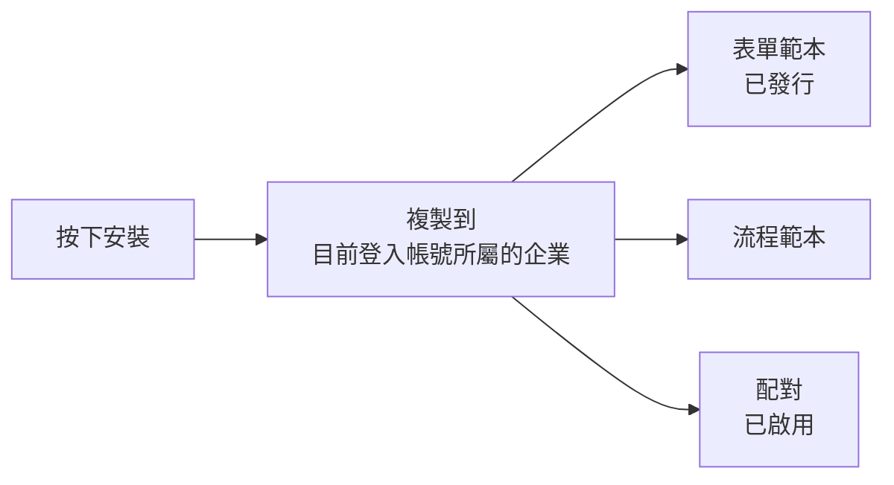

# 內部商場

商場提供官方的**表單與流程範本**，按 [安裝] 就會複製一份到自己的企業，
之後可以自由修改，與商場再無關聯。

!!! abstract "作業：安裝一個範本"
    **MENU**：內部商場

    1. 用篩選列切換「表單+流程」或「表單範本」
    2. 在商品卡片按 [安裝]
    3. 在確認框按 [確定]

## 安裝到哪裡，誰能安裝



- **裝進的是「你登入的那個企業」**。系統管理員按安裝，範本會裝進系統企業，
  不會裝進任何客戶。要幫客戶安裝，得用該客戶的企業管理員帳號登入操作
- **只有管理員能安裝**（企業管理員或系統管理員）。一般成員看得到商場、也看得到 [安裝] 按鈕，
  按下去會得到權限錯誤，這是預期行為
- 裝好的表單範本直接是「已發行」、配對是「已啟用」，員工馬上就能在表單中心看到並送件。
  不想這麼快開放的話，裝完先到配對管理把它停用
- 建立者欄位會顯示「內部商場」

## 畫面上看不出來的規則

- **同一個商品每個企業只能安裝一次**。裝過之後卡片變成「已安裝」，即使你把裝出來的範本刪了，
  也不能再從商場裝一次
- **「可升級」只是提示，沒有升級按鈕**。它表示商場上的版本比你當初裝的新，
  但平台目前沒有升級功能，也不會動到你已安裝的範本
- 商場清單對所有企業相同，只有標記為「僅系統企業」的商品在客戶那邊看不到
- 商品的分類篩選只有畫面上那三個，沒有更細的搜尋

## 商品從哪裡來

**全新安裝的平台，商場是空的**。商品由維運人員在主機上用指令載入，
來源是安裝目錄底下 `fixtures/store/` 的定義檔，出廠只附一個「請假申請範本」：

```bash
# 在安裝目錄執行，先載入 .env，再進 backend 目錄
flask store seed            # 載入新商品；版本號變了的會更新
flask store seed --force    # 全部重新載入，覆蓋既有商品
```

- 版本號沒變的商品會被略過，改了定義檔內容但沒改版本號不會生效
- 重新載入只更新商場上的商品，**不影響任何企業已經安裝出來的範本**
- 要提供自己的範本，在同一個目錄新增一個定義檔再執行上面的指令；
  定義檔格式可參考出廠附的那一個

## 常見問題

**客戶說商場是空的。**
維運人員還沒執行載入指令，或客戶看的商品全被標成「僅系統企業」。

**安裝時出現「已安裝 (v1.0)」。**
這個企業之前裝過同一個商品。商場不會重複安裝，需要第二份請在表單範本頁用複製功能。
