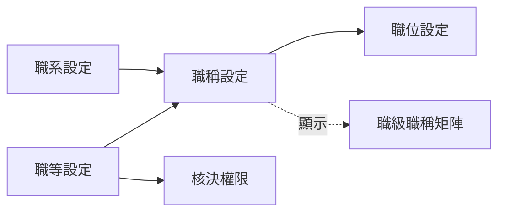

# 職級職稱矩陣

一張表看完貴公司的職等與職稱：**列是職等（高的在上）、欄是職系、格子裡是職稱**。
它也是「職級職稱」這組六頁的總覽，先讀這頁再到各頁建資料。

!!! abstract "作業：看整體結構、搬動職稱"
    **MENU**：職級職稱 ／ 職級職稱矩陣

    1. 找到要搬的職稱，按住拖到另一個格子
    2. 放開就存檔，右上角短暫出現「已更新」；拖錯就再拖回去

## 六頁之間的關係

| 頁 | 管什麼 |
|---|---|
| [職等設定](job_levels.md) | 高低順序：總經理級、經理級、職員級 |
| [職系設定](job_families.md) | 職涯軌道：管理職、專業職，專業職底下再分業務、工程等 |
| [職稱設定](job_titles.md) | 正式頭銜＝一個職等＋一個職系 |
| [核決權限](job_approval_categories.md) | 各職等在各費用類別的核決金額上限 |
| [職位設定](positions.md) | 哪位成員、在哪個部門、掛哪個職稱 |

建議的建置順序：職等 → 職系 → 職稱 → 職位；核決權限只要有職等與職系就能設。
**新企業這六頁一開始全是空的**，沒有出廠範本。

## 這組設定怎麼進到流程

這六頁是企業的人事結構資料。**流程不會自動讀它們**：要讓簽核送給直屬主管、依金額找核決人、
或依職等與職系分流，流程裡要先放一顆[人事資料取值節點](../04_form_workflow/hr_lookup_node.md)，
它會把申請人的職等、職稱、職系、直屬主管、核決上限變成流程變數，後面的分支與簽核節點才用得到。
沒有放這顆節點的流程，這裡怎麼設都不會影響簽核。

## 矩陣上看不出來的規則

- **只顯示啟用中的**職等、職系、職稱。停用的一律不出現，資料仍在
- **有子職系的職系不會成為一欄**，只有末端職系（沒有子職系的）才有欄位。
  直接掛在上層職系上的職稱因此不會出現在矩陣上，見[職系設定](job_families.md)
- **拖拉會同時改職等與職系**，而且立刻存檔，沒有確認、沒有復原鍵
- **拖拉後，職稱的「帶人主管」旗標一律重設為所在職等的「管理職」設定**，就算只是橫向換職系也一樣：
  落在管理職等的格子就變成帶人主管（藍框），落在非管理職等就取消。
  在職稱設定頁改職等不會這樣連動，只有拖拉會
- 藍框＝帶人主管的職稱；職等旁的「管理」標記＝該職等勾了管理職
- 這頁只能搬，不能新增或刪除；同一格內的多個職稱沒有順序可調

## 常見問題

**矩陣是空的，只看到「尚無資料」。**
職等、職系、職稱缺任何一種就不顯示。頁面上的三個連結分別通往建立頁。

**我建的職稱在矩陣上找不到。**
依序查：職稱是否停用；它的職等或職系是否停用；它掛的職系是不是後來多了子職系
（上層職系不成為欄位）。
