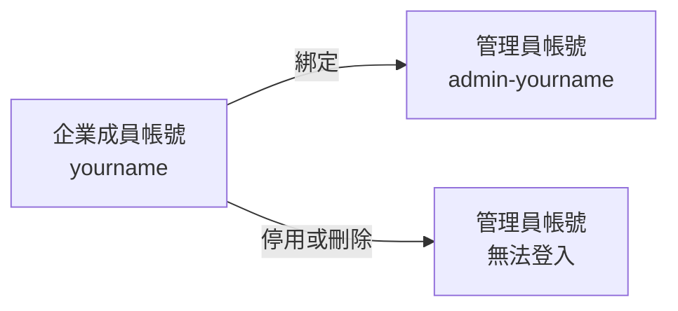

# 企業管理員

企業管理員是**綁在某位企業成員身上的第二組帳號**。一個人日常填單、簽核用自己的成員帳號，
要改企業設定、建帳號、指派角色時才切換到 `admin-` 開頭的管理員帳號。
這一頁管的就是這種帳號：新增、停用、重設密碼、刪除。

!!! abstract "作業：新增管理員"
    **MENU**：系統管理 ／ 企業管理員

    1. 按 [+ 新增管理員]
    2. 在「綁定企業成員」選一位同仁（姓名、帳號、通知信箱會自動帶入）
    3. 填密碼（可按 [建議密碼] 產生）
    4. 按 [建立管理員]

!!! abstract "作業：重設某位管理員的密碼"
    **MENU**：系統管理 ／ 企業管理員

    1. 該列按 [重設密碼]
    2. 填新密碼兩次，按 [確認重設]

!!! abstract "作業：停用、啟用或刪除管理員"
    **MENU**：系統管理 ／ 企業管理員

    1. 該列按 [停用]（或 [啟用]、[刪除]）

## 帳號名稱與綁定關係

- 管理員帳號固定是 **`admin-` 加上被綁定成員的帳號**，網域與成員相同。
  建立後名稱改不了，姓名與通知信箱也是從成員帶入的
- **一位成員只能綁一個管理員**。下拉清單只列出「有用戶編號、啟用中、尚未被綁定」的企業成員；
  找不到某人多半是這三個條件之一不符
- 清單是空的時候會直接顯示「無法建立管理員」，先到[企業成員帳號](users.md)建立至少一位有編號的成員
- **綁定的成員一停用或刪除，對應的管理員立刻無法登入**，登入頁會顯示「綁定的企業成員帳號已停用」。
  離職流程只要停用成員帳號，管理員帳號會跟著失效，不必另外處理
- 管理員帳號不計入企業的帳號上限

## 預設管理員

列表裡標「(預設)」的是建立企業時系統產生的原始管理員（`admin@貴公司網域`）。
它不綁任何成員，也不受合約效期限制，只用來完成初次設定：

- 第一次用它登入會被強制導向初始設定頁，建立第一位成員與綁定管理員後，它會**自動停用**
- 在本頁新增管理員時，若預設管理員還在啟用狀態，也會一併被停用
- **停用後只有系統管理員能再啟用**，本頁按 [啟用] 會被拒絕。這個帳號名稱人人猜得到，
  平時保持停用是刻意的
- 只有預設管理員有出廠編號（`ADM001`），之後新增的管理員不會自動取號

## 三道防呆

| 動作 | 限制 |
|---|---|
| 停用或刪除自己 | 不允許，自己那列只顯示「（自己）」 |
| 重設自己的密碼 | 不允許，請走個人設定的「變更密碼」 |
| 停用或刪除最後一個啟用中的管理員 | 不允許，企業至少要留一個能登入的管理員 |

!!! warning "建議至少保留兩個啟用中的管理員"
    全部管理員都失效（忘記密碼、離職、同時被鎖）時，這頁沒有自助救援入口，
    只能請系統管理員從平台端處理。平時多留一個備用管理員，就能互相重設密碼。

## 重設密碼會通知所有管理員

在本頁重設任何一位管理員的密碼，系統會寄「管理員密碼已重設」通知給**這家企業全部的管理員，
包含停用中的**，寄到各自的「備用 Email 1」，沒填的才寄主信箱。
信裡有操作者、被重設的帳號與時間，目的是讓其他管理員知道有人動過密碼。
通知信寄不出去時畫面會顯示紅色錯誤，但**密碼已經重設完成**，不必重做；
寄不出去的原因在平台主機的發信服務，請通知系統管理員。
新密碼要符合企業的密碼政策，畫面會即時提示還缺什麼。

## 常見問題

**我用管理員帳號登入被拒，訊息是「綁定的企業成員帳號已停用」。**
你的成員帳號被停用了，請另一位管理員到企業成員帳號把它啟用，管理員帳號就會恢復。

**想綁定的同仁不在下拉清單裡。**
依序檢查：他是不是企業成員（外部廠商不能綁）、有沒有用戶編號、帳號是否啟用、
是不是已經綁了另一個管理員。

**可以直接用管理員帳號填單、簽核嗎？**
技術上可以，但不建議。管理員權限很大，日常作業請用成員帳號，
需要管理設定時再切換。

**刪除管理員後，那位同仁的成員帳號會怎樣？**
不受影響。刪除的只是管理員帳號，成員帳號照常使用，之後也可以再替他建一個新的管理員帳號。

**所有管理員都忘記密碼或都被停用了。**
本頁無法處理，請聯絡系統管理員，平台端有專為這個情境設計的救援功能。
