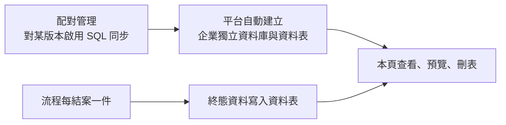

# 企業獨立資料庫

貴公司對某個表單版本啟用 SQL 同步之後，平台會替貴公司建一個**獨立的資料庫**，
流程結案的資料寫在那裡，供報表或 BI 工具直接查詢。
這一頁是那個資料庫的管理入口：看有哪些表、各有多大、預覽內容，以及刪掉不再需要的表。

!!! abstract "作業：預覽某張表的資料"
    **MENU**：系統管理 ／ 獨立資料庫

    1. 左側清單點表名，右上方列出資料
    2. 點某一列的列號，右下方顯示該筆的所有欄位
    3. 拖曳中間的分隔線可以調整上下比例

!!! abstract "作業：刪除不再需要的資料表"
    **MENU**：系統管理 ／ 獨立資料庫

    1. 左側勾選要刪的表（可用 [反選]，或勾最上方的全選）
    2. 按 [刪除選取]
    3. 對話框會列出每張表的筆數與會被連動標記的項目，確認後按 [確認刪除]

## 什麼時候會有內容

- **資料庫不是在這裡建的**。第一次在[配對管理與發行](../04_form_workflow/mappings.md)
  對某個版本打開「SQL 同步」時平台自動建立；沒啟用過的企業開這頁只會看到
  「尚未建立獨立資料庫」，不是故障
- 寫入時機是**流程結束**。簽核途中的單子在這裡查不到，這是正常的
- 每次「新發行」都會為新版本建新表，舊表留著。所以表會越來越多，
  清掉舊版的表就是這頁存在的主要理由

## 為什麼表比表單版本多

一個啟用同步的版本會產生不只一張表：

| 表 | 內容 |
|---|---|
| 主表（名稱等於版本清單的「資料表名稱」） | 每件單子一列，欄位對應表單欄位 |
| `主表_approvals` | 該單子的簽核紀錄 |
| `主表_items_<欄位>` | 表單裡的表格型欄位，每一列一筆 |

刪主表時附屬的表不會自動一起刪，要一併勾選。

## 預覽的限制

- 一次最多顯示 **100 筆**，有 `id` 欄位的表以最新在前
- 二進位欄位顯示為 `(binary)`，不會顯示內容
- 這裡只能看，不能改資料。要修正內容請用資料庫工具直接連線

## 刪表之後會發生什麼

- **無法復原**，資料一併消失。刪之前先在預覽確認是哪一版的資料
- 該表在配對管理裡對應的同步登記會被標記為已刪除，**之後這個版本再結案的單子不會寫入，
  也不會自動把表建回來**。要恢復同步得重新發行一個新版本
- 子系統若有資料檢視引用這張表，會被自動停用，並在說明欄註記「已透過企業獨立資料庫管理刪除」。
  對話框裡的「以下稽核記錄將被標記」列的就是這些
- 刪表不會影響平台主資料庫裡的表單紀錄，表單中心照樣查得到那些單子

## 畫面上的其他數字

- **筆數是估計值**，來自資料庫的統計資訊，剛大量寫入時可能與實際有落差；
  預覽標題上的「共 N 筆」才是精確計數。「總大小」與「索引大小」是精確的
- 上方的「DDL 帳號」負責建表改表，「DML 帳號」只做資料讀寫，流程寫入用的是後者。
  畫面只顯示帳號名稱，**密碼不會出現在畫面上**
- 「密碼輪換」顯示「尚未輪換」是正常的，輪換由系統管理員在主機上執行

## 常見問題

**頁面顯示「憑證解密失敗，請檢查伺服器環境設定」。**
平台主機端的設定出了問題，這時所有企業的獨立資料庫都連不上，流程同步也會失敗。
請聯絡系統管理員。

**頁面顯示「連線失敗」。**
資料庫在伺服器上被移除或改名了，平台的登記還在。請聯絡系統管理員確認。

**我想用 BI 工具直接連這個資料庫。**
連線主機、資料庫名與帳號名稱都在畫面上方，密碼請向系統管理員索取。
建議用 DML 帳號連線，它只有資料讀寫權限。

**刪錯表了。**
沒有還原路徑。若該版本仍在使用，重新發行一個新版本會建出新表，之後結案的單子會寫進新表；
已刪掉的舊資料只能從資料庫備份找回，請聯絡系統管理員。
