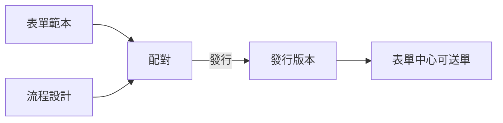

# 流程設計

!!! abstract "作業：建立流程"
    **MENU**：表單流程 ／ 流程設計

    1. 按「+ 新增工作流」，填名稱、選分類
    2. 按「編輯」進設計器
    3. 從左欄「流程元件」把節點拖進畫布
    4. 點節點，右欄「設定面板」填該節點的設定
    5. 節點之間拉線決定先後順序
    6. 按「儲存」

一張流程要能被人使用，還要跟表單配對並發行，見[配對管理與發行](mappings.md)。

## 節點分成八組

左欄依用途分組，展開才看得到組內的節點。

| 組 | 用途 | 組內節點 |
|---|---|---|
| 基本節點 | 流程終點 | 結束 |
| 表單處理 | 交給人簽核 | 簽核 |
| 通知機制 | 送出訊息 | Telegram 通知、Email 通知、跑馬燈廣播、緊急廣播 |
| 流程控制 | 決定走哪條路、等多久 | 分支、匯合、並行分支、並行匯合、暫停、子流程 |
| 資料處理 | 讀寫表單欄位與流程變數 | 設定變數、讀取欄位、寫入欄位 |
| 系統整合 | 呼叫平台以外的能力 | [SQL 執行](sql_executor_node.md)、[AI 分析](ai_agent_node.md)、子系統配置 |
| 安全管控 | 機器處置 | API Key 處置 |
| 系統專用 | 強制中止 | 中止 |

起點（Start）是每個流程本來就有的，不必自己拉。

## 畫面上看不出來的規則

### 儲存不等於生效

表單中心跑的是**發行版本的快照**，不是設計器裡的圖。改完流程按了儲存，
使用者送的單還是照舊版走，**而且不會有任何提示**。改完一定要回配對管理按「新發行」。

例外是**還沒發行過的配對**：這種配對直接採用設計圖，所以設計中的流程可以邊改邊測試。

### 「儲存」與「另存新版」

「儲存」改的是同一份流程，已發動的單不受影響（它們跑的是自己那一版的快照）。
「另存新版」複製一份新的流程，原本那份留著。想保留舊設計又要大改時用後者。

### 引用資料的寫法

節點設定裡可以帶入流程中的資料，寫法固定：

| 寫法 | 取到的東西 |
|---|---|
| `${f.欄位識別碼}` | 表單欄位值 |
| `${v.變數名}` | 流程變數 |
| `${wi.exec_code}` | 流程編號，例如 `OD-20260821-0003` |

**變數是平的，`${v.結果.欄位}` 這種寫法取不到值**（結果會變成空字串）。
會回傳多個欄位的節點都會另外攤平成 `${v.結果_欄位}`，要比大小、判斷內容就用攤平的那個。

### 分支節點會走完每一條命中的規則

分支不是「命中第一條就停」，**所有條件成立的規則都會展開**。規則之間沒有互斥時，
一張單會同時往好幾條路跑。

條件列的「且／或」是**分組符號**：遇到「或」就切一組，同組之內是「且」，組與組之間是「或」。
想表達「A 且 B」，兩條都要標「且」。

欄位沒有值或型別對不上時，該條件一律判定為不成立。可以刻意利用這點，
讓資料不齊的單落到預備路徑。

### 結束節點決定其他分支的下場

結束節點有三種模式，**有並行分支時選錯會留下永遠不會結束的節點**：

| 模式 | 行為 |
|---|---|
| 分離執行（預設） | 直接結束，不管還沒跑完的節點 |
| 取消未完成 | 結束並取消所有未完成節點——**有並行分支時用這個** |
| 嚴格等待 | 等全部節點完成才結束 |

另外，**結束節點是流程層級的**：並行的兩條路只要有一條走到結束，整張單就結束了，
另一條上的簽核任務會被視為流程已結束。要讓某條分支安靜收尾，
就讓它的最後一個節點**不要連出任何線**，不要接到結束節點。

### 沒有連出去的節點是安靜結束

節點後面沒有接線不會報錯，該分支就到此為止。這是正常用法，不是漏接。

## 常見問題

**改了流程，使用者送的單還是舊的**——沒有重新發行。見上方「儲存不等於生效」。

**流程卡在某個節點不動**——先看該節點是不是在等人簽核（簽核節點）或等時間到（暫停節點）。
都不是的話，到表單中心開該筆單的流程圖，節點上會標示執行狀態與錯誤訊息。

**節點設定填了變數，執行結果是空的**——變數名稱打錯、或用了 `${v.a.b}` 這種巢狀寫法。
把節點實際寫出的變數名稱抄下來用。
