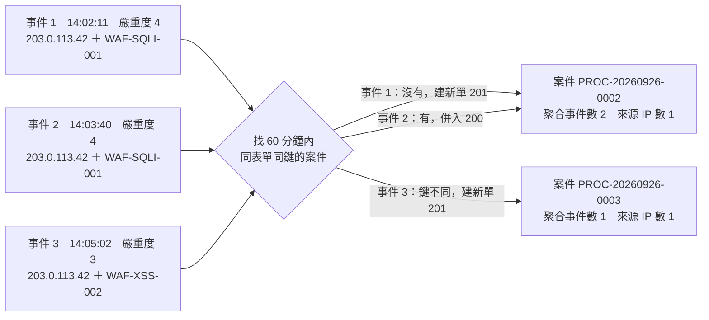

# 持續事件如何累加到同一張案件

攻擊是連續的。一個來源對登入頁跑 SQL injection 工具，WAF 一分鐘就能產生 50 筆告警；
如果每筆都建一張案件，值班人員會面對 50 張內容幾乎相同的單，真正要做的判斷（封鎖或放行這個來源）卻只有一個。

所以 `POST /api/trigger/form` 建立資安案件時，平台會先判斷這筆事件是不是「已經有一張單在處理的同一群事件」。
是，就把事件併入那張單，回 `200` 並帶 `merged: true`；不是，才建新單回 `201`。

「併入」做的事是累加，不是覆蓋：案件的「聚合事件數」加一、事件摘要追加一筆到「持續事件」分頁、
來源 IP 去重後記錄、嚴重度只升不降、風險分數重算。案件本身的流程不會重跑，也不會另發通知。

你需要的身分——送事件：[管理員配發](by_admin.md)或[表單申請](by_request.md)拿到的 API Key；
看案件：資安人員（`SECURITY_STAFF`）；調整聚合規則：企業管理員。

!!! note "只有資安案件表單會聚合"
    聚合判斷只對「資安案件」分類下的表單啟動（DemoSOC 出廠的 `SEC_INCIDENT_RESPONSE`、`SEC_IR_SOC_TEAM`、
    `SEC_IR_SOLO` 都是）。用同一把 Key 建一般表單（例如差旅費）時每次都是新單。

## 平台怎麼判斷「同一群」

平台替每筆事件算一個「分組鍵」，再拿這個鍵去找「同一張表單、同一企業、視窗內、鍵完全相同」的既有案件。
找到就併入，找不到就建新單並把鍵存進新單。沒有自訂規則時，用的是下面這組預設值：

| 設定 | 預設值 | 意思 |
|---|---|---|
| 分組鍵 | `actor_ip` ＋ `finding_rule_id` | 攻擊者 IP 與規則 ID 兩個值都完全相同，才算同一群 |
| 視窗 | 60 分鐘 | 只在這段時間內找可併入的案件；超過就開新單 |
| 視窗起點 | 案件建立時間 | 從案件建立那一刻起算 60 分鐘，固定不延長。可改成「最後一筆事件起算」變成滾動視窗，見「調整聚合規則」 |
| 已結案合併閾值 | 2 | 嚴重度 2 以下（含）的事件可以併入已結案的案件；3 以上只併進行中的案件。見「已結案的案件會不會被併」 |

### 分組鍵怎麼組出來

用 `/api/trigger/form` 送件時，平台從 `form_data` 取六條共同軸線
（`severity_id`／`actor_ip`／`target_host`／`source_system`／`finding_rule_id`／`occurred_at`），
依規則勾選的分組欄位把值串起來，前面加上規則代碼、後面加上入口種類，形成類似下面的鍵
（分隔符是不可見字元，這裡以 `|` 表示）：

```text
rule:<規則代碼>:203.0.113.42|WAF-SQLI-001|kind=trigger
```

從這個組法可以推出四條規則，都是實際會踩到的：

- **任一分組欄位缺值就不併。** 事件少了 `finding_rule_id`（或值是空字串），平台算不出鍵，這筆事件各自開一張新單；而且那張單上沒有分組鍵，之後任何事件都併不進去。
- **不同表單不互併。** 候選案件的查詢限定同一張表單模板。同一個來源同一條規則，一筆送到 `SEC_INCIDENT_RESPONSE`、一筆送到 `SEC_IR_SOC_TEAM`，會是兩張單。
- **不同入口不互併。** 鍵尾端的 `kind=trigger` 讓本節的路徑與整合型防禦節點走的 `/api/open_defense/intake` 路徑分開，即使軸線值相同。
- **比對是逐字。** `WAF-SQLI-001` 與 `waf-sqli-001` 是兩群；設備端輸出規則 ID 的大小寫要固定。

### 聚合設定從哪條規則來

聚合設定住在「開放防禦 ／ 事件路由設定」的路由規則裡，每條規則各有一組「聚合」設定。
`/api/trigger/form` 路徑是呼叫端自己指定表單，不走規則的比對條件，所以平台的取法是：
**在啟用中的規則裡，找「目標表單」等於你指定那張表單、優先序最高的一條，讀它的聚合設定；找不到就用上表的預設值。**
規則本身的比對條件（嚴重度、來源系統之類）在這條路徑完全不看。

以 DemoSOC 出廠設定為例：送 `SEC_INCIDENT_RESPONSE` 時取到「全部事件（catch-all）」，它沒有自訂聚合，所以是預設值；
送 `SEC_IR_SOC_TEAM` 時取到「高嚴重度走 SOC 團隊版」；`SEC_IR_SOLO` 對應的規則出廠是停用的，所以也是預設值。

### 三筆事件落到兩張單



同來源同規則的事件 1、2 落到同一張單；事件 3 規則 ID 不同，即使來源相同也另開一張。案件編號取自下一節的實跑。

## 實際看一遍

!!! abstract "作業：連送幾筆事件，觀察併入與開新單"
    **工具**：平台安裝目錄下的 `scripts/bp_trigger.py`

    1. 設定三個環境變數（與[建立第一張案件](create_case.md)同一把 Key）
    2. 依序送出下列事件
    3. 看每筆回的是 `201`（新單）還是 `200`（併入）

以下對 `SEC_INCIDENT_RESPONSE` 連送幾筆事件。回應是實跑結果，只把案件的識別碼換成佔位文字。

```bash
export BP_BASE_URL=http://192.168.0.112:8000/beakplatform
export BP_KEY_ID=ak_a85efc52cc2455a4
export BP_SECRET='<領取時顯示一次的 secret>'
```

### 事件 1：第一筆，建新單（201）

```bash
python3 bp_trigger.py --form-code SEC_INCIDENT_RESPONSE \
  --subject 'WAF-01 SQL injection 203.0.113.42 -> www.demo.internal' \
  --field finding_title='SQL injection attempt on /login' \
  --field finding_summary='WAF 攔截到 /login 的 POST 參數含 UNION SELECT，10 秒內 3 次' \
  --field event_class='web_attack' --field source_system='waf-01' --field severity_id=4 --field confidence=90 \
  --field occurred_at='2026-09-26T14:02:11Z' --field actor_ip=203.0.113.42 --field actor_country=XX \
  --field actor_user_agent='sqlmap/1.8' \
  --field target_host=www.demo.internal --field target_url='/login' --field target_service=https \
  --field finding_rule_id=WAF-SQLI-001 --field finding_rule_set=owasp-crs \
  --field detector_hint_action=block --field detector_hint_ttl_sec=3600
```

```text
建單成功（HTTP 201）
{
  "data": {
    "execution_code": "PROC-20260926-0002",
    "form_instance_secure_code": "<表單實例識別碼>",
    "serial_number": "Form-260900021",
    "workflow_instance_secure_code": "<流程實例識別碼>"
  },
  "message": "表單已送出，流程已啟動",
  "success": true
}
```

這一步平台算出分組鍵「`203.0.113.42` ＋ `WAF-SQLI-001`」，60 分鐘內沒有同鍵案件，所以建了 `PROC-20260926-0002`，
並把鍵、第一筆事件摘要、來源 IP 清單一起寫進案件。

### 事件 2：同來源同規則，併入（200）

一分半後同一個來源又觸發同一條規則。這次只送最小欄位集也沒關係，分組欄位有帶到即可：

```bash
python3 bp_trigger.py --form-code SEC_INCIDENT_RESPONSE \
  --subject 'WAF-01 SQL injection 203.0.113.42 -> www.demo.internal' \
  --field finding_title='SQL injection attempt on /login' --field source_system='waf-01' --field severity_id=4 \
  --field occurred_at='2026-09-26T14:03:40Z' --field actor_ip=203.0.113.42 --field target_host=www.demo.internal \
  --field target_url='/login' --field finding_rule_id=WAF-SQLI-001
```

```text
事件已併入既有案件 PROC-20260926-0002（累計 2 筆）（HTTP 200）
{
  "data": {
    "merged_into": {
      "execution_code": "PROC-20260926-0002",
      "form_instance_secure_code": "<表單實例識別碼>",
      "od_event_count": 2,
      "workflow_instance_secure_code": "<流程實例識別碼>"
    }
  },
  "merged": true,
  "message": "事件已併入既有案件",
  "success": true
}
```

回應結構與 201 不同：頂層多了 `merged: true`，`data.merged_into` 告訴你併進了哪張單、目前累計幾筆。
`subject` 在併入時不會被使用，案件標題維持第一筆的。設備端程式要同時處理 201 與 200 兩種成功回應。

### 事件 3：同來源、不同規則，建新單（201）

```bash
python3 bp_trigger.py --form-code SEC_INCIDENT_RESPONSE \
  --subject 'WAF-01 XSS 203.0.113.42 -> www.demo.internal' \
  --field finding_title='Reflected XSS attempt on /search' --field source_system='waf-01' --field severity_id=3 \
  --field occurred_at='2026-09-26T14:05:02Z' --field actor_ip=203.0.113.42 --field target_host=www.demo.internal \
  --field target_url='/search' --field finding_rule_id=WAF-XSS-002
```

```text
建單成功（HTTP 201）
{
  "data": {
    "execution_code": "PROC-20260926-0003",
    "form_instance_secure_code": "<表單實例識別碼>",
    "serial_number": "Form-260900022",
    "workflow_instance_secure_code": "<流程實例識別碼>"
  },
  "message": "表單已送出，流程已啟動",
  "success": true
}
```

來源一樣，但 `finding_rule_id` 從 `WAF-SQLI-001` 變成 `WAF-XSS-002`，分組鍵不同，所以是新的一張 `PROC-20260926-0003`。
如果你希望「同一個來源不管觸發什麼規則都一張單」，要改規則的分組鍵只勾「攻擊者 IP」（見「調整聚合規則」），
或由設備端指定 `case_group_key`。

### 事件 4：缺 `finding_rule_id`，各自開單（201）

```bash
python3 bp_trigger.py --form-code SEC_INCIDENT_RESPONSE \
  --subject 'WAF-01 unknown 203.0.113.42' \
  --field finding_title='no rule id' --field source_system='waf-01' --field severity_id=2 \
  --field actor_ip=203.0.113.42 --field target_host=www.demo.internal
```

```text
建單成功（HTTP 201）
{
  "data": {
    "execution_code": "PROC-20260926-0004",
    "form_instance_secure_code": "<表單實例識別碼>",
    "serial_number": "Form-260900023",
    "workflow_instance_secure_code": "<流程實例識別碼>"
  },
  "message": "表單已送出，流程已啟動",
  "success": true
}
```

沒有規則 ID，平台算不出分組鍵，這筆就是獨立的一張單。這張單在清單 API 的 `od_event_count` 是 1、
`od_actor_ip_count` 是 0，案件畫面上也不會有「持續事件」分頁——因為分組鍵算不出來時，
事件摘要與來源 IP 清單整組都不會寫入。再送一筆一模一樣的，會再開一張。
這就是[建立第一張案件](create_case.md)要求最小欄位集一定要含 `actor_ip` 與 `finding_rule_id` 的原因。

### 嚴重度升級：併入且案件嚴重度升到 5（200）

回到 SQL injection 那一群，攻擊成功了，設備以嚴重度 5 再報一次：

```bash
python3 bp_trigger.py --form-code SEC_INCIDENT_RESPONSE \
  --subject 'WAF-01 SQL injection 203.0.113.42 -> www.demo.internal' \
  --field finding_title='SQL injection succeeded (200 with data)' --field source_system='waf-01' --field severity_id=5 \
  --field occurred_at='2026-09-26T14:09:15Z' --field actor_ip=203.0.113.42 --field target_host=www.demo.internal \
  --field finding_rule_id=WAF-SQLI-001
```

```text
事件已併入既有案件 PROC-20260926-0002（累計 3 筆）（HTTP 200）
{
  "data": {
    "merged_into": {
      "execution_code": "PROC-20260926-0002",
      "form_instance_secure_code": "<表單實例識別碼>",
      "od_event_count": 3,
      "workflow_instance_secure_code": "<流程實例識別碼>"
    }
  },
  "merged": true,
  "message": "事件已併入既有案件",
  "success": true
}
```

併入後以資安人員身分讀清單 `GET /api/open_defense/cases`，`PROC-20260926-0002` 這一筆變成（節錄聚合相關欄位）：

```text
{"execution_code": "PROC-20260926-0002", "subject": "WAF-01 SQL injection 203.0.113.42 -> www.demo.internal",
 "status": "RUNNING", "severity_id": 5, "od_event_count": 3, "od_actor_ip_count": 1, "risk_score": 90}
```

嚴重度從 4 升到 5（只升不降），風險分數從事件 1 時的 60 重算成 90，建議處置 `block`。
三筆事件的摘要都在案件的「持續事件」分頁，各自保留自己送來時的嚴重度 4、4、5。

## 送件端自己指定分組：`case_group_key`

預設分組鍵是「同來源同規則」，適合 WAF 這種一個來源打一個目標的情境。但有些事件的「同一群」只有設備自己知道：
一個弱點掃描任務打了 30 台主機、一波掃描來自三個不同 IP、一個 EDR 事件鏈跨越多台端點。
這時由設備在 body 頂層帶 `case_group_key`，平台改用它分組。

情境：防火牆偵測到掃描任務 `SCAN-20260926-001`，來源有三個 IP。`bp_trigger.py` 用 `--group-key` 帶入：

```bash
for ip in 203.0.113.51 203.0.113.52 203.0.113.53; do
python3 bp_trigger.py --form-code SEC_INCIDENT_RESPONSE \
  --subject 'FW-01 port scan SCAN-20260926-001' --group-key SCAN-20260926-001 \
  --field finding_title='Port scan detected' --field source_system='fw-01' --field severity_id=2 \
  --field actor_ip=$ip --field target_host=www.demo.internal --field finding_rule_id=FW-SCAN-010
done
```

三次分別回 `201`（建立 `PROC-20260926-0005`）、`200`（累計 2 筆）、`200`（累計 3 筆）。第三次的回應：

```text
事件已併入既有案件 PROC-20260926-0005（累計 3 筆）（HTTP 200）
{
  "data": {
    "merged_into": {
      "execution_code": "PROC-20260926-0005",
      "form_instance_secure_code": "<表單實例識別碼>",
      "od_event_count": 3,
      "workflow_instance_secure_code": "<流程實例識別碼>"
    }
  },
  "merged": true,
  "message": "事件已併入既有案件",
  "success": true
}
```

案件的 payload（`GET /api/open_defense/cases/<流程實例識別碼>/payload`）裡 `actor_ips` 是
`["203.0.113.51", "203.0.113.52", "203.0.113.53"]`，清單的 `od_actor_ip_count` 是 3，畫面上「來源 IP 數」顯示 3。
若不帶 `--group-key`，三個 IP 的預設分組鍵各不相同，會是三張單。

直接組 JSON 時，`case_group_key` 放在 body 頂層，與 `form_code`、`subject`、`form_data` 同層：

```json
{
  "form_code": "SEC_INCIDENT_RESPONSE",
  "subject": "FW-01 port scan SCAN-20260926-001",
  "case_group_key": "SCAN-20260926-001",
  "form_data": {"finding_title": "Port scan detected", "source_system": "fw-01", "severity_id": 2,
                "actor_ip": "203.0.113.52", "target_host": "www.demo.internal", "finding_rule_id": "FW-SCAN-010"}
}
```

| 規則 | 說明 |
|---|---|
| 型別與長度 | 必須是字串、最長 128 字元；超過或不是字串回 `400` `invalid_case_group_key`。前後空白會被去掉，去掉後為空視同沒帶 |
| 優先於預設分組鍵 | 有帶時完全不看 `actor_ip`／`finding_rule_id`，分組欄位缺值也能併入。但 `actor_ip` 仍決定「來源 IP 數」與後續封鎖目標，建議照帶 |
| 視窗與已結案規則照舊 | 只有「怎麼算鍵」被取代；找候選案件時仍套用該表單規則的視窗、起點、已結案閾值。掃描任務跨越 60 分鐘就會被切成兩張單，要拉長視窗見「調整聚合規則」 |
| 仍以表單為界 | 同一個 `case_group_key` 送到不同表單，是不同的案件 |
| 鍵值要唯一 | 鍵只在該企業該表單內比對，但沒有時間戳的鍵（例如固定寫 `scan`）會在視窗內把不相干的任務併在一起。建議含任務編號或日期 |

## 案件上會看到什麼

!!! abstract "作業：在案件上查看累加的事件"
    **MENU**：開放防禦 ／ 資安案件處置中心

    1. 點左側清單的案件
    2. 在「案件摘要」分頁看「聚合事件數」「來源 IP 數」
    3. 點「持續事件」分頁看每筆事件

「案件摘要」分頁的聚合相關欄位：

| 畫面欄位 | API 欄位 | 說明 |
|---|---|---|
| 聚合事件數 | 清單 `od_event_count`；payload `event_count` | 這張單累計的事件筆數，含建立時那一筆。畫面優先顯示點選案件時即時抓的 payload 值；清單值是開頁面時的快照，同一頁停留期間持續有事件併入時，重新點選案件才會更新 |
| 來源 IP 數 | 清單 `od_actor_ip_count`；payload `actor_ips` | 累積過的不重複 `actor_ip` 個數。沒有分組鍵的案件（上一節事件 4）這裡是 0 |
| 嚴重度 | `severity_id` | 案件目前的嚴重度，併入時只升不降 |
| 風險 ／ 建議 | `risk_score`／`recommended_action` | 每次併入重算，見「風險分數與建議處置」 |

### 「持續事件」分頁

案件有聚合事件時（也就是有分組鍵、事件摘要至少一筆），分頁列多一個「持續事件」；沒有分組鍵的案件不會出現這個分頁。
分頁最上方一行摘要：「共 N 筆事件，來源 IP M 個；最早 …，最新 …」，下面是表格，最新的事件在最上面：

| 欄位 | 來源 key | 內容 |
|---|---|---|
| 收到時間 | `received_at` | 平台收到這筆事件的時間，依你的個人時區顯示 |
| 發生時間 | `occurred_at` | 你送的 `occurred_at`；沒送顯示「-」 |
| 來源 | `source_system` | 你送的 `source_system` |
| 嚴重度 | `severity_id` | 這筆事件自己的嚴重度，不是案件的 |
| 來源 IP | `actor_ip` | 這筆事件的攻擊者 IP |
| 目標主機 | `target_host` | 你送的 `target_host` |
| 規則 ID | `finding_rule_id` | 你送的 `finding_rule_id` |
| 標題 | `finding_title` | 你送的 `finding_title` |

事件摘要只存表格裡這幾個欄位，其他欄位（`finding_summary`、`target_url`、`actor_user_agent` 等）
只保留第一筆事件寫進案件表單的值，之後併入的事件不會更新它們。要讓值班人員看到每筆事件的差異，把差異放進 `finding_title`。

!!! note "上限 200 筆"
    案件最多保留 200 筆事件摘要：最早的 100 筆與最新的 100 筆。超過時中段被丟掉，分頁上方會出現
    「事件超過 200 筆，中段已省略 N 筆，只保留最早與最新各 100 筆。」；「聚合事件數」仍然是完整計數，不受影響。
    來源 IP 清單另有 500 個的上限，超過的新 IP 不再記錄。

### 風險分數與建議處置

風險分數是規則式計算，0 到 100：

```text
risk_score = min(100, 嚴重度 × 15 + min(重複次數, 6) × 5 + min(歷史封鎖次數, 3) × 10)
recommended_action = "block"（risk_score ≥ 60）／ "observe"（其他）
```

「重複次數」在建單時是過去 24 小時內同一 `actor_ip` 經 `/api/open_defense/intake` 路徑進來的事件數
（本節的 `trigger` 路徑不計入），併入時改取「這個值」與「聚合事件數」兩者較大者；
「歷史封鎖次數」是這個 IP 過去被寫過幾筆封鎖決策。所以上一節的 `PROC-20260926-0002`：
事件 1 時 4 × 15 ＝ 60，三筆併完且升到嚴重度 5 之後 5 × 15 ＋ 3 × 5 ＝ 90；
掃描任務那張單 2 × 15 ＋ 3 × 5 ＝ 45，建議 `observe`。

### 併入不會做的事

- **不重跑流程、不另發通知。** 併入只改案件表單上的欄位就回 200，流程實例沒有新的節點執行；流程裡的通知節點（Telegram、Email、橫幅）只在建單時跑過一次。
- **不延長 SLA 起點。** 清單上的 SLA 倒數以案件建立時間（`submitted_at`）起算，併入不會重設。但時限的分鐘數依案件*目前*嚴重度即時決定（4 以上 15 分鐘、3 為 60 分鐘、2 以下沒有 SLA），所以一張嚴重度 2 的單被升到 4 之後，會立刻套用「建立後 15 分鐘」的時限，可能當下就是逾時。
- **不改案件標題與申請人。** 後續事件的 `subject` 被忽略。
- **不改案件狀態。** 併進已結案案件時案件維持已結案，不會重新開啟。

## 已結案的案件會不會被併

會，但只限低嚴重度。找候選案件時，平台先取視窗內同鍵的案件（最新的最多 20 張），逐一檢查：
案件仍在進行中（`RUNNING`）就可併；已不是進行中的，只有事件嚴重度 ≤ 「已結案合併閾值」時才可併。預設閾值是 2：

| 事件嚴重度 | 同鍵案件進行中 | 同鍵案件已結案（視窗內） |
|---|---|---|
| 0、1、2 | 併入 | 併入（案件維持已結案，不重開） |
| 3 以上 | 併入 | 不併，建新單 |

### 實際跑一次

用 `--group-key TEST-CLOSED-001` 建一張嚴重度 2 的案件，由資安人員按「誤判結案」讓流程跑完（狀態 `COMPLETED`），
案件建立後 30 分鐘內再送四筆：

| 送出的事件 | 回應 | 結果 |
|---|---|---|
| 嚴重度 2，同分組鍵 | `200` `merged: true` | 併入已結案的那張，事件數 3 → 4，狀態仍是 `COMPLETED`，流程沒有重新啟動 |
| 嚴重度 3，同分組鍵 | `201` | 超過閾值 2，另開一張新案件（進行中） |
| 嚴重度 1，同分組鍵（上一步的新單已存在） | `200` `merged: true` | 併入的是**剛開的那張進行中案件**，不是已結案的舊單：候選案件以最新的優先，進行中的一律可併 |
| 嚴重度 2，分組鍵指向一張**建立超過 60 分鐘**的案件（不論結案與否） | `201` | 視窗已過，開新單 |

設計理由：值班人員已經判定過的低危事件持續發生時，不該每 60 分鐘就冒出一張新單；
而高危事件即使同鍵，也必須由人重新看一次。三件事要知道：

- 「已結案」指流程狀態不是 `RUNNING`：正常結案、駁回、取消都算。畫面上切到「已結案」篩選才看得到這些單，併入的事件在它的「持續事件」分頁。
- 視窗仍然有效。預設從案件建立起算 60 分鐘，所以「併入已結案」實際上只發生在結案後不久；要讓低危事件長期累積到同一張，把視窗拉長或改成滾動視窗。
- 閾值設 `-1` 就完全不併已結案案件，任何嚴重度都開新單；設 6 則所有嚴重度都可併入已結案案件。

## 調整聚合規則

!!! abstract "作業：調整某張表單的聚合規則"
    **MENU**：開放防禦 ／ 事件路由設定

    1. 在規則列表找到「目標表單」是該表單的規則，開啟編輯視窗
    2. 在最下方「聚合」區塊勾「自訂聚合設定」
    3. 調整分組鍵、視窗分鐘數、視窗起點、已結案合併閾值
    4. 儲存

這個作業需要企業管理員身分。規則列表有一欄「聚合」，沒自訂的顯示「預設」，
自訂過的顯示像 `actor_ip+finding_rule_id / 60分`，滾動視窗會多一個「滾動」字樣。「聚合」區塊的欄位：

| 畫面欄位 | 設定 key | 可用值 | 說明 |
|---|---|---|---|
| 自訂聚合設定（未勾＝沿用系統預設） | — | 勾／不勾 | 不勾時整組不存，跑預設值。勾了才會出現下面的欄位 |
| 啟用聚合 | `enabled` | 勾／不勾 | 不勾等於關閉聚合：這張表單的每筆事件都建新單，而且案件上不會有分組鍵、事件摘要、來源 IP 清單 |
| 分組鍵 | `group_by` | 嚴重度、攻擊者 IP、目標主機、來源系統、規則 ID（複選） | 勾選的欄位值全部相同才併入。畫面提示：「欄位值完全相同才併入同一案，任一欄缺值會各自開案。」一個都不勾等於不聚合 |
| 視窗分鐘數 | `window_minutes` | 1 到 10080 的整數 | 10080 分鐘 ＝ 7 天，是上限。畫面提示：「只在視窗內尋找可合併案件。」 |
| 視窗起點 | `window_from` | 案件建立起算（`first_seen`）／最後一筆事件起算（`last_seen`） | 畫面提示：「案件建立起算固定視窗；最後一筆事件起算會隨新事件延長。」滾動視窗以案件的「最後事件時間」為基準，而那個值是最後一筆事件的 `occurred_at`（沒送才用收到時間），設備送的 `occurred_at` 若落後太多，滾動視窗會提前失效 |
| 已結案合併閾值 | `merge_closed_max_severity` | 不併已結案（`-1`）、S0 到 S6 | 畫面提示：「嚴重度小於等於閾值時，可併入已結案案件；-1 表示不併。」 |

常見的三種調法：

- **同一來源不分規則一張單**：分組鍵只勾「攻擊者 IP」。
- **持續的掃描不要每小時開新單**：視窗起點改「最後一筆事件起算」，視窗分鐘數設 120，只要兩小時內還有事件就一直併。
- **每筆事件都要人看**：取消「啟用聚合」。

!!! warning "改規則只影響之後的事件"
    分組鍵是收到事件那一刻算的，並且存在案件上。改了「分組鍵」的欄位組合後，新事件算出的鍵與舊案件的鍵不同，
    會另開新單而不是併進舊案；只改視窗或閾值則鍵不變，既有案件仍可被併入。
    既有案件的事件數、嚴重度、風險分數都不會回溯重算。

!!! note "「路由試算」對這條路徑的限制"
    同一頁的「路由試算」是給 `/api/open_defense/intake` 路徑用的：貼「事件 JSON」、選「格式」（`native`／`ocsf`）後
    按「執行試算」，會顯示「命中規則」「聚合設定」與「分組鍵」。它依規則的比對條件挑規則，
    與本節「依目標表單挑規則」的取法不同；格式選 `native` 時分組鍵那格只顯示
    「原生格式的軸線由來源格式決定，試算不算分組鍵」。要驗證 `trigger` 路徑的分組結果，
    直接照「實際看一遍」送兩筆事件看第二筆回 200 還是 201 最準。

規則其餘欄位的說明見[事件路由設定](../event_routing.md)。

## 注意事項

!!! danger "送了四筆一樣的事件，出現四張單"
    **症狀**：每筆事件都回 201，案件的「來源 IP 數」是 0、沒有「持續事件」分頁。
    **原因**：事件缺分組欄位（預設是 `actor_ip` 與 `finding_rule_id` 任一缺值或空字串），平台算不出分組鍵。
    **正確做法**：設備端每筆事件都帶齊分組欄位；設備本身沒有規則 ID 的（例如只有事件類型），
    把類型填進 `finding_rule_id`，或改用 `case_group_key`。

!!! warning "持續攻擊每 60 分鐘多一張單"
    **症狀**：同一來源同一規則，每小時出現一張新案件。
    **原因**：預設視窗從案件建立起算 60 分鐘，固定不延長。
    **做法**：該表單的路由規則改「視窗起點」為「最後一筆事件起算」，並依攻擊節奏設視窗分鐘數（上限 7 天）。

!!! warning "併入了，但值班人員沒收到通知"
    **症狀**：設備回 200 併入成功，Telegram 或 Email 沒有新訊息。
    **原因**：設計如此。通知由流程節點發送，併入不執行任何節點。
    **做法**：值班人員看案件的「聚合事件數」與「持續事件」分頁；清單上的「聚合事件數」是開頁面時的快照，
    重新點選案件才會更新。嚴重度升級這件事，也只反映在案件的嚴重度與風險分數上。

!!! warning "嚴重度升了，SLA 起點沒變"
    **症狀**：一張嚴重度 2 的單被嚴重度 5 的事件併入後，立刻顯示逾時。
    **原因**：SLA 起點是案件建立時間，不因併入重設；但時限分鐘數依目前嚴重度即時決定（4 以上 15 分鐘）。
    **做法**：這是刻意的——升級代表這張單早就該處理。若不希望低危單被高危事件併入而突然逾時，
    把嚴重度也勾進分組鍵，讓不同嚴重度各自開單。

!!! note "多 IP 一單時，流程的封鎖節點封哪些 IP"
    案件表單上有兩個地方存 IP：`actor_ip`（第一筆事件的來源）與來源 IP 清單（累積的全部來源）。
    流程裡的「防禦決策」（`DecisionWriter`）節點依它的「目標來源」設定決定封哪個：
    設為「案件的全部來源 IP（od_actor_ips）」時，會對來源 IP 清單的每一個 IP 各寫一筆決策
    （預設最多 200 個，超過整個節點報錯、一筆都不寫）；清單是空的（沒有分組鍵的案件）就退回只封 `actor_ip` 那一個。
    DemoSOC 出廠的「SOC 團隊版」與「小企業單人版」流程，封鎖、放行、解除封鎖節點都已設為
    「案件的全部來源 IP（od_actor_ips）」，所以掃描任務那張單封鎖時三個 IP 都會被封；
    命中「封鎖目標保護清單」的 IP 依節點設定整個報錯或略過。出廠的最小版 `SEC_INCIDENT_RESPONSE` 流程只有簽核節點，
    沒有寫入決策的節點，簽核結果不會產生封鎖。

!!! note "同一事件送到兩張表單，是兩張單"
    分組以表單為界。設備端若為了「高嚴重度走 SOC 團隊版」而自行切換 `form_code`，
    同一來源的低危與高危事件會分在兩張單上，彼此不會互相併入。
    若希望在同一張單上追蹤，固定送同一張表單，由流程內部依嚴重度分支。

## 下一步

案件建立與併入之後，值班人員在案件上做的決策（封鎖、放行、誤判）由該表單綁定的流程執行。
SOC 團隊版流程各節點怎麼處理逾時、自動封鎖、多 IP 展開，見[資安事件處置流程](../soc_planning/workflow_variants.md)；
審理畫面的操作見[資安案件處置中心](../security_cases.md)。建立第一張案件的步驟在[上一篇](create_case.md)。
