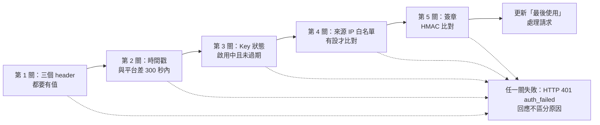

# 企業管理員直接配發 API Key

替一台設備（本篇以 WAF-01 為例）在「API Key 管理」建立一把只能建立資安案件的 API Key，
並把 `key_id` 與 `secret` 交給設備。做完會得到一組 `key_id`／`secret`，
以及一個能確認「設備真的打進來了」的檢查點（列表的「最後使用」欄）。
設備拿這組憑證呼叫 `POST /api/trigger/form` 建立資安案件，做法見[從你的設備建立第一張資安案件](create_case.md)。

「系統安全」選單只開放給企業管理員，一般員工與系統管理員看不到。
找不到「系統安全」這個群組，代表目前登入的帳號不是企業管理員，請換帳號。

!!! abstract "作業：替設備建立一把 API Key"
    **MENU**：系統安全 ／ API Key 管理

    1. 按右上角「建立 API Key」
    2. 填「名稱」、「使用者標籤」；「授權範圍 - 表單分類」勾「資安案件」
    3. 按「建立」
    4. 在「API Key 已建立」視窗按「複製」，把 `key_id` 與 `secret` 存進設備的設定檔或密碼庫
    5. 按「我已保存，關閉」
    6. 在設備上用 `bp_trigger.py --list` 驗證，回列表看「最後使用」欄是否出現時間

## 什麼情況用這條路徑

平台有兩條拿到 API Key 的路徑。本篇是**企業管理員直接配發**：管理員替一台設備建立 Key，
當場拿到 `secret`，再交給設備。另一條是[透過表單中心申請 API Key](by_request.md)：
員工自己填「API Key 申請單」，管理員核准後由系統核發，歸屬人本人到個人設定領取。

設備符合以下任一情況，用本篇這條：

- 設備不屬於某個員工（WAF、防火牆、掃描器、排程主機），沒有「歸屬人」可以去領金鑰。
- 要把設備建出來的案件掛在一個專用帳號名下，讓簽核鏈上的「申請人」有明確身分。
- 要鎖定來源 IP，而且日後可能還要調整白名單。

| 比較項目 | 本篇：管理員直接配發 | 透過表單中心申請 |
|---|---|---|
| 誰發起 | 企業管理員 | 員工本人（也可替同事申請），管理員只做核准 |
| Key 歸屬 | 設備或外部系統；可選擇綁定一個專用員工帳號當申請人 | 申請單上的「使用者（Key 歸屬人）」個人 |
| 授權範圍 | 表單分類（含子分類）、個別已發行表單、資安事件接收（三者可並用） | 表單模板；限歸屬人自己填得到、且已發行的表單 |
| secret 給誰 | 建立當下在管理員畫面顯示一次，由管理員轉交設備 | 歸屬人本人在「個人設定 ／ 我的 API Key」按「領取金鑰」，核發後 72 小時內有效 |
| secret 遺失 | 沒有重發功能，只能撤銷後重建一把 | 本人可按「重新產生金鑰」，舊金鑰立即失效 |
| 管理員之後能改什麼 | 名稱、標籤、說明、期限、來源 IP 白名單、授權範圍、綁定帳號 | 可暫停、撤銷、改來源 IP 白名單；表單模板授權不可在管理端編輯 |
| 適合 | 設備專用 Key、要鎖 IP、要綁專用帳號 | 員工自助、Key 歸屬個人 |

## 建立 API Key

頁面上方的說明是「每個外部系統/裝置一把 Key，來源清楚可稽核」——一台設備一把 Key，不要多台共用。

### 「建立 API Key」視窗的欄位

| 欄位 | 必填 | 說明 |
|---|---|---|
| 名稱 | 必填 | 這把 Key 的用途名稱，列表以此顯示。留空按「建立」會提示「請填寫名稱」。 |
| 使用者標籤 | 選填 | 標示持有這把 Key 的設備。沒有綁定申請人時，設備建出的案件「申請人」就顯示這個標籤。建議寫成「設備名 (IP)」，例如 `WAF-01 (192.168.0.111)`。 |
| 說明 | 選填 | 備註用，最多 500 字。 |
| 使用期限 | 選填 | 日期欄位，留空＝永久有效。到期判定的細節見「注意事項」。 |
| 來源 IP 白名單 | 選填 | 一行一筆，支援單一 IP 與 CIDR。留空＝不鎖 IP（動態 IP 場景建議留空，改以暫停 Key 做處置）。格式不合法會拒絕建立並顯示「IP 或 CIDR 格式錯誤: 」加上那一筆。 |
| 授權範圍 - 表單分類 | 選填 | 勾選分類後，該分類（含子分類）底下所有**已發行**的表單都可以由這把 Key 建立，之後在分類裡新增的表單自動納入。 |
| 授權範圍 - 個別表單（例外直綁） | 選填 | 直接勾選特定已發行表單。清單只列目前已發行的表單，未發行的不會出現。 |
| 授權範圍 - 資安事件接收（OpenDefense intake） | 選填 | 每行一個 `source_system`。**這不是表單觸發的路徑**，一般設備留空，見下一小節。 |
| 綁定申請人（專用系統帳號） | 選填 | 預設「不綁定（申請人顯示使用者標籤）」。綁定後，發動的表單以此帳號為申請人。下拉只列本企業的一般員工帳號，企業管理員與外部帳號選不到。 |

### 授權範圍怎麼選

三個授權範圍欄位可以並用，任一個涵蓋到目標表單即可建單。設備只走 `POST /api/trigger/form`，所以：

- **勾「資安案件」分類**。示範企業 DemoSOC 出廠的三張資安表單（「資安事件處置」、「資安事件處置（SOC 團隊版）」、「資安事件處置（小企業單人版）」）都在這個分類下，勾一次全部涵蓋。
- 只想讓設備建其中一張時，改在「個別表單（例外直綁）」勾那一張，分類留空。
- 「資安事件接收（OpenDefense intake）」**留空**。它是給會送 OCSF／原生 payload 到 `/api/open_defense/intake` 的整合型防禦節點用的，走的是[事件路由設定](../event_routing.md)那套規則，不是表單觸發路徑。填了不會讓 `/api/trigger/form` 多出任何權限。

!!! note "授權範圍只決定「能建哪張表單」，不決定欄位"
    設備送進來的欄位必須是那張表單的欄位，欄位名對照見[從你的設備建立第一張資安案件](create_case.md)。這裡只要確定表單在範圍內就好。

### 本篇範例：WAF-01

| 欄位 | 填入值 |
|---|---|
| 名稱 | `WAF-01 事件通報` |
| 使用者標籤 | `WAF-01 (192.168.0.111)` |
| 說明 | `WAF 事件自動建案` |
| 使用期限 | 留空 |
| 來源 IP 白名單 | `192.168.0.111`（設備會經 NAT 出去時填 NAT 後的位址，見「來源 IP 白名單怎麼判」；不確定就先留空） |
| 授權範圍 - 表單分類 | 勾「資安案件」 |
| 授權範圍 - 個別表單 | 留空 |
| 授權範圍 - 資安事件接收 | 留空 |
| 綁定申請人 | 不綁定（要綁時先替設備建一個一般員工帳號，例如 `svc-waf01`） |

按「建立」，成功後視窗關閉並跳出「API Key 已建立」視窗。

## 保存 secret

「API Key 已建立」視窗最上方是紅色提示「Secret 僅顯示這一次，關閉後無法再查看」，接著是兩行：

```
key_id: ak_a85efc52cc2455a4
secret: <領取時顯示一次的 secret>
```

下方一行小字是簽章方式（HMAC-SHA256、三個 `X-BP-*` header），給要自己實作簽章的人看的，
現在只要把兩個值存好。按「複製」會把上面兩行（含 `key_id:`／`secret:` 前綴）放進剪貼簿；
按「我已保存，關閉」視窗就關閉，**secret 隨即從畫面與記憶體丟棄**，列表與任何查詢都不會再回傳它。

!!! danger "關閉視窗前先把 secret 存到設備的設定檔或密碼庫"
    管理端沒有「重新顯示」也沒有「重發」。關掉之後才發現沒存到，唯一的做法是「撤銷」這把 Key 再建一把新的。
    透過申請單核發的個人 Key 才有「重新產生金鑰」按鈕，本篇這條路徑沒有。

### secret 長什麼樣、怎麼用

- `key_id` 固定是 `ak_` 加 16 個十六進位字元，是公開識別碼，會出現在列表與平台日誌裡，不是秘密。
- `secret` 是 32 個隨機位元組經 base64url 編碼的字串（44 個字元，結尾通常是 `=`）。**原樣保存、原樣使用**，不要自行去掉 `=`、不要再做一次 base64、不要轉成十六進位。平台提供的 `bp_trigger.py` 會自己把它解碼回位元組再算 HMAC；自己實作簽章時也要先解碼。

建議把三個值放進設備或工作機的環境變數，`bp_trigger.py` 就認這三個名字：

```bash
export BP_BASE_URL='http://192.168.0.112:8000/beakplatform'
export BP_KEY_ID='ak_a85efc52cc2455a4'
export BP_SECRET='<領取時顯示一次的 secret>'
```

### 立刻驗證這把 Key 能用

工具是平台安裝目錄下的 `scripts/bp_trigger.py`，只用 Python 3 標準函式庫，
複製到任何有 `python3` 的主機都能跑。在平台安裝目錄下執行，先列出這把 Key 能建的表單：

```bash
python3 scripts/bp_trigger.py --list
```

成功時第一行是「列出可發動表單成功（HTTP 200）」，接著是 JSON；以上面的設定，
`data` 陣列會有三筆，`form_code` 分別是 `SEC_INCIDENT_RESPONSE`、`SEC_IR_SOC_TEAM`、`SEC_IR_SOLO`，
每筆的 `field_keys` 就是可送的欄位名。回到「API Key 管理」重新整理，這把 Key 的「最後使用」欄會從 `-` 變成時間。

如果回的是「列出可發動表單失敗（HTTP 401）」與 `{"error": "auth_failed"}`，看「注意事項」的排除順序。

### 系統實際存下的內容

建立成功時系統回傳的紀錄長這樣（畫面只顯示其中 `key_id` 與 `secret`；識別碼欄位以佔位表示）：

```json
{
  "key_id": "ak_a85efc52cc2455a4",
  "name": "WAF-01 事件通報",
  "consumer_label": "WAF-01 (192.168.0.111)",
  "description": "WAF 事件自動建案",
  "scopes": {"form_category": ["<資安案件分類的識別碼>"], "form": []},
  "allowed_ips": null,
  "applicant_user_secure_code": null,
  "expires_at": null,
  "status": "active",
  "last_used_at": null,
  "secret": "<領取時顯示一次的 secret>"
}
```

`scopes` 就是三個授權範圍欄位的儲存形式：`form_category`（分類）、`form`（個別表單）、
`od_intake.source_systems`（資安事件接收，沒填就不會出現這個 key）。`allowed_ips` 留空存成 `null`，代表不鎖。

## 列表與日常管理

列表只有本企業的 Key，依建立時間新的在前。

| 欄位 | 內容 |
|---|---|
| Key ID | `ak_…` 公開識別碼。設備送出的 `X-BP-Key-Id` 就是它。 |
| 名稱 / 使用者 | 上行是「名稱」，下行小字是「使用者標籤」。 |
| 授權範圍 | 摘要成「分類 x1」、「表單 x2」、「表單模板 x1」（申請流程核發的 Key 才會有）、「資安事件來源 x1」；都沒有時顯示「（無授權範圍）」——這種 Key 什麼表單都建不了。 |
| IP 鎖定 | 白名單內容以逗號相連；沒設顯示「不鎖」。 |
| 期限 | 日期；沒設顯示「永久」。 |
| 最後使用 | 最近一次驗章成功的時間（依你的顯示時區）；從未使用顯示 `-`。 |
| 狀態 | 「啟用中」或「已暫停」；已暫停的下方會顯示暫停原因。已撤銷的 Key 不會出現在列表。 |
| 操作 | 「編輯」、「暫停」（啟用中時）或「復原」（已暫停時）、「撤銷」。 |

### 四個操作

| 操作 | 效果 | 什麼時候用 |
|---|---|---|
| 編輯 | 可改名稱、使用者標籤、說明、使用期限、來源 IP 白名單、三個授權範圍、綁定申請人。**secret 不能改、也不會顯示。** 儲存後設備不必換憑證。 | 設備換 IP、要多授權一張表單、要補綁專用帳號。 |
| 暫停 | 「暫停原因」必填。狀態變「已暫停」，設備的每一次呼叫都回 401 `auth_failed`；原因顯示在列表狀態欄下方。可隨時復原，是疑似 Key 遭盜用時的首選處置。 | 疑似外洩、設備維護、暫時不想收它的事件。可逆，先暫停再查。 |
| 復原 | 狀態回「啟用中」，暫停原因清除，設備沿用原本的 `secret` 立即可用。 | 查證完畢要恢復收事件。 |
| 撤銷 | 狀態變「已撤銷」並從列表消失，**不可復原**。要再用得重建一把、重新交付 secret。 | 確認外洩、設備除役、secret 遺失要重發。 |

### 「最後使用」代表什麼

設備每一次通過驗章（headers、時間戳、Key 狀態、來源 IP、簽章五關全過），
平台就把這把 Key 的「最後使用」更新為當下時間，然後才處理請求內容。所以：

- 有時間＝設備的憑證與網路路徑是通的，這是接線時最好用的檢查點。
- 有時間**不代表**案件建成功。欄位名打錯（400）、表單不在範圍（404）都會先更新「最後使用」才回錯誤。建沒建成要看設備收到的回應，或到「開放防禦 ／ 資安案件處置中心」找案件。
- 401 的呼叫不會更新它。設備一直打卻始終是 `-`，就是卡在驗章。

## 來源 IP 白名單怎麼判

**格式**

- 一行一筆。單一位址寫 `192.168.0.111`；網段寫 CIDR，例如 `10.0.0.0/24`。CIDR 的主機位元不必歸零，`10.0.0.5/24` 會被視為 `10.0.0.0/24`。
- 任何一筆格式不合法，整個建立或儲存都會被拒絕。
- 留空或全部刪掉＝不鎖，任何來源都可用（其他四關仍要過）。

**比對的是哪個 IP**

平台比對的是**它看到的連線來源位址**。設備經過 NAT、代理或 VPN 出口才連到平台時，
平台看到的是轉換後的位址，白名單要填那個，不是設備自己網卡上的 IP。
不確定設備出口是什麼，就先留空，用 `--list` 打通後，再從平台端的應用程式日誌看這把 Key 被記錄的 `ip=` 是多少，填上去。
設備是動態 IP 時不要鎖：留空，遇到異常改用「暫停」處置。

**驗章順序：白名單只是第四關**



五關任一失敗，設備收到的都是同一個回應：HTTP 401、`{"error": "auth_failed"}`。
平台刻意不告訴呼叫端是哪一關失敗，避免被拿來探測；真正的原因只記在平台端的應用程式日誌。
所以來源 IP 被擋時，設備端看起來跟 secret 錯誤一模一樣。例如一把來源 IP 白名單設為 `192.168.0.111` 的 Key，從另一台主機執行 `--list`，得到的是：

```
列出可發動表單失敗（HTTP 401）
{
  "error": "auth_failed"
}
```

## 注意事項

!!! danger "回 401 卻不知道為什麼"
    **症狀**：設備或 `--list` 一律得到 HTTP 401 `auth_failed`，「最後使用」始終是 `-`。
    **原因**：驗章五關之一沒過，回應不會說是哪一關。
    **做法**：照驗章順序逐項排除，每一步都排除了再看下一步：

    1. **header 齊不齊**：自己實作時確認 `X-BP-Key-Id`、`X-BP-Timestamp`、`X-BP-Signature` 三個都有送，任一個空白直接 401。用 `bp_trigger.py` 可略過這一步。
    2. **時鐘**：設備與平台的時間差必須在 300 秒內。在設備上跑 `date -u +%s`，和平台主機比一下；設備沒對 NTP 是最常見的原因。
    3. **Key 狀態**：到列表看這把 Key 的「狀態」是不是「啟用中」、「期限」有沒有過；已撤銷的 Key 不會在列表上，找不到就是被撤銷了。
    4. **來源 IP**：「IP 鎖定」欄有值時，確認平台看到的來源位址在白名單內。要快速切割，先「編輯」把白名單清空試一次。
    5. **secret 與簽章**：確認 `BP_KEY_ID` 對到列表上的 Key ID、`BP_SECRET` 是建立時原樣複製（沒有多空白、沒有少 `=`）。自行實作簽章時先拿 `bp_trigger.py` 用同一組憑證打一次，能過就是簽章實作的問題，不是憑證的問題。

    另外，同一個來源位址一分鐘內累積 30 次 401 之後，平台會改回 HTTP 429（`{"success": false, "error": "請求頻率過高，請稍後再試"}`）。
    排錯時不要讓設備在迴圈裡重試，先停下來，一分鐘後再試。

!!! warning "「使用期限」填的那一天一開始就失效，不是那天結束"
    **症狀**：期限填 3 月 31 日，31 日早上設備就開始 401。
    **原因**：管理端把日期存成該日 00:00（UTC），平台以 UTC 判斷是否過期，換算成台灣時間是當天早上 8 點。
    **做法**：期限填「最後可用日的隔一天」；或到期前一天先「編輯」延長。留空則永久有效。

!!! warning "分類勾了，設備卻建不了那張表單"
    **症狀**：回 HTTP 422 `form_not_published`（訊息「表單尚未發行」或「表單已有發行記錄，但目前沒有 Published 版本」），或 HTTP 404 `form_not_found`。
    **原因**：授權範圍只涵蓋**已發行**的表單。表單在範圍內但沒有發行中的版本是 422；`form_code` 打錯、表單不在這把 Key 的範圍內、表單不屬於本企業，都是 404，平台刻意不區分「不存在」與「沒授權」。
    **做法**：先用 `--list` 看這把 Key 目前能建哪些 `form_code`；沒列出來就去「表單管理 ／ 表單流程配對」確認該表單已發行，或回「編輯」補授權。

!!! note "綁定專用帳號後，案件的申請人就是那個帳號"
    設備建出的案件在表單中心、待簽核清單與案件內容的「申請人」欄位顯示的是：有綁定申請人時，顯示該帳號的顯示名稱；沒綁定時，顯示「使用者標籤」；連標籤也沒填，就顯示 Key 的「名稱」。
    綁定的帳號之後被停用或刪除，設備的呼叫會回 HTTP 422 `applicant_invalid`（訊息「API Key 綁定的系統帳號不存在或已停用」）——這不是 401，看到它就直接去「編輯」換綁或改成不綁定。

!!! note "「綁定申請人」下拉找不到想綁的帳號"
    下拉只列本企業「啟用中的一般員工」帳號，企業管理員與外部帳號不會出現；而且最多列 100 位（依建立時間新的在前）。
    要替設備綁專用帳號，先在帳號管理建一個一般員工帳號再回來綁。

!!! note "「最後使用」有值不等於建單成功"
    它在驗章通過的那一刻就更新，之後的 400（欄位名錯）、404（表單不在範圍）、422 都不會把它清掉。
    確認案件有沒有建起來，看設備收到的回應，或到「開放防禦 ／ [資安案件處置中心](../security_cases.md)」找案件編號。

## 下一步

你現在手上有 `BP_BASE_URL`、`BP_KEY_ID`、`BP_SECRET`，而且 `--list` 已經回 200。
接著到[從你的設備建立第一張資安案件](create_case.md)：對照表單欄位、用 `bp_trigger.py` 送出第一筆事件、到處置中心找到那張案件。

如果設備其實是某位員工在維護、Key 該歸屬那個人，改走[透過表單中心申請 API Key](by_request.md)。
