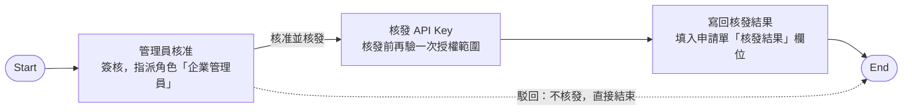

# 透過表單中心申請 API Key

不經管理員手動建 Key：資安人員在表單中心填「API Key 申請單」，管理員核准後由系統自動核發，
本人到「個人設定」一次性領取金鑰。做完會得到一把歸屬於申請人本人、只能發動勾選那幾張表單的
API Key（`key_id` 與 secret），以及「個人設定」頁可直接複製的 curl 串接範例。

- **申請人**：持有已授權資安表單的角色（示範企業 DemoSOC 出廠為 `SECURITY_STAFF`、`SOC_SUPERVISOR`）。
- **核准人**：企業管理員。

核發由流程自動完成，通常十幾秒內。



出廠的「API Key 申請核發流程」只有「管理員核准」一個人工關卡，有兩個決策：「核准並核發」與「駁回」。

## 什麼情況用這條路徑

平台有兩條拿到 API Key 的路徑。本篇講的是「員工自助申請、Key 歸屬個人、管理員只做核准」的申請單路徑；
管理員直接配發的路徑見[企業管理員直接配發 API Key](by_admin.md)。

| 比較項目 | 管理員直接配發 | 本篇：表單中心申請 |
|---|---|---|
| 誰發起 | 企業管理員在「系統安全 ／ API Key 管理」按「建立 API Key」 | 任何填得到「API Key 申請單」的成員（出廠授權給企業成員與企業管理員） |
| Key 歸誰 | 可不綁人，或綁定一個專用系統帳號 | 一定歸屬「使用者（Key 歸屬人）」欄位選的那個人；可代同事申請，但金鑰只有歸屬人本人領得到 |
| 授權範圍 | 表單分類（含子分類）、個別已發行表單、資安事件接收來源 | 只有「授權表單」勾選的那幾張個別表單，且只能勾歸屬人自己填得到的表單；管理端看得到但不能改 |
| 誰把關 | 管理員自己 | 流程中的「管理員核准」關卡（指派角色「企業管理員」）；核准後系統再驗一次授權範圍 |
| secret 怎麼拿 | 建立完成的視窗顯示一次 | 歸屬人本人到「個人設定 ／ 我的 API Key」按「領取金鑰」，只顯示一次，領取憑證 72 小時有效 |
| secret 遺失 | 撤銷重建 | 本人按「重新產生金鑰」，舊金鑰立即失效 |
| 適合的情境 | 設備不屬於某個員工、要綁專用帳號、要集中管理 | 資安人員替自己負責的設備接線，管理員不想經手金鑰 |

!!! note "金鑰不經手任何人"
    核發節點產生 secret 後立刻丟棄明文，只留一張「一次性領取憑證」給歸屬人。
    管理員在整條流程裡看不到 secret，也沒有替他人領取的功能。

## 前提：資安表單要先授權給你的角色

!!! abstract "作業：把資安表單授權給角色（企業管理員）"
    **MENU**：表單流程 ／ 配對管理

    1. 找到該表單那一列，按「權限」
    2. 在「+ 新增規則」的「類型」選「角色」
    3. 在「選擇角色」選角色（例如「資安人員」）
    4. 按「新增」

申請單上的「授權表單」清單不是全企業的表單，而是「**Key 歸屬人自己填得到、而且已發行**」的表單。
規則是：你手動填得到的表單，才能申請一把 Key 去自動填。判定方式如下：

- 持有「流程設計師」或「表單設計師」角色的人，任何已發行表單都填得到（供試行設計稿）。
- 一般表單沒有設任何自訂規則時，預設「企業成員（`EMPLOYEE`）」角色可填；外部廠商帳號不適用預設規則。
- **資安案件分類的表單相反：沒有任何自訂規則時，誰都填不到、也申請不到。** 它們刻意不出現在表單中心「新填表單」區（改由[資安案件處置中心](../security_cases.md)呈現），但只要該表單的配對上授權了角色，持有那個角色的人就會在申請單的「授權表單」清單裡看到它。
- 代同事申請時，清單依「被代申請的那位」計算；換人時清單重新載入，對方填不到的已勾項目會被自動移除。外部廠商帳號不能代他人申請。

DemoSOC 出廠已把三張資安表單授權給角色「資安人員（`SECURITY_STAFF`）」與「資安主管（`SOC_SUPERVISOR`）」。
以 `linda.hu@demo-soc.example`（資安人員）為例，清單共 6 張：

| 分類 | 表單名稱 | 表單代碼 | 為什麼在清單裡 |
|---|---|---|---|
| 其他 | API Key 申請單 | `API_KEY_REQUEST` | 出廠授權企業成員、企業管理員、全企業群組 |
| 其他 | 代理指定申請單 | `PROXY_REQUEST` | 一般表單，預設企業成員可填 |
| 其他 | 差旅費申請（人事取值示範） | `HR_LOOKUP_TRAVEL_DEMO` | 一般表單，預設企業成員可填 |
| 資安案件 | 資安事件處置 | `SEC_INCIDENT_RESPONSE` | 配對已授權 `SECURITY_STAFF` |
| 資安案件 | 資安事件處置（SOC 團隊版） | `SEC_IR_SOC_TEAM` | 同上 |
| 資安案件 | 資安事件處置（小企業單人版） | `SEC_IR_SOLO` | 同上 |

「權限」按鈕上會顯示規則筆數，沒有規則時顯示「預設」。開啟的「填寫權限設定」視窗有三個區塊：

| 視窗區塊 | 內容 |
|---|---|
| 預設規則（不可修改） | 流程設計師 (FLOW_DESIGNER) 角色永遠可填；表單設計師 (FORM_DESIGNER) 角色永遠可填；未設任何自訂規則時企業成員 (EMPLOYEE) 角色可填、外部廠商不可填 |
| 自訂規則 | 已建立的規則列表，每列顯示類型標籤（部門／角色／社群／個人）與對象名稱，列尾可刪除。沒有規則時顯示「尚無自訂規則，目前由企業成員 (EMPLOYEE) 角色可填寫此表單」 |
| + 新增規則 | 「類型」下拉（部門／角色／社群／個人）；部門類型可勾「包含所有子部門」、社群類型可勾「包含下層群組」 |

!!! warning "資安表單的「預設規則」那三行不適用"
    視窗裡「未設任何自訂規則時企業成員可填」是一般表單的規則。資安案件分類的表單沒有自訂規則時是**全部拒絕**，
    所以要讓資安人員申請得到 Key，至少要加一條「角色」規則。

## 填寫申請單

!!! abstract "作業：申請 API Key（申請人）"
    **MENU**：表單中心 ／ 新填表單 ／ 其他 ／ API Key 申請單

    1. 填「表單主旨」
    2. 「使用者（Key 歸屬人）」預設是你自己；替同事申請時改選對方
    3. 在「授權表單」勾選這把 Key 可以發動的表單
    4. 填「用途說明」、「有效期限」；需要時填「來源 IP 限制」
    5. 按「送出表單」

| 畫面欄位 | 必填 | 欄位說明 | 本篇範例值 |
|---|---|---|---|
| 表單主旨 | 必填 | 平台層欄位；核發後會成為這把 Key 在管理端與「我的 API Key」列表的「名稱」 | WAF-01 事件通報用 API Key |
| 使用者（Key 歸屬人） | 必填 | 預設為登入者本人。代為申請時改選對象；核發的 Key 歸該對象所有，只有本人領得到金鑰 | linda.hu（預設帶入本人） |
| 授權表單 | 必填 | 只列出「Key 歸屬人」自己填得到、且已發行的表單。換人時選項會重新計算 | 勾「資安事件處置」（`SEC_INCIDENT_RESPONSE`） |
| 用途說明 | 必填 | 寫明哪一台設備、哪一個系統要使用，以及大約的呼叫頻率。至少 10 個字 | WAF-01（192.168.0.111）偵測到攻擊時自動建立資安案件，預估每小時最多 60 次 |
| 有效期限 | 必填 | 到期後這把 Key 立即失效，需要重新申請。格式 `yyyy-MM-dd`；系統把它解讀為「該日在企業時區的結束」，也就是可以用到當天 24:00 | 2027-03-31 |
| 來源 IP 限制 | 選填 | 可填單一 IP 或 CIDR，多筆以逗號分隔。留空表示不限制來源 | 192.168.0.111（WAF-01 自己的 IP） |
| 核發結果 | — | 由流程自動填寫，申請人不需輸入（欄位是唯讀的） | 留空 |

成功時畫面回「表單已送出，流程已啟動」，表單中心會出現這張單的序號（例如 `Form-260900025`）。

!!! warning "有效期限與其他必填欄位留空送不出去"
    「使用者（Key 歸屬人）」「授權表單」「用途說明」「有效期限」都是必填，送出前畫面會擋；
    就算繞過畫面直接送，伺服器也會回 400 `missing_required_fields`，訊息「缺少必填欄位：」加上欄位名稱。
    「用途說明」的 10 字下限由表單本身檢查。

!!! note "來源 IP 限制填的是「設備的 IP」，不是你的工作機"
    這個限制會寫進 Key 的來源白名單，之後從白名單以外的主機打 API 一律 401。
    填了工作機 IP、再把 Key 放到設備上，設備就會被擋。
    如果設備在 NAT 後面，要填 NAT 之後平台看到的 IP。

## 管理員核准

!!! abstract "作業：核准 API Key 申請單（企業管理員）"
    **MENU**：表單中心 ／ 待簽核

    1. 在「目前關卡」是「管理員核准」的那一列按「簽核」
    2. 核對 Key 歸屬人與授權表單
    3. 在「請選擇決策」按「核准並核發」或「駁回」
    4. 按「送出簽核」

簽核視窗中段的申請單內容（歸屬人、授權表單、用途說明、有效期限、來源 IP 限制）是**核發前唯一的把關點**。
「簽核意見」為選填（出廠設定不強制）。該列若別人正在簽會顯示「簽核中」且不能按；
沒選決策就按送出會提示「請選擇一個決策選項」。

### 核准之後系統做什麼

「核發 API Key」節點在核發前會再檢查一次，任一項不符就不核發，流程停在這個節點：

| 檢查 | 不符時的錯誤訊息 |
|---|---|
| 歸屬人有填 | API Key 核發失敗：未指定領取人 |
| 授權表單至少一張 | API Key 核發失敗：未指定授權表單 |
| 有效期限是可解讀的日期 | API Key 核發失敗：有效期限格式錯誤 |
| 歸屬人是本企業有效帳號（未停用、未刪除） | API Key 核發失敗：領取人不是本企業有效帳號 |
| **授權表單全部落在歸屬人「自己填得到」的範圍內**（與前提一節同一套判定，核准當下重算） | API Key 核發失敗：授權表單超出領取人可填寫的範圍 |

檢查通過後，系統建立 Key，並建立一張只有歸屬人能用的一次性領取憑證，有效 72 小時。
**Key 的 secret 明文在這一步就被丟棄**，之後只能靠領取憑證解出一次。Key 的內容對應如下：

| Key 的欄位 | 來源 |
|---|---|
| 名稱 | 表單主旨 |
| 說明 | 用途說明加一行「來源申請單: 」與申請單識別碼 |
| 授權範圍 | 勾選的表單模板 |
| 來源 IP 白名單 | 「來源 IP 限制」拆成的清單 |
| 期限 | 有效期限當天結束 |

接著「寫回核發結果」節點把下面這段文字寫進申請單的「核發結果」欄位（識別碼即這把 Key 的 `key_id`）：

```
已核發 API Key，識別碼 ak_7bbdad985194ff13。請 Key 歸屬人本人登入平台，於「個人設定」頁一次性領取金鑰；金鑰只顯示一次，逾期未領取需重新申請。
```

選「駁回」則直接到 End，不建立任何 Key，申請單與簽核記錄照常保留。

## 本人領取金鑰

!!! abstract "作業：領取金鑰（Key 歸屬人本人）"
    **MENU**：個人設定 ／ 我的 API Key

    1. 在「金鑰」欄是「尚未領取」的那一列按「領取金鑰」
    2. 在「API Key 串接範例」視窗按金鑰旁的「複製」，存進設備的設定檔或密碼庫
    3. 關閉視窗

「我的 API Key」在「個人設定」頁面下方。沒有任何 Key 時顯示「目前沒有屬於你的 API Key。可到表單中心提出「API Key 申請單」。」
有 Key 時是一張表格：

| 欄位 | 內容 |
|---|---|
| 名稱 | Key 名稱（＝申請單主旨），下方小字是說明（用途說明與來源申請單） |
| Key ID | `ak_` 開頭的公開識別碼，例 `ak_7bbdad985194ff13` |
| 授權表單 | 這把 Key 能發動的已發行表單名稱，每張一行；沒有時顯示「（無）」 |
| 狀態 | 啟用中／已暫停／已撤銷；下方小字「有效期限」，過期改顯示「已過期」，沒設期限顯示「永久有效」 |
| 最後使用 | 最近一次驗章成功的時間；從未用過顯示「尚未使用」 |
| 申請單 | 來源申請單的序號（例 `Form-260900025`）；管理員直接配發的 Key 這格是「—」 |
| 金鑰 | 領取狀態：「尚未領取」（下方小字「領取期限」）／「已於某時間領取」／「領取期限已過」／「未建立領取憑證」 |
| 操作 | 依領取狀態出現：「領取金鑰」（尚未領取時）；「查看串接範例」（已領取時）；「重新產生金鑰」（只要不是「尚未領取」都會出現） |

這張表只列「歸屬人是你」的 Key。別人替你申請的 Key 會出現在你的頁面、不會出現在申請人的頁面；管理員也沒有替你領取的功能。

### 領取

按「領取金鑰」時，系統確認這張領取憑證屬於你、尚未領取、還沒過期，而且 Key 仍是啟用狀態，
然後把 secret 解出來顯示一次，並開啟「API Key 串接範例」視窗，視窗頂端警示：

```
這串金鑰只會顯示這一次。關閉後將無法再次查看，遺失時只能重新產生。
```

底層 API 的回應（secret 已隱去）：

```
POST /api/my-api-keys/<key 識別碼>/claim
{
  "success": true,
  "data": {
    "key_id": "ak_7bbdad985194ff13",
    "secret": "<領取時顯示一次的 secret>",
    "claimed_at": "2026-09-26T15:35:45"
  }
}
```

領取後表格的「金鑰」欄變成「已於某時間領取」，按鈕變成「查看串接範例」與「重新產生金鑰」。

### 只能領一次、72 小時內要領

- 領取憑證在核發當下建立，**72 小時**後失效；表格「金鑰」欄的「領取期限」就是這個時間。
- 再按一次領取（或用工具重送）回 HTTP 400，訊息「這筆領取憑證已失效或已領取過」。
- 憑證過期後「金鑰」欄顯示「領取期限已過」，「領取金鑰」按鈕消失。申請單「核發結果」寫的是「逾期未領取需重新申請」，不過此時頁面仍會出現「重新產生金鑰」按鈕，Key 本身還在、只是沒人拿到 secret；按下去就能拿到一組新的 secret，不必重新走一次申請流程。
- 領取失敗的原因（不是你的、已領過、過期、Key 已暫停或撤銷）一律回同一句「無法領取 API Key」，畫面不會告訴你是哪一種。

### 重新產生金鑰

按「重新產生金鑰」會先跳確認：「重新產生後，舊的金鑰立即失效，所有正在使用它的系統都會連不上。確定要繼續嗎？」
確定後系統換一組 secret、開同一個「API Key 串接範例」視窗顯示一次。Key 必須是啟用中；
已暫停的 Key 會回「已停用的 API Key 不可重新產生金鑰」；已撤銷的 Key 會直接從「我的 API Key」列表消失。

## 查看串接範例

領取當下、重新產生當下，或之後按「查看串接範例」，都會開同一個「API Key 串接範例」視窗，內容由上到下：

| 區塊 | 內容 |
|---|---|
| 警示列 | 剛領到金鑰時是「這串金鑰只會顯示這一次…」；事後開啟時是「金鑰已領取過，範例中以環境變數佔位。請自行代入當初保存的金鑰。」 |
| 金鑰 | 唯讀輸入框加「複製」按鈕。剛領到時是真實 secret；事後開啟時顯示佔位字串 `$BP_API_KEY_SECRET` |
| 表單 | 下拉，選項是這把 Key 能發動的表單（本篇只有「資安事件處置」）。換表單會重設下方欄位 |
| 主旨 | 預設「外部系統觸發」，可改；會成為案件的主旨 |
| 網址警示 | 系統對外網址沒設定時顯示「（尚未設定系統對外網址，請聯絡管理員）」，且 curl 裡的網址也會是這句話——這個值由系統管理員在「主機設定」頁的「系統對外網址」設定，企業管理員無法自行填 |
| 併案提示 | 選到資安表單時顯示：「資安案件會依 actor_ip 與 finding_rule_id 併入同一案件；兩者任一留空就每次各自開案。也可在 body 頂層加 case_group_key 自訂分組鍵。」 |
| 欄位輸入框 | 表單的每個欄位 key 各一格（資安表單有 28 格）。資安表單會預填四格：`actor_ip`＝`203.0.113.42`、`finding_rule_id`＝`RULE-1`、`severity_id`＝`3`、`source_system`＝`manual`；留空的欄位不會進 body |
| case_group_key | 標示「（選填，自訂分組鍵）」，最多 128 字元，只在資安表單出現；有填才會放進 body 頂層 |
| curl | 唯讀多行文字框加「複製」按鈕，內容隨上方欄位即時更新 |

併案規則的細節見[持續事件如何累加到同一張案件](aggregate_events.md)。

以本篇的 Key、表單「資安事件處置」、預填值不動、事後開啟（金鑰以環境變數佔位）為例，視窗產生的 curl 是：

```bash
BASE='http://192.168.0.112:8000/beakplatform'
KEY_ID='ak_7bbdad985194ff13'
SECRET="$BP_API_KEY_SECRET"
BODY='{"form_code":"SEC_INCIDENT_RESPONSE","subject":"外部系統觸發","form_data":{"actor_ip":"203.0.113.42","finding_rule_id":"RULE-1","severity_id":"3","source_system":"manual"}}'
TS=$(date +%s)
KEY_HEX=$(printf '%s' "$SECRET" | tr '_-' '/+' | base64 -d | xxd -p | tr -d '\n')
SIG=$(printf '%s\n%s' "$TS" "$BODY" | openssl dgst -sha256 -mac HMAC -macopt hexkey:"$KEY_HEX" -hex | awk '{print $NF}')
curl -s -X POST "$BASE/api/trigger/form" \
  -H 'Content-Type: application/json' \
  -H "X-BP-Key-Id: $KEY_ID" \
  -H "X-BP-Timestamp: $TS" \
  -H "X-BP-Signature: sha256=$SIG" \
  -d "$BODY"
```

這幾行在做的事：

- `SECRET`：剛領到金鑰時這行直接是單引號包住的真實 secret；事後開啟時改用雙引號包環境變數，執行前要先把當初保存的 secret 放進環境變數 `BP_API_KEY_SECRET`。
- `KEY_HEX`：secret 是 base64url 字串，先換回標準 base64 字元、解碼成原始位元組，再轉成十六進位給 openssl 當 HMAC 金鑰。**不要拿 secret 字串本身當金鑰**，那樣簽出來的東西一律 401。
- `SIG`：對「時間戳、換行、body」這串文字算 HMAC-SHA256，時間戳是 Unix 秒，與平台時間差超過 5 分鐘也是 401。
- 三個 `X-BP-*` 標頭把 key_id、時間戳、簽章帶給平台；`-d "$BODY"` 送出的內容必須與簽章時的位元組完全一致，不要事後重排 JSON。

簽章規格的完整說明、用平台安裝目錄下的 `scripts/bp_trigger.py` 免算簽章的做法、以及回應與錯誤碼，
見[從你的設備建立第一張資安案件](create_case.md)。該篇的工具吃 `BP_BASE_URL`／`BP_KEY_ID`／`BP_SECRET` 三個環境變數，
`BP_SECRET` 放的就是這裡領到的 secret。

## 管理員端看到什麼

申請流程核發的 Key 與管理員直接建立的 Key 放在同一張表：「系統安全 ／ [API Key 管理](../api_keys.md)」。
本篇這把 Key 在列表上長這樣：

| 欄位 | 顯示值 | 來源 |
|---|---|---|
| Key ID | `ak_7bbdad985194ff13` | 系統產生 |
| 名稱 / 使用者 | WAF-01 事件通報用 API Key（第二行「使用者標籤」為空） | 申請單主旨；流程不填使用者標籤 |
| 授權範圍 | 表單模板 x1 | 「授權表單」勾了幾張就是幾 |
| IP 鎖定 | 192.168.0.111 | 「來源 IP 限制」；沒填顯示「不鎖」 |
| 期限 | 2027-03-31 | 「有效期限」 |
| 狀態 | 啟用中 | 核發即啟用 |

管理員可以對它做的事與其他 Key 相同：「暫停」（可復原）、「復原」、「撤銷」（不可逆）、
「編輯」（改名稱、期限、IP 白名單、追加分類或個別表單範圍）。不同的是：

- 「編輯」視窗會多一個區塊「授權範圍 - 表單模板（申請流程核發）」，說明這些表單模板授權由 API Key 申請流程核發，此處不可編輯；儲存時會原樣保留。要縮小這把 Key 的範圍只能撤銷後請本人重新申請。
- 管理端沒有「領取金鑰」或「重新產生金鑰」；secret 從頭到尾只有歸屬人本人拿得到。
- 管理員暫停之後，本人頁面的「領取金鑰」會失敗（回「無法領取 API Key」），「重新產生金鑰」會回「已停用的 API Key 不可重新產生金鑰」；撤銷之後這把 Key 直接從本人的「我的 API Key」列表消失。

## 注意事項

!!! danger "「授權表單」清單裡沒有資安表單"
    **症狀**：只看得到「其他」分類的表單，或清單顯示「沒有可申請的表單」。
    **原因**：資安案件表單沒有規則時是全部拒絕，而且清單依「Key 歸屬人」而不是填單的人計算——代申請時對方沒有角色，你有也沒用。
    **做法**：請管理員到「表單流程 ／ 配對管理」該表單的「權限」加一條角色規則（例如「資安人員」），並確認歸屬人真的持有該角色。

!!! danger "管理員核准了，但「我的 API Key」沒有出現新的一列"
    **症狀**：申請單的「核發結果」欄位空白，個人設定頁沒有這把 Key。
    **原因**：「核發 API Key」節點在核准當下重算了一次歸屬人的填寫權限，最常見是核准前角色被拿掉、歸屬人被停用，或送單時塞進了歸屬人填不到的表單；節點回的錯誤訊息是「核准之後系統做什麼」那張表其中一句，流程停在該節點。
    **做法**：修正權限或帳號狀態後重新申請一張。

!!! warning "領取期限過了"
    「金鑰」欄變成「領取期限已過」，「領取金鑰」按鈕消失。Key 還在，按「重新產生金鑰」會立刻顯示一組新的 secret（只顯示一次）。
    管理員無法替你延長或代領。

!!! warning "「來源 IP 限制」填了工作機 IP，設備打 API 卻 401"
    白名單在驗章之前就檢查，只要來源不在清單內就是 401 `auth_failed`，回應不會說是 IP 的問題。
    從自己的工作機測試通了、搬到設備上就失敗，通常就是這個原因。
    請管理員在「API Key 管理」的「編輯」視窗改「來源 IP 白名單」，或重新申請時填設備的 IP；動態 IP 的設備建議留空。

!!! warning "「重新產生金鑰」會讓舊金鑰立即失效"
    確認對話框已經寫明：所有正在使用舊金鑰的系統都會連不上。先確定設備能同步更新設定再按；
    只是想「再看一次」金鑰是不行的，關閉視窗後沒有任何地方可以再看到舊值。

!!! note "兩個容易混淆的時間"
    「有效期限」是 Key 本身的壽命（申請單上填的日期，用到當天結束）；「領取期限」是拿 secret 的時限（核發後 72 小時）。
    前者到期 Key 失效、要重新申請；後者到期只是還沒拿到 secret，用「重新產生金鑰」即可。

!!! note "簽核記錄與決策"
    管理員選「駁回」時流程直接結束、不核發，申請人在表單中心看到的是這張單已結束而「核發結果」為空；要知道原因看簽核意見。

## 下一步

拿到 `key_id` 與 secret 之後，到[從你的設備建立第一張資安案件](create_case.md)，
用 `bp_trigger.py` 或上面那段 curl 打 `POST /api/trigger/form`，並對照 28 個資安表單欄位把設備的告警對應進去。
