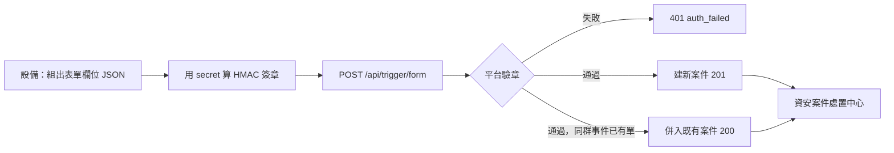

# 從你的設備建立第一張資安案件

拿著[管理員配發](by_admin.md)或[表單申請](by_request.md)取得的 `key_id` 與 `secret`，
由設備端對平台送一個帶簽章的 HTTP 請求，平台就會依你指定的表單建立一張資安案件並啟動它的處置流程，
值班人員在「開放防禦 ／ 資安案件處置中心」看到案件、按決策按鈕。

你需要：一把授權範圍含「資安案件」分類（或個別資安表單）的 API Key；
驗證畫面時需要能開處置中心的帳號（例：資安人員 `linda.hu@demo-soc.example`）。
做完會得到一張案件編號形如 `PROC-20260926-0002` 的資安案件、一份你的設備欄位到表單 28 個欄位的對照、
一段可直接放進設備或排程的呼叫指令。



全篇用同一個固定情境，範例指令與回應都照它寫：

| 項目 | 值 |
|---|---|
| 偵測設備 | `WAF-01`（`192.168.0.111`，你的防禦節點） |
| 攻擊來源 | `203.0.113.42` |
| 被攻擊目標 | `www.demo.internal` 的 `/login` |
| 攻擊型態 | SQL injection（`UNION SELECT`，10 秒內 3 次） |
| 命中規則 | `WAF-SQLI-001`（規則集 `owasp-crs`） |
| 嚴重度 | 4 |
| 平台 | `http://192.168.0.112:8000/beakplatform` |
| 企業／表單 | DemoSOC，表單 `SEC_INCIDENT_RESPONSE`（資安事件處置） |

指令一律用三個環境變數帶認證，之後每一段都沿用：

```bash
export BP_BASE_URL='http://192.168.0.112:8000/beakplatform'
export BP_KEY_ID='ak_a85efc52cc2455a4'
export BP_SECRET='<領取時顯示一次的 secret>'
```

!!! note "secret 原樣貼上，不要自己轉碼"
    畫面顯示的 secret 是 base64url 字串。做 HMAC 時用的是它解碼後的 raw bytes，
    `bp_trigger.py` 會自己解碼；「直接 curl」那段的寫法也有解碼那一行。
    先自行轉成十六進位或再 base64 一次，結果一律是 `401 auth_failed`。

## 兩條事件入口，選對的那條

平台有兩個能用 API Key 建資安案件的入口。這一節只講第一條；第二條是給整合型防禦節點用的，
欄位格式與授權方式都不同，這裡只列差別讓你確認自己沒走錯門。

| 比較項目 | `POST /api/trigger/form`（本節） | `POST /api/open_defense/intake` |
|---|---|---|
| 適合誰 | 任何設備、SIEM、維運腳本；只要能算 HMAC 就能送 | 會送 OCSF 事件（或已在「事件路由設定」建好來源格式的原生 payload，走 `/api/open_defense/intake/native?profile=…`）的整合型防禦節點 |
| Key 的授權範圍 | 「授權範圍 - 表單分類」或「授權範圍 - 個別表單」（表單申請核發的 Key 則是表單模板） | 「授權範圍 - 資安事件接收（OpenDefense intake，選填）」，並列出允許的 `source_system` |
| Body 的欄位 | 就是表單欄位：`form_code`、`subject`、`form_data{…}`；key 只能是表單裡存在的欄位 | OCSF 結構（`severity_id` 必須是 0 到 6 的整數、`correlation_id` 等），由平台轉成表單欄位 |
| 建到哪張表單 | 呼叫端在 `form_code` 指定；「事件路由設定」的規則**不會**改送到別張表單，只拿來讀該表單的「聚合」設定 | 由「事件路由設定」依優先序比對規則決定目標表單；沒有命中就 `422 no_mapping` |
| 重送同一事件 | 依聚合設定併入既有案件（回 `200 merged:true`，見[累加事件](aggregate_events.md)） | `correlation_id` 是冪等鍵，同 id 重送回 `duplicate:true`；另外也套聚合 |
| 成功回應 | `201` 帶案件編號 `execution_code` 與表單序號 `serial_number` | `200` 帶 `case_secure_code` |
| 簽章與驗證順序 | 兩條完全相同：headers `X-BP-Key-Id`／`X-BP-Timestamp`／`X-BP-Signature`，驗證順序 headers → 時間戳 ±300 秒 → Key 狀態 → 來源 IP 白名單 → 簽章；失敗一律 `401 auth_failed` | 同左 |

判斷方式很簡單：你的設備能不能自己組出「表單欄位名 = 值」這種 JSON？能，就走 `/api/trigger/form`。
它不需要任何路由規則就能建案，設備欄位怎麼對到表單欄位由你在設備端決定。

## 先列出你能建的表單

!!! abstract "作業：列出這把 Key 能建的表單"
    **工具**：平台安裝目錄下的 `scripts/bp_trigger.py`（單一檔案、只用 Python 3 標準函式庫，可直接複製到任何有 `python3` 的主機）

    1. 依上一段設定三個環境變數
    2. 執行 `python3 bp_trigger.py --list`

```bash
python3 bp_trigger.py --list
```

它打的是 `GET /api/trigger/forms`，只回這把 Key 授權範圍內、而且目前有「已發行」版本的表單。
DemoSOC 的 Key 勾了「資安案件」分類時，輸出長這樣（`field_keys` 為節省篇幅只列前幾個）：

```text
列出可發動表單成功（HTTP 200）
{
  "data": [
    {
      "code": "SEC_INCIDENT_RESPONSE",
      "field_keys": ["actor_asn", "actor_country", "actor_ip", "actor_user_agent", "actor_xff", "confidence", "..."],
      "form_code": "SEC_INCIDENT_RESPONSE",
      "is_security": true,
      "name": "資安事件處置",
      "published_secure_code": "<已發行版本的識別碼>",
      "version": "AA"
    },
    { "code": "SEC_IR_SOC_TEAM", "name": "資安事件處置（SOC 團隊版）", "is_security": true, "...": "..." },
    { "code": "SEC_IR_SOLO",     "name": "資安事件處置（小企業單人版）", "is_security": true, "...": "..." }
  ],
  "success": true
}
```

| 輸出欄位 | 意義 |
|---|---|
| `form_code`（與 `code` 相同） | 建單時 `--form-code` 要填的穩定代號；表單重新發行也不會變 |
| `name` | 表單在畫面上的名稱 |
| `field_keys` | 這張表單接受的全部欄位 key（依字母排序）；送了不在清單裡的 key 會被 `400 unknown_field` 擋下 |
| `is_security` | `true` 表示是資安案件表單：案件會進處置中心、而且會套用事件聚合 |
| `published_secure_code`、`version` | 目前生效的已發行版本；一般不需要用到（body 也可以用 `published_secure_code` 取代 `form_code`，但重新發行後就失效，只適合一次性測試） |

DemoSOC 出廠有三張資安表單，**28 個欄位完全相同**，差別只在綁的處置流程：

| form_code | 名稱 | 流程差別 |
|---|---|---|
| `SEC_INCIDENT_RESPONSE` | 資安事件處置 | 最小版：Start → 資安人員簽核 → End，決策按鈕「封鎖攻擊來源」「放行（可接受風險）」「誤判結案」 |
| `SEC_IR_SOC_TEAM` | 資安事件處置（SOC 團隊版） | 供 3~8 人輪班監控中心：簽核與 SLA 計時雙軌，逾時催辦、再逾時升級通報資安主管 |
| `SEC_IR_SOLO` | 資安事件處置（小企業單人版） | 供單一資安人員：非上班時段高危案件自動封鎖後留待複核，上班時段交人工、逾時仍自動封鎖 |

本頁一律用 `SEC_INCIDENT_RESPONSE`。要換成另外兩張，只需改 `--form-code`，欄位對照表不變。

## 表單欄位對照表

這是本頁的核心。三張出廠資安表單的 28 個欄位分成五組（畫面上是五個折疊面板，標題與下表的組名相同）。
「畫面標籤」是案件在處置中心與表單裡顯示的欄位名，「你的設備通常對到什麼」是建議的對應方式，依你的設備調整。

!!! note "六條共同軸線"
    表中標「軸線」的六個欄位——`severity_id`、`actor_ip`、`target_host`、`source_system`、
    `finding_rule_id`、`occurred_at`——是平台判斷事件是否併入既有案件、計算風險分數、顯示案件摘要時讀的欄位。
    其中 `actor_ip` 與 `finding_rule_id` 是預設的分組鍵：**兩個都有值，同來源同規則的後續事件才會併進同一張案件；
    任一缺值就各自開案**（細節見[累加事件](aggregate_events.md)）。其他四條軸線可在「事件路由設定」的聚合區塊勾為分組鍵。

### 事件資訊

| 欄位 key | 畫面標籤 | 型別 | 你的設備通常對到什麼 | 影響併案 |
|---|---|---|---|---|
| `finding_title` | 事件標題 | 文字 | 告警的一句話標題（例 `SQL injection attempt on /login`）。處置中心「持續事件」分頁每筆事件都會顯示它，建議一定帶 | 否 |
| `finding_summary` | 事件摘要 | 多行文字 | 告警說明、命中的 payload 片段、次數等給值班人員看的脈絡 | 否 |
| `event_class` | 事件類別 | 文字 | 你自己的事件分類（例 `web_attack`）；trigger 路徑不會拿它做路由，純顯示 | 否 |
| `source_system` | 偵測來源 | 文字 | 設備識別名（例 `waf-01`）。處置中心「案件摘要」的「偵測來源」讀它 | 軸線；預設不是分組鍵 |
| `severity_id` | 嚴重度 (OCSF 1-5) | 數字 | 依 OCSF 嚴重度自行對映你的等級（例 WAF 的 critical→5、high→4、medium→3、low→2）。畫面標籤寫 1-5；平台的 OCSF 入口接受 0~6，這條路徑不檢查範圍，建議用 1~5 | 軸線；決定案件嚴重度（併入時只升不降）與是否可併入已結案案件 |
| `confidence` | 信心度 | 數字 | 偵測端的信心值（例 0~100）；純顯示 | 否 |
| `occurred_at` | 發生時間 | 文字 | 設備記錄的事件時間，建議 ISO 8601 UTC（例 `2026-09-26T14:02:11Z`）。缺值時「首次出現」「最近出現」改用平台收到的時間 | 軸線；預設不是分組鍵 |
| `correlation_id` | 事件關聯 ID | 文字 | 你這端的告警 ID，方便回查；**在這條路徑不是冪等鍵**（重送靠聚合而不是靠它） | 否 |

### 攻擊者

| 欄位 key | 畫面標籤 | 型別 | 你的設備通常對到什麼 | 影響併案 |
|---|---|---|---|---|
| `actor_ip` | 攻擊者 IP | 文字 | WAF／防火牆看到的 client IP。設備在反向代理後面時要放**真實來源 IP**，不是代理 IP | **軸線；預設分組鍵**。也是風險分數（24 小時內同源事件數、該 IP 歷史封鎖次數）與封鎖決策的對象 |
| `actor_asn` | ASN | 文字 | 來源 ASN（設備有查才填） | 否 |
| `actor_country` | 國別 | 文字 | 來源國別碼（例 GeoIP 的兩碼） | 否 |
| `actor_user_agent` | User-Agent | 文字 | HTTP 請求的 User-Agent 原文（例 `sqlmap/1.8`） | 否 |
| `actor_xff` | X-Forwarded-For 原文 | 文字 | 請求的 `X-Forwarded-For` 整串原文，留給人工判斷代理鏈 | 否 |

### 受攻擊目標

| 欄位 key | 畫面標籤 | 型別 | 你的設備通常對到什麼 | 影響併案 |
|---|---|---|---|---|
| `target_host` | 目標主機 | 文字 | 被攻擊的主機名或 IP（例 `www.demo.internal`）；WAF 通常對到請求的 `Host` | 軸線；預設不是分組鍵 |
| `target_url` | 目標 URL | 文字 | 請求路徑（例 `/login`） | 否 |
| `target_service` | 目標服務 | 文字 | 服務或協定名（例 `https`、`ssh`） | 否 |

### 偵測規則

| 欄位 key | 畫面標籤 | 型別 | 你的設備通常對到什麼 | 影響併案 |
|---|---|---|---|---|
| `finding_rule_id` | 規則 ID | 文字 | 命中的規則識別碼（例 `WAF-SQLI-001`、Suricata 的 SID）。處置中心「案件摘要」的「規則 ID」讀它 | **軸線；預設分組鍵** |
| `finding_rule_set` | 規則集 | 文字 | 規則所屬的規則集（例 `owasp-crs`） | 否 |
| `detector_hint_action` | 偵測端建議動作 | 文字 | 設備自己的建議（例 `block`）；只是給值班人員參考，平台不會照它自動執行 | 否 |
| `detector_hint_ttl_sec` | 建議 TTL (秒) | 數字 | 設備建議的封鎖時長（例 `3600`）；同上，僅供參考 | 否 |

### 情報彙整（系統自動填寫）

!!! warning "這一組送件時不要填"
    下列 8 個欄位由平台在建案與併案時寫入。它們出現在 `field_keys` 裡，技術上送了不會被 `400` 擋下，
    但建案時會被平台算出的值覆蓋，或者留下誤導值。

| 欄位 key | 畫面標籤 | 型別 | 平台怎麼填 | 影響併案 |
|---|---|---|---|---|
| `risk_score` | 風險分數 (0-100) | 數字 | 嚴重度 ×15 ＋ 24 小時內同源事件數 ×5（最多算 6 次）＋ 該 IP 歷史封鎖次數 ×10（最多算 3 次），上限 100 | 否（併入時重算） |
| `recommended_action` | 建議處置 | 文字 | 風險分數 ≥ 60 為 `block`，否則 `observe` | 否 |
| `od_event_count` | 本案件聚合事件數 | 數字 | 建案為 1，每併入一筆 +1；就是回應裡的 `od_event_count` | 否 |
| `od_repeat_count` | 24 小時內同源事件數 | 數字 | 建案時查過去 24 小時內、經事件接收入口（`/api/open_defense/intake`）進案且 `actor_ip` 相同的事件數；只走本頁路徑的環境沒有那類事件，這個值通常是 0 | 否 |
| `od_history_block_count` | 該 IP 歷史封鎖次數 | 數字 | 建案時查同一 `actor_ip` 的封鎖決策筆數 | 否 |
| `intel_summary` | 情報摘要 | 多行文字 | 保留給情報彙整用；送件端不要填 | 否 |
| `od_first_seen` | 首次出現 | 文字 | 建案時取 `occurred_at`，沒有就用收到的時間 | 否 |
| `od_last_seen` | 最近出現 | 文字 | 建案同上；每併入一筆事件就更新 | 否 |

三張出廠表單都**沒有**設定任何必填欄位，所以只帶一個欄位也能建案。但少了 `actor_ip` 或 `finding_rule_id`，
之後同一波攻擊的每筆告警都會各自開一張單，「接到你的設備上」一節的「最小欄位集」就是為了避免這件事。

## 建立第一張案件

!!! abstract "作業：用建單工具送出第一筆事件"
    **工具**：平台安裝目錄下的 `scripts/bp_trigger.py`

    1. 帶 `--form-code` 指定表單
    2. 帶 `--subject`（案件在處置中心清單上顯示的標題，必填）
    3. 每個欄位一個 `--field 欄位key=值`
    4. 看到「建單成功（HTTP 201）」即完成

```bash
python3 bp_trigger.py --form-code SEC_INCIDENT_RESPONSE \
  --subject 'WAF-01 SQL injection 203.0.113.42 -> www.demo.internal' \
  --field finding_title='SQL injection attempt on /login' \
  --field finding_summary='WAF 攔截到 /login 的 POST 參數含 UNION SELECT，10 秒內 3 次' \
  --field event_class='web_attack' \
  --field source_system='waf-01' \
  --field severity_id=4 \
  --field confidence=90 \
  --field occurred_at='2026-09-26T14:02:11Z' \
  --field actor_ip=203.0.113.42 \
  --field actor_country=XX \
  --field actor_user_agent='sqlmap/1.8' \
  --field target_host=www.demo.internal \
  --field target_url='/login' \
  --field target_service=https \
  --field finding_rule_id=WAF-SQLI-001 \
  --field finding_rule_set=owasp-crs \
  --field detector_hint_action=block \
  --field detector_hint_ttl_sec=3600
```

成功時工具印出「建單成功（HTTP 201）」與平台回應：

```text
建單成功（HTTP 201）
{
  "data": {
    "execution_code": "PROC-20260926-0002",
    "form_instance_secure_code": "<表單實例識別碼>",
    "serial_number": "Form-260900021",
    "workflow_instance_secure_code": "<流程實例識別碼>"
  },
  "message": "表單已送出，流程已啟動",
  "success": true
}
```

| 回應欄位 | 意義 |
|---|---|
| `execution_code` | **案件編號**，處置中心清單與案件標題旁顯示的就是它（`PROC-` 加日期加流水號）。跟值班人員溝通時報這個 |
| `serial_number` | 表單引擎配的**表單序號**（`Form-` 開頭）。資安案件不在一般「表單中心」列出，所以畫面上通常看不到它；保留在你的設備日誌裡供對帳即可 |
| `workflow_instance_secure_code` | 流程實例的識別碼。處置中心的案件 API 以它定位案件 |
| `form_instance_secure_code` | 表單實例的識別碼，與上一個一對一 |

同一事件**再送一次**時不會多開一張單：只要 `actor_ip` 與 `finding_rule_id` 相同、且在聚合視窗內，
平台回 `200` 並帶 `merged: true`，工具會印「事件已併入既有案件 PROC-20260926-0002（累計 2 筆）」。
這是[累加事件](aggregate_events.md)的主題。

### 用 `--json` 整包送

設備端已經組好 JSON 時，用 `--json` 一次帶入整包 `form_data`；仍可用 `--field` 覆蓋或追加單一欄位（`--field` 優先）：

```bash
python3 bp_trigger.py --form-code SEC_INCIDENT_RESPONSE \
  --subject 'WAF-01 SQL injection 203.0.113.42 -> www.demo.internal' \
  --json '{"finding_title":"SQL injection attempt on /login","source_system":"waf-01","severity_id":4,
           "occurred_at":"2026-09-26T14:02:11Z","actor_ip":"203.0.113.42","target_host":"www.demo.internal",
           "target_url":"/login","finding_rule_id":"WAF-SQLI-001"}' \
  --field finding_rule_set=owasp-crs
```

`--field` 送出的值一律是字串（`severity_id=4` 送出去是 `"4"`），平台照樣接受；要送真正的數字用 `--json`。

### 工具的參數與退出碼

| 參數 | 說明 |
|---|---|
| `--base`／`--key-id`／`--secret` | 分別對應環境變數 `BP_BASE_URL`／`BP_KEY_ID`／`BP_SECRET`；命令列給了就優先。三者缺任一個立刻退出，不會連平台 |
| `--list` | 列出可建的表單 |
| `--form-code CODE` | 建案；必須同時給 `--subject` |
| `--field KEY=VALUE` | 表單欄位，可重複；沒有 `=` 會被當參數錯誤 |
| `--json '{…}'` | 整包 `form_data`，必須是 JSON 物件 |
| `--group-key TEXT` | 送件端自訂的案件分組鍵（`case_group_key`），見[累加事件](aggregate_events.md) |
| `--selftest CODE` | 對指定表單跑四項驗證：列表 200、未知欄位 400、不存在表單 404、錯誤簽章 401。它只驗連線與簽章，不驗你的欄位填得完不完整 |

| 退出碼 | 意義 | 你的排程或設備該怎麼處理 |
|---|---|---|
| 0 | 成功（含 `merged: true` 的 200） | 不重試 |
| 1 | 沒帶任何參數，只印了使用說明 | 修呼叫方式 |
| 2 | 參數錯：缺認證、缺 `--subject`、`--field` 格式錯、secret 不是合法 base64url | 修參數，不重試 |
| 3 | 平台回非 2xx（見「錯誤碼對照」） | 依錯誤碼處理；4xx 不要盲目重試 |
| 4 | 連不上平台（DNS、逾時、連線被拒） | 退避後重試 |

## 不用工具，直接 curl

設備或 SIEM 上沒有 Python 時，自己組請求。簽章規格如下：

| Header | 值 |
|---|---|
| `X-BP-Key-Id` | `key_id`（`ak_` 開頭） |
| `X-BP-Timestamp` | 送出當下的 Unix 秒；與平台時鐘相差超過 300 秒即 `401` |
| `X-BP-Signature` | `sha256=` 加上 `hex(HMAC-SHA256(secret_raw, "{timestamp}\n{body}"))`。`secret_raw` 是 secret 字串 base64url 解碼後的 raw bytes；被簽的字串是「時間戳、一個換行、原始 body」，換行只有一個、body 後面沒有換行 |
| `Content-Type` | `application/json` |

下面這段 bash 與「個人設定 ／ 我的 API Key」的「查看串接範例」視窗產生的格式相同，用上一節的欄位改寫；
需要 `openssl`、`base64`、`xxd`、`curl`：

```bash
BASE='http://192.168.0.112:8000/beakplatform'
KEY_ID='ak_a85efc52cc2455a4'
SECRET="$BP_SECRET"
BODY='{"form_code":"SEC_INCIDENT_RESPONSE","subject":"WAF-01 SQL injection 203.0.113.42 -> www.demo.internal","form_data":{"finding_title":"SQL injection attempt on /login","source_system":"waf-01","severity_id":4,"occurred_at":"2026-09-26T14:02:11Z","actor_ip":"203.0.113.42","target_host":"www.demo.internal","target_url":"/login","finding_rule_id":"WAF-SQLI-001","finding_rule_set":"owasp-crs"}}'
TS=$(date +%s)
KEY_HEX=$(printf '%s' "$SECRET" | tr '_-' '/+' | base64 -d | xxd -p | tr -d '\n')
SIG=$(printf '%s\n%s' "$TS" "$BODY" | openssl dgst -sha256 -mac HMAC -macopt hexkey:"$KEY_HEX" -hex | awk '{print $NF}')
curl -s -X POST "$BASE/api/trigger/form" \
  -H 'Content-Type: application/json' \
  -H "X-BP-Key-Id: $KEY_ID" \
  -H "X-BP-Timestamp: $TS" \
  -H "X-BP-Signature: sha256=$SIG" \
  -d "$BODY"
```

逐行說明：

- `SECRET="$BP_SECRET"` 一定用雙引號。單引號不展開變數，會拿 `$BP_SECRET` 這七個字元去解碼，恆得 `401`。
- `KEY_HEX=…`：把 base64url 的 `_`、`-` 換回 `/`、`+` 後解碼，再轉成十六進位交給 openssl 當金鑰。這一行就是「secret 要先解碼」的實作。
- `SIG=…`：`printf '%s\n%s'` 產生「時間戳＋一個換行＋body」，交給 HMAC-SHA256，取最後一欄的十六進位值。
- `-d "$BODY"`：**送出的 body 必須與簽章時的位元組完全相同**。不要在簽完之後再用工具重新排版、排序 key 或改縮排；平台是拿收到的原始 bytes 驗章，多一個空白就是 `401`。

!!! note "在其他語言實作時"
    只有三件事：(1) secret 用 base64url 解碼成 bytes；(2) 先把 body 序列化成最終要送的 bytes，
    再用同一份 bytes 算 HMAC；(3) 時間戳用 Unix 秒的字串。`bp_trigger.py` 用的序列化是
    `json.dumps(body, ensure_ascii=False, separators=(',', ':'))`，但這不是要求，任何序列化都可以，
    只要簽的與送的是同一份。

## 到畫面上找到這張案件

!!! abstract "作業：確認案件已進處置中心"
    **MENU**：開放防禦 ／ 資安案件處置中心

    1. 用能開處置中心的帳號登入（DemoSOC 出廠的 `SEC_INCIDENT_RESPONSE` 流程指派給角色「資安人員」，`linda.hu@demo-soc.example` 持有它）
    2. 在左側清單找到標題等於你送的 `subject`、案件編號等於回應 `execution_code` 的那一列
    3. 點進去，切換「案件摘要」「原始欄位」「持續事件」分頁核對欄位

各分頁會看到的內容：

- 左側案件清單每一列顯示：案件標題（就是你送的 `subject`）、嚴重度徽章（`S4`）、案件編號（`PROC-20260926-0002`）、送單時間、SLA 狀態。清單可依「時間」「案件編號」「緊急度」「逾時」排序。
- 右側標題旁再次顯示案件編號與狀態（`RUNNING`），右上是「風險」分數與「建議」處置。
- 「案件摘要」分頁列出：攻擊者 IP、嚴重度、偵測來源、規則 ID、聚合事件數、來源 IP 數、建立時間、處置流程，以及簽核歷程（前手判斷）與決策按鈕。第一張案件的「聚合事件數」是 1。
- 「原始欄位」分頁以「欄位名／值」表格列出案件其餘的欄位（已在摘要呈現的六條軸線、風險分數、建議處置，以及 `correlation_id`、`actor_xff` 與 `od_` 開頭的系統欄位不在這張表），可用來核對對照表有沒有送錯欄。
- 「持續事件」分頁在案件有事件摘要時才出現：帶了 `actor_ip` 與 `finding_rule_id` 建的案件從第一筆就有，欄位是收到時間、發生時間、來源、嚴重度、來源 IP、目標主機、規則 ID、標題。

!!! warning "「僅我可簽核」預設是開著的"
    清單頂端的「僅我可簽核」按鈕預設啟用，只列輪到你這一關簽核的案件。上方統計「進行中案件」有數字、
    清單卻空的，通常是你的帳號沒有這張表單流程簽核節點要求的角色（預設流程是「資安人員」），不是建單失敗。
    按掉「僅我可簽核」可以看到全部案件；要能按決策按鈕仍然要有角色。

兩件容易誤判的事：

- **資安案件不會出現在「表單中心」**。表單中心的待簽核與追蹤清單刻意過濾掉資安案件分類，所以回應裡的表單序號 `serial_number`（`Form-260900021`）在畫面上看不到；處置中心顯示的一律是案件編號 `execution_code`。
- **「系統安全 ／ API Key 管理」列表的「最後使用」欄會更新**。平台在每次驗章成功後（包含 `--list`）就寫入時間，所以管理員可以從這一欄確認設備真的打進來了；值一直是空的代表請求根本沒通過驗章。

## 錯誤碼對照

平台的錯誤回應是 JSON，主要看 `error`；驗章失敗的回應只有 `{"error": "auth_failed"}`，其餘還多一個 `success: false`。
工具遇到非 2xx 印「建單失敗（HTTP …）」並以退出碼 3 結束。

| HTTP | error | 最常見原因 |
|---|---|---|
| 400 | `unknown_field` | `form_data` 裡有表單沒有的 key（例把 `actor_ip` 寫成 `src_ip`）。回應的 `details.unknown_keys` 列出打錯的 key，`details.allowed_keys` 列出全部 28 個合法 key，照它改 |
| 400 | `missing_required_fields` | 表單設計者在表單上設了必填欄位而你沒帶或帶空值；`details.missing_keys` 列出缺的 key。出廠三張資安表單沒有必填欄位，自訂表單才會遇到 |
| 400 | `missing_subject` | body 沒有 `subject` 或是空字串。用工具時是忘了 `--subject`（工具會先擋下，退出碼 2） |
| 400 | `missing_form_identifier` | body 既沒有 `form_code` 也沒有 `published_secure_code` |
| 400 | `form_data_must_be_object` | `form_data` 不是 JSON 物件（例送成陣列或字串） |
| 400 | `invalid_json` | body 不是合法 JSON；純 curl 時常是引號被 shell 吃掉 |
| 400 | `invalid_case_group_key` | `case_group_key` 不是字串或超過 128 字元 |
| 401 | `auth_failed` | 五種原因共用同一個回應，平台刻意不區分：缺 header、時間戳與平台相差超過 300 秒、Key 已暫停／撤銷／過期或 `key_id` 打錯、來源 IP 不在白名單、簽章不符（secret 沒解碼、body 簽完又改）。依這個順序逐項排除 |
| 403 | `scope_denied` | 用 `published_secure_code` 指定表單、而那張表單不在 Key 的授權範圍。用 `form_code` 時同樣情況回的是 `404 form_not_found` |
| 404 | `form_not_found` | `form_code` 不存在，或存在但不在這把 Key 的授權範圍（平台不區分，避免探測）。先跑 `--list` 看 Key 看得到哪些表單 |
| 422 | `form_not_published` | 表單在授權範圍內但目前沒有「已發行」版本（`message` 會分「表單尚未發行」與「有發行記錄但目前沒有 Published 版本」）。請表單設計者發行 |
| 422 | `applicant_invalid` | Key 綁定的專用系統帳號已停用或刪除。請管理員在「API Key 管理」的「編輯」改綁或解除綁定 |
| 422 | `workflow_error` | 表單建好但流程啟動失敗，`message` 有原因；通常是流程配對或發行狀態的問題，找表單設計者 |
| 429 | （限流訊息） | 同一把 Key 超過每分鐘 100 次或每小時 5000 次；或同一來源 IP 連續 `401` 超過每分鐘 30 次。退避後重試，後者先修好認證 |
| 500 | `internal_error` | 平台內部錯誤。退避後重試，並通知平台管理員 |

三個實際回應範例：

```text
# 欄位打錯名（src_ip）
建單失敗（HTTP 400）
{"details": {"allowed_keys": ["actor_asn", "actor_country", "actor_ip", "..."], "unknown_keys": ["src_ip"]},
 "error": "unknown_field", "success": false}

# secret 錯
列出可發動表單失敗（HTTP 401）
{"error": "auth_failed"}

# 表單不在授權範圍（用了人資表單的 form_code）
建單失敗（HTTP 404）
{"error": "form_not_found", "success": false}
```

## 接到你的設備上

先決定「最小欄位集」。不論用哪種接法，每筆事件至少帶這七個欄位，之後的併案、風險分數、案件摘要才會正確：

| 欄位 | 為什麼一定要 |
|---|---|
| `finding_title` | 清單與「持續事件」分頁的每筆事件都顯示它；沒有就只剩 subject |
| `source_system` | 案件摘要的「偵測來源」；多台設備接進來時靠它分辨 |
| `severity_id` | 決定案件嚴重度、SLA、風險分數、是否可併入已結案案件 |
| `actor_ip` | 預設分組鍵之一；也是封鎖決策的對象與歷史封鎖查詢的依據 |
| `target_host` | 案件摘要與事件摘要顯示；可勾為分組鍵 |
| `finding_rule_id` | 預設分組鍵之一；**缺它每筆告警都會各自開單** |
| `occurred_at` | 「首次出現」「最近出現」的依據；缺值會用平台收到的時間，和設備的時間對不上 |

`actor_ip` 與 `finding_rule_id` 為什麼非帶不可，[累加事件](aggregate_events.md)有實際跑出來的對照（帶了併成一單、缺了各自開單）。

### 設備本身能發 webhook

條件是設備的 webhook 功能要能**自己算 HMAC-SHA256 並放進 header**——多數設備的「HTTP 通知」只能填固定 URL 與固定 header，
算不出隨時間變動的 `X-BP-Signature`，這種就不能直接接。能寫腳本的設備（例如有 Lua、Python 或 shell hook 的 WAF）
照「直接 curl」一節的三個步驟實作：解碼 secret、用送出的 body bytes 算簽章、帶三個 header。
secret 放在設備的密碼庫或只有 root 可讀的設定檔，不要寫在通知規則的畫面裡。

### 設備只會寫 log

最常見的情況。在設備旁或能讀到 log 的主機放一支輪詢腳本，做三件事：讀新增的告警行、把欄位對到對照表的 key、呼叫 `bp_trigger.py`。
範例（以每筆告警已整理成一行 JSON 為前提）：

```bash
#!/bin/bash
# 由排程每分鐘執行；環境變數 BP_BASE_URL / BP_KEY_ID / BP_SECRET 放在 root 0600 的檔案裡 source 進來
set -u
. /etc/waf-01/bp.env
LOG=/var/log/waf-01/alerts.jsonl
OFFSET_FILE=/var/lib/waf-01/bp.offset
done_lines=$(cat "$OFFSET_FILE" 2>/dev/null || echo 0)   # 上一輪已處理的行數
n=$done_lines
while read -r line; do
  python3 /usr/local/bin/bp_trigger.py --form-code SEC_INCIDENT_RESPONSE \
    --subject "WAF-01 $(echo "$line" | python3 -c 'import sys,json;d=json.load(sys.stdin);print(d["rule"],d["client_ip"])')" \
    --json "$(echo "$line" | python3 -c '
import sys, json
d = json.load(sys.stdin)
print(json.dumps({
  "finding_title": d["msg"], "source_system": "waf-01", "severity_id": d["sev"],
  "occurred_at": d["ts"], "actor_ip": d["client_ip"], "target_host": d["host"],
  "target_url": d["uri"], "finding_rule_id": d["rule"], "finding_rule_set": d.get("ruleset", ""),
}))')"
  rc=$?
  if [ "$rc" -eq 4 ]; then break; fi              # 連不上平台：停在這一行，offset 不推進，下一輪從這裡重送
  if [ "$rc" -eq 3 ]; then echo "line $((n + 1)) rejected rc=3" >&2; fi   # 4xx：內容或授權問題，記錄後跳過
  n=$((n + 1))
done < <(tail -n +"$((done_lines + 1))" "$LOG")
echo "$n" > "$OFFSET_FILE"
```

要點：退出碼 4（連不上）不推進讀取位置，下一輪重送；退出碼 3 的 4xx 是內容或授權問題，重送也不會過，記錄下來人工處理。
重送同一筆事件不會多開單，所以偶爾重複送是安全的。

### SIEM／SOAR 有 HTTP 動作

多數 SIEM／SOAR 的 HTTP 動作允許在送出前跑一段腳本或表達式。把「直接 curl」一節的三步驟放進那段腳本（大部分平台內建 HMAC-SHA256 函式），
body 用 SIEM 的告警欄位對到對照表的 key。留意兩點：SIEM 常會替你「美化」JSON——要確定簽章算的是最終送出的那份；
以及 SIEM 主機的時鐘要 NTP 同步，否則整批 `401`。一個 SIEM 規則可能同時涵蓋多台設備，這時 `source_system` 填原始設備名，
不要填 SIEM 名，案件摘要才看得出來源。

## 注意事項

!!! danger "時鐘差超過 5 分鐘，整台設備的請求全部 401"
    **症狀**：昨天還好好的，今天每一筆都 `auth_failed`，secret 沒改過。
    **原因**：平台只接受與自己相差 300 秒內的 `X-BP-Timestamp`，設備時鐘飄掉就整批失敗，而且回應不會告訴你是時間問題。
    **正確做法**：設備與平台都做 NTP 同步；排除 401 時先比對 `date +%s` 與平台主機的差值。

!!! danger "secret 自行轉碼或被引號吃掉，恆 401"
    **症狀**：用 `--selftest` 第 1 項就 `401`。
    **原因**：secret 要原樣交給工具（它自己解 base64url）；純 curl 時 `SECRET` 用了單引號包 `$BP_SECRET`，
    或把畫面上的 secret 又 base64 一次、轉成 hex。
    **正確做法**：複製畫面上的字串原樣放進 `BP_SECRET`；純 curl 照「直接 curl」那段，不要改 `KEY_HEX` 那行。

!!! warning "主旨缺少 → 400 missing_subject；欄位打錯名 → 400 unknown_field"
    這兩個是接新設備時最先遇到的。前者是 body 沒有 `subject`（工具會在本機就擋下）；
    後者照回應裡的 `allowed_keys` 改欄位名。欄位名區分大小寫，且不能用畫面標籤（「攻擊者 IP」）代替 key（`actor_ip`）。

!!! warning "表單分類勾了，建案卻 404 form_not_found"
    Key 的授權範圍是對的，但那張表單目前沒有「已發行」版本時，平台回的是 `422 form_not_published`；
    若 `form_code` 根本不在授權範圍才是 `404`。先跑 `--list`：列得出來的表單一定建得了；
    列不出來，不是 Key 沒授權那個分類，就是表單沒發行或不在該分類下。

!!! note "同一事件重送不會多開單"
    只要 `actor_ip` 與 `finding_rule_id` 相同且在聚合視窗內，第二筆會回 `200 merged:true` 併進第一張案件，
    「聚合事件數」+1。這是設計，不是漏建；設備端重試機制可以放心重送。
    什麼情況會併、什麼情況不會，見[累加事件](aggregate_events.md)。

!!! note "「事件路由設定」的規則不會把 trigger 事件改送到別張表單"
    DemoSOC 出廠有一條「高嚴重度走 SOC 團隊版」規則，但它只對 `/api/open_defense/intake` 路徑生效。
    你在 `form_code` 指定哪張表單，案件就建在哪張；規則只拿來讀該表單的聚合設定。
    要讓 WAF 的高嚴重度事件走 SOC 團隊版，設備端自己依嚴重度改 `--form-code`。

!!! note "「情報彙整」那組欄位不要送"
    `risk_score`、`recommended_action`、`od_event_count` 等 8 個欄位由平台寫；送了不會報錯，但會被覆蓋或留下誤導值。

## 下一步

第一張案件建好之後，設備會持續送第二筆、第三筆。哪些會併進同一張案件、哪些會開新單、
怎麼用 `case_group_key` 把一次掃描的多個 IP 併成一單、在案件上看到什麼，見[持續事件如何累加到同一張案件](aggregate_events.md)。
還沒有 API Key 的讀者回[企業管理員直接配發 API Key](by_admin.md)或[透過表單中心申請 API Key](by_request.md)。
