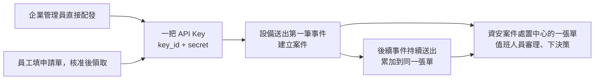

# 設備告警接入（API Key 串接）

WAF、防火牆、EDR、弱點掃描器、維運腳本都會產生告警。過去這些告警靠 email 或即時通訊轉給值班人員，
沒有編號、沒有時限、也沒有人知道同一個攻擊來源今天已經被通報過幾次。
這一節教你用一把 API Key，讓設備在偵測到事件時直接在平台建立一張「資安案件」，
後續同一群事件會累加到同一張單，值班人員在「資安案件處置中心」審理並下決策。

整條路徑分成四段，各自一篇：

取得 API Key 有兩條路徑（[管理員直接配發](by_admin.md)或[透過表單中心申請](by_request.md)，擇一），
之後設備用同一支 API [建立案件](create_case.md)與[累加事件](aggregate_events.md)。

!!! note "閱讀順序建議"
    你是管理員、要替一台設備開通：先讀管理員配發，再讀建立案件與累加事件。
    你是資安人員、自己要接設備：先讀表單申請，再讀建立案件與累加事件。
    只想知道「為什麼第二筆告警沒有開新單」：直接讀累加事件。
    四篇以同一個虛構情境貫穿：示範企業 DemoSOC 的 WAF-01 攔到來源 `203.0.113.42`
    對 `www.demo.internal` 的 SQL injection。

## 先認識幾個名詞

| 名詞 | 意思 |
|---|---|
| `key_id` ／ `secret` | 一把 API Key 的兩半。`key_id` 是公開識別碼（`ak_` 開頭），可以寫在設定檔與文件裡；`secret` 是簽章用的金鑰，只在建立或領取當下顯示一次，之後平台自己也查不到明文 |
| 授權範圍 | 這把 Key 能建哪些表單。管理員配發時用「表單分類」或「個別表單」勾選；申請單核發的 Key 則固定綁申請時勾的表單 |
| HMAC 簽章 | 設備每次呼叫都用 secret 對「時間戳＋請求內容」算一個簽章放在 header，平台重算一次比對。不需要 session、不需要登入 |
| `form_code` | 表單的代號，例如 `SEC_INCIDENT_RESPONSE`。建案時用它指定要建哪一種案件 |
| 案件編號 | 同一張案件有兩個編號：處置中心顯示流程執行編號（如 `PROC-20260926-0002`），表單中心顯示表單序號（如 `Form-260900021`）。跟同事溝通時要說清楚是哪一個 |
| 共同軸線 | 六個所有資安表單都有的欄位：`severity_id`、`actor_ip`、`target_host`、`source_system`、`finding_rule_id`、`occurred_at`。併案判斷、風險分數、處置中心清單都讀這六個 |
| 分組鍵 | 平台用來判斷「這筆事件跟哪張既有案件是同一群」的值。預設由 `actor_ip` 與 `finding_rule_id` 組成；送件端也可以自己指定 `case_group_key` |

## 文件裡的示範環境

| 項目 | 示範值 |
|---|---|
| 平台網址 | `http://192.168.0.112:8000/beakplatform`（換成你自己的；網址一定要帶埠號與 `/beakplatform`） |
| 設備 | WAF-01，IP `192.168.0.111` |
| 企業 | 示範企業 DemoSOC，網域 `demo-soc.example` |
| 企業管理員 | `admin-admin.ops@demo-soc.example` |
| 資安人員 | `linda.hu@demo-soc.example`（角色「資安人員」`SECURITY_STAFF`） |
| 攻擊來源 | `203.0.113.42`（保留給文件用的測試網段，不是真實位址） |
| 被攻擊主機 | `www.demo.internal` |
| 資安表單 | `SEC_INCIDENT_RESPONSE`「資安事件處置」（示範企業出廠另有 SOC 團隊版與小企業單人版，欄位完全相同） |

示範企業由平台安裝時的 `INSTALL_DEMO=1` 建立；沒有示範企業的環境，把上表換成自己企業的帳號與表單即可，步驟不變。

案件建立之後在流程裡怎麼走、簽核節點與防禦決策節點怎麼設，見[資安事件處置流程](../soc_planning/workflow_variants.md)；
Key 的管理畫面見 [API Key 管理](../api_keys.md)，案件審理畫面見[資安案件處置中心](../security_cases.md)。
