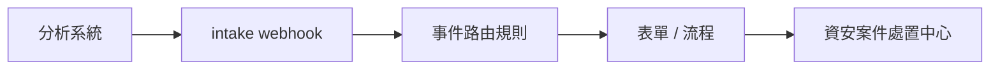

# 事件接收金鑰

讓企業自己的分析系統（ELK / SIEM / 自建腳本）把「需要列案」的事件送進平台，自動建立資安案件並啟動處置流程。



!!! abstract "作業：建立事件接收金鑰"
    **MENU**：安全中心 ／ API Key 管理

    1. 按「新增 API Key」
    2. 勾選 od_intake 範圍，填入允許的來源系統名稱
    3. 複製畫面顯示的 secret（只顯示這一次）

!!! abstract "作業：用範例程式送出第一筆事件"
    **執行位置**：企業自己的分析主機（命令列）

    這支程式在專案的 `scripts/examples/` 目錄下，只用 Python 標準函式庫、不需要安裝任何套件，可直接複製到分析主機使用。

    1. 在分析主機設定 `BP_BASE_URL`、`BP_API_KEY_ID`、`BP_API_KEY_SECRET`
    2. 執行 `scripts/examples/od_intake_send_event.py`
    3. 回到處置中心確認案件

```bash
export BP_BASE_URL=https://platform.example.com/beakplatform
export BP_API_KEY_ID=ak_xxxxxxxx
export BP_API_KEY_SECRET='建立 API Key 時顯示的一次性 secret'

python3 scripts/examples/od_intake_send_event.py \
  --source-system elk \
  --event-class web_activity \
  --severity 4 \
  --title "SQLi attempt on /login" \
  --actor-ip 203.0.113.42 \
  --target-host app.example.com
```

送出前想先確認簽章與內容，加 `--dry-run`；要改用 curl 或其他語言實作，加 `--print-curl` 取得等價指令。

## 畫面上看不出來的規則

- `secret` 只顯示一次，而且是 base64 urlsafe 字串；做 HMAC 簽章前要先還原成 32 bytes。直接把 base64 字串當 HMAC key 會得到 `401 auth_failed`。
- 主機時鐘要做 NTP 同步；timestamp 超過平台時間正負 5 分鐘一律 `401 auth_failed`。
- `source_system` 必須在這把 API Key 的白名單內。
- `correlation_id` 是冪等鍵；同一個 id 重送會回 `duplicate:true`，不會重複開案。
- 同一攻擊在短時間內大量送入時，可能被聚合併入既有案件，不會每筆都開一張單。
- 只有固定欄位會進入表單：`correlation_id`、`source_system`、`event_class`、`occurred_at`、`severity_id`、`confidence`、`actor_ip`、`actor_asn`、`actor_country`、`actor_user_agent`、`actor_xff`、`target_host`、`target_url`、`target_service`、`finding_title`、`finding_summary`、`finding_rule_id`、`finding_rule_set`、`detector_hint_action`、`detector_hint_ttl_sec`。整包原始事件不會進表單。
- 舊的「開放防禦 ／ 事件接收金鑰」頁已改為唯讀；金鑰統一在「安全中心 ／ API Key 管理」建立與撤銷。

## 範例程式退出碼

| 退出碼 | 意義 | 呼叫端該做什麼 |
|---:|---|---|
| 0 | 成功，含 `duplicate:true` | 不重試 |
| 1 | 參數或本地設定錯誤 | 修正參數、環境變數或事件 JSON，不重試 |
| 3 | `401` 認證失敗 | 檢查 secret 解碼、NTP、key 狀態、來源 IP，不重試 |
| 4 | `403` 授權失敗 | 補 scope 或調整 `source_system` 白名單，不重試 |
| 5 | `400` 事件內容不合格 | 依錯誤欄位修正，不重試 |
| 6 | `422` 平台端設定未完成 | 通知平台管理員補路由或發行表單 |
| 7 | `429` 限流 | 退避後重試 |
| 8 | `5xx` 平台內部錯誤 | 退避後重試，並通知平台管理員 |
| 9 | 連線失敗、逾時、DNS 解析失敗 | 退避後重試 |

## 常見錯誤

| HTTP | 回應 | 意義 | 處理方式 |
|---:|---|---|---|
| 400 | `invalid_json` | body 不是合法 JSON | 修程式，不要重試 |
| 400 | `validation_error` | 欄位不合 schema | 依 `details` 逐欄修正，不要重試 |
| 401 | `auth_failed` | 簽章錯、時間戳過期、key 不存在或停用、來源 IP 不在白名單 | 檢查 secret 是否先 base64 解碼、主機時鐘、key 狀態，不要重試 |
| 403 | `scope_denied` | key 沒有 `od_intake` scope | 到 API Key 管理補 scope，不要重試 |
| 403 | `source_not_allowed` | `source_system` 不在白名單 | 改用允許名稱，或把名稱加進 key，不要重試 |
| 422 | `no_mapping` | 沒有命中的事件路由規則 | 到事件路由設定新增規則 |
| 422 | `form_not_published` | 路由指到的表單沒有已發行版本 | 請表單設計者發行 |
| 429 | `請求頻率過高，請稍後再試` | 限流 | 退避後重試 |
| 500 | 平台錯誤 | 平台端問題 | 退避後重試，並通知平台管理員 |

## 另一條路：原生格式

企業原生格式若不想先轉成 OCSF，可改送 `POST /api/open_defense/intake/native?profile=<代碼>`。使用前需先在「開放防禦 ／ 事件路由設定」建立 payload profile；本頁範例只示範 OCSF intake。
