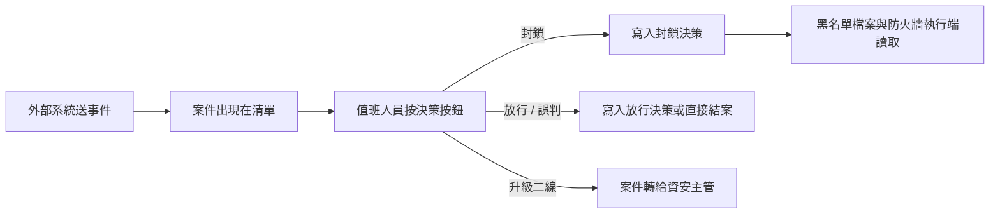

# 資安案件處置中心

值班人員審理資安案件的單一畫面：左側是案件清單，右側是案件內容與決策按鈕。
按下決策按鈕就等於完成該案件目前這一關的簽核，不必再到表單中心處理。

!!! abstract "作業：審理一件資安案件"
    **MENU**：開放防禦 ／ 資安案件處置中心

    1. 點左側案件
    2. 在「處置意見」填寫判斷依據
    3. 按決策按鈕（例如「封鎖攻擊來源」或「放行（可接受風險）」）
    4. 在確認視窗按「確定」

## 畫面上看不出來的規則

**決策按鈕不是固定的。** 按鈕的名稱、數量與「至少要寫幾個字的意見」都來自
這件案件所走的流程裡簽核節點的設定。同一個企業裡不同流程的案件，按鈕可以完全不同；
流程設計師改了設定並重新發行之後，新進的案件就會換成新的按鈕。

**「僅我可簽核」預設是開著的。** 清單只列輪到你這一關簽核的案件，
所以會出現「上方統計有數字、清單卻是空的」——這不是故障，通常是你的帳號沒有被指派到
該流程簽核節點所要求的角色。把「僅我可簽核」按掉可以看到全部案件，
但沒有角色仍然不能按決策按鈕。要讓案件預設就出現，請企業管理員在
「角色管控 ／ 權限管理中心」把你的帳號配上該角色（預設流程用的是「資安人員」）。

**封鎖多久、送到哪些執行端，由流程決定，畫面上不會問你。** 預設的 SOC 團隊版流程
封鎖一小時、寫到 nftables 與 EDL 兩個執行點；小企業單人版封鎖七天。
要改這些值是改流程，不是改這個畫面。

**決策寫入後狀態停在「待處理」是正常的**——只要沒有執行端回報「已套用」，
狀態就不會前進。只靠黑名單檔案（EDL）接防火牆的部署沒有回報機制，
所有決策會一直是「待處理」，但黑名單檔案照樣每分鐘依「尚未到期」的決策重算，
封鎖是生效的。判斷有沒有生效看黑名單檔案的內容，不要看這個狀態。

**放行也會留下決策紀錄。** 之後同一個來源再進案時，案件右側「關聯防禦決策」
會看到前一次的判斷與意見，這是留給下一個值班人員的脈絡。

**同一件案件有兩個編號。** 這個畫面顯示的是流程執行編號（例如 `OD-20260901-0001`），
表單中心顯示的是表單序號（例如 `OD-20260901-46D0EF70`）。兩邊互相查不到對方的號碼，
跟其他人溝通時說清楚是哪一個。

**時間一律依你的個人時區顯示**，與伺服器所在地無關；「今日新案」「今日封鎖」
的「今日」也是依你的時區切日。

## 統計帶的意思

| 欄位 | 計算方式 |
|---|---|
| 進行中案件 | 流程仍在執行的資安案件數，不分是否輪到你 |
| 待簽核 | 進行中案件裡，停在簽核節點等人處理的數量 |
| SLA 逾時 | 待簽核且已超過該嚴重度預設處理時限的數量 |
| 今日封鎖 | 今天寫入的封鎖決策數（含自動封鎖） |
| 今日新案 | 今天送進來的案件數 |

按過決策後統計帶不會立刻重算，按「重新整理」即可。

## 常見問題

**開頁面得到 403。** 兩種原因：企業對「開放防禦」模組的合約不在效期內
（合約日期依企業時區判斷，剛建立、起日是今天的合約要到企業時區的當天才生效），
或你的帳號沒有這個選單所要求的角色。前者找平台管理員，後者找企業管理員。

**事件送成功了，清單裡卻沒有案件。** 見[卡住時對照這張表](../09_from_zero/04_when_it_fails.md)：
最常見的是被聚合進既有案件，或路由規則把它送到另一張表單。

**按了決策沒有反應。** 處置意見字數不足時會直接被擋下並顯示需要的最少字數；
若確認視窗出現後畫面沒有變化，按「重新整理」看案件是否已離開清單——
決策送出後案件會在幾秒內完成流程，從「進行中」移到「已結案」。
