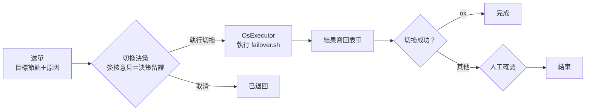

# WAF 節點熱備切換

!!! abstract "作業：申請 WAF 節點切換"
    **MENU**：表單中心 ／ 新填表單 ／ node展覽館 ／ WAF 節點熱備切換申請

    1. 選「目標節點」、寫「故障現象／切換原因」，按 [送出表單]
    2. 在「待簽核」按這張單的 [簽核]，選 [執行切換] 或 [取消]，寫簽核意見，按 [送出簽核]
    3. 約半分鐘後回到這張單看「執行結果」與「failover.sh 輸出」

這張申請單是 OsExecutor 節點的實務應用：把「誰決定切換、為什麼切換、切換結果如何」留在同一張單上，
真正動手的是管理機上的切換工具，人只做決策。

## 畫面上看不出來的規則

- **這張單只有系統預設企業看得到。** 切換工具跑在平台主機上，屬於系統級節點（OsExecutor），
  一般企業的表單中心不會出現它。
- **[取消] 就是終態。** 取消不接任何後續步驟，表單中心顯示「已退回」，不會執行任何東西。
- **簽核意見是必填的。** 這就是人員決策記錄；事後在表單中心開這張單，簽核歷程會列出誰、何時、
  為什麼決定切換。
- **「執行結果」看的是工具的判定，不等於服務一定壞了。** `ok` 表示切換完成且事後驗證通過；
  `exception` 表示工具回報非零（最常見是新節點的 cloudflared 在時限內沒就緒，服務其實已經正常）；
  `timeout` 表示工具本身超過時限被中止。`exception` 與 `timeout` 都會停在「人工確認」關卡，
  請先看「failover.sh 輸出」與對外網址實況，再決定要不要照輸出裡的回退指令處理，
  確認完按 [已人工處置] 結束流程。
- **切換期間對外服務會中斷約 15～20 秒**，這是舊節點釋放到新節點向 Cloudflare 註冊完成的時間。
  兩台都活著時工具會先把封鎖清單複製到新節點；舊節點已經失聯時複製不到，新節點從空清單開始。
- **同一時間只送一張。** 兩張單同時執行會互相搶服務 IP，工具會擋下第二張（回報 exception），
  但仍會多一段中斷。

## 想改決策人

出廠範本的決策關卡是「送單者自己決策」，適合一個人值班的環境。要改成由特定角色（例如資安主管）
決策，請平台管理員重新佈建範本並指定 `--approver-role <角色代碼>`，或在流程設計器打開
「WAF 節點熱備切換（OsExecutor 實務）」、把「切換決策」節點的簽核者改成角色後重新發行。

## 常見問題

| 症狀 | 處理 |
|---|---|
| 表單中心找不到這張單 | 你不在系統預設企業，或這個企業沒有佈建範本。請平台管理員佈建 |
| 送出後一直停在「尚未到簽核關卡」 | 流程引擎尚未撿起，等幾秒重新整理；超過一分鐘請平台管理員看流程管理頁 |
| 執行結果是 `exception`，但網站正常 | 依上面的規則先確認實況；多半是就緒判定逾時，按 [已人工處置] 結束即可 |
| 執行結果是 `exception`，網站也壞了 | 「failover.sh 輸出」最後幾行有手動回退指令，交給平台管理員在管理機執行 |
| 想看兩台節點現在誰在服務 | 這張單看不到，請平台管理員在管理機執行切換工具的 `status` |
