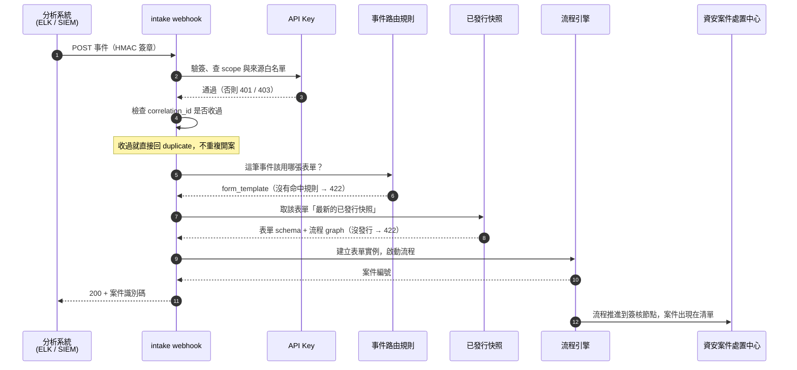

# 這條鏈路怎麼運作

外部系統送一筆事件進來，平台自動開一張表單、跑一段流程、讓人簽核——中間沒有任何人工介入。
這一章帶你把整條鏈路從零建起來。

新企業剛開通時，這條鏈路是**空的**：沒有分類、沒有表單、沒有流程、沒有路由規則、沒有金鑰。
事件送進來會被拒絕，儀表板與處置中心永遠是 0。本章要建的就是這些前置。

## 一筆事件進來之後發生什麼

## 為什麼需要這麼多前置

每一項都對應上圖的一個環節，缺任何一項事件都進不來：

| 要建的東西 | 對應環節 | 缺了會怎樣 |
|---|---|---|
| 資安分類 | 表單的歸屬 | 案件建得起來，但**不會出現在資安案件處置中心** |
| 表單範本 | 事件內容的容器 | 沒有東西可以承接事件欄位 |
| 流程設計 | 收到案件後由誰處理 | 沒有簽核節點，案件開了就沒有下文 |
| 配對並發行 | 上圖的「已發行快照」 | 422，事件被拒收 |
| 事件路由規則 | 上圖的「這筆事件該用哪張表單」 | 422，事件被拒收 |
| API Key | 上圖的驗簽與來源白名單 | 401 或 403 |

## 三個畫面上看不出來的規則

這三件事沒有任何 UI 會提示你，卻是最常卡住的地方：

!!! warning "一、資安案件是靠分類的識別碼認出來的"
    處置中心只認**識別碼以 `CAT_SECURITY_` 開頭**的分類，不是看分類名稱。
    自己取名叫「資安案件」但識別碼是隨機值的分類，案件建得起來、
    在表單中心看得到，就是不會出現在處置中心。

    用本章的建置腳本就不會踩到；手動建立時，
    直接沿用企業既有的資安分類是最安全的做法。

!!! warning "二、事件走哪個流程，是由「表單」決定的，不是由規則決定的"
    路由規則只決定用哪張**表單**；流程則是「該表單目前最新的已發行版本」綁的那一個。

    所以一張表單同時只會有一個生效流程。要讓不同案件走不同流程，
    必須準備**不同的表單**，再用路由規則把事件分派過去。

!!! warning "三、改了表單或流程，不重新發行等於沒改"
    事件進來時讀的是「已發行快照」，不是設計中的版本。
    改完設計一定要回到配對管理重新發行，否則行為完全不變。

## 兩條建置路徑

**用畫面一步步建**——第一次建議這樣做。照著[逐步建置](02_build_it.md)完成六個步驟，
過程中你會看到每個設定實際落在哪個畫面，日後要調整才知道去哪裡改。

**用腳本一次建好**——趕時間或要重建時用。專案內附一支建置腳本，
一道指令把六件事全部建起來，見[送出第一筆事件](03_send_and_verify.md)的
「一道指令建好整條鏈路」。適合示範環境、重建測試資料，
或是先把鏈路跑通再回頭調整內容。
