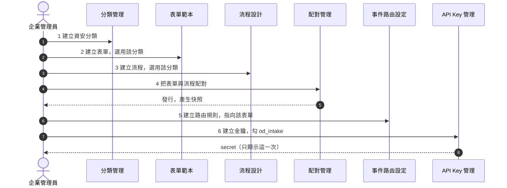

# 逐步建置

六個步驟，順序不能對調——後面的步驟要選前面步驟建出來的東西。

## 步驟一：資安分類

!!! abstract "作業：建立資安分類"
    **MENU**：表單流程 ／ 分類管理

    1. 按「+ 新增父分類」
    2. 名稱填「資安案件」
    3. 儲存

!!! danger "企業已經有資安分類時，直接沿用，不要另建一個"
    處置中心認的是分類的**識別碼前綴**（`CAT_SECURITY_`），不是名稱。
    透過畫面新建的分類拿到的是隨機識別碼，
    用它建出來的案件不會出現在資安案件處置中心。

    也就是說：**這一步只有兩種正確做法**——沿用企業既有的資安分類，
    或改用[建置腳本](03_send_and_verify.md)（腳本會產生正確前綴的識別碼）。

## 步驟二：表單範本

!!! abstract "作業：建立表單範本"
    **MENU**：表單流程 ／ 表單範本

    1. 按「+ 新增表單模板」
    2. 分類選步驟一的資安分類
    3. 進設計器，拉出要承接事件內容的欄位
    4. 儲存

事件送進來時，平台只會寫入**固定的一組欄位**，欄位識別碼必須完全一致才對得上。
必填的六個是共同軸線，其餘可依需要取捨：

| 欄位識別碼 | 內容 |
|---|---|
| `finding_title` | 事件標題（也會成為案件主旨） |
| `severity_id` | 嚴重度 0-6 |
| `actor_ip` | 來源 IP |
| `target_host` | 目標主機 |
| `source_system` | 偵測來源系統 |
| `occurred_at` | 事件發生時間 |

其他可用的欄位識別碼：`finding_summary`、`finding_rule_id`、`finding_rule_set`、
`event_class`、`correlation_id`、`confidence`、`actor_asn`、`actor_country`、
`actor_user_agent`、`actor_xff`、`target_url`、`target_service`、
`detector_hint_action`、`detector_hint_ttl_sec`。

平台另外會自動補上情報欄位：`risk_score`、`recommended_action`、`od_event_count`、
`od_repeat_count`、`od_history_block_count`、`intel_summary`、`od_first_seen`、`od_last_seen`。

!!! note "欄位可以少，不可以拼錯"
    表單裡沒有的欄位，事件內容就不會顯示，但不會報錯。
    識別碼拼錯的症狀一樣是「那一格永遠空白」——沒有任何錯誤訊息，很難查。

## 步驟三：流程設計

!!! abstract "作業：建立處置流程"
    **MENU**：表單流程 ／ 流程設計

    1. 按「+ 新增工作流」
    2. 分類選步驟一的資安分類
    3. 進設計器，拉出「開始 → 簽核 → 結束」三個節點並連起來
    4. 簽核節點的處理人指定為資安人員角色
    5. 儲存

第一次建議就從最小流程開始：一個簽核節點就足以驗證整條鏈路通不通。
分流、自動封鎖、逾時催辦這些等鏈路跑通了再加。

!!! warning "簽核節點沒有指定處理人，案件會卡在那裡且沒有人收到通知"
    指定的角色必須真的有成員，否則案件開得起來、清單也看得到，就是沒有人能簽。

## 步驟四：配對並發行

!!! abstract "作業：配對並發行"
    **MENU**：表單流程 ／ 配對管理

    1. 按「+ 新增配對」，表單選步驟二、流程選步驟三
    2. 儲存後在該配對上按「新發行」
    3. 確認狀態變成「已發行」

!!! danger "這一步是最常被漏掉的"
    事件進來時讀的是**已發行快照**，不是設計中的版本。沒有發行，
    事件會被退回 `422 form_not_published`。

    日後只要改了表單或流程，都必須回到這裡重新發行一次，改動才會生效。

## 步驟五：事件路由規則

!!! abstract "作業：建立路由規則"
    **MENU**：開放防禦 ／ 事件路由設定

    1. 停在「路由規則」分頁
    2. 新增一條規則，表單選步驟二那一張
    3. 條件先留空（代表全部事件都套用），優先序填 0
    4. 啟用並儲存

規則是**優先序由大到小逐條比對、命中即停**。條件全空的那條就是最後的接住者，
所以它的優先序要放最小。

先用一條全空的規則把鏈路跑通，確認收得到案件之後，再往上加優先序較高的分流規則。

!!! note "改了規則想確認會不會命中，不必真的送事件"
    同一頁有「執行試算」：貼一段事件 JSON，直接看它會命中哪一條規則。

## 步驟六：事件接收金鑰

!!! abstract "作業：建立 API Key"
    **MENU**：系統安全 ／ API Key 管理

    1. 按「建立 API Key」
    2. 授權範圍勾選 `od_intake`
    3. 填入允許的來源系統名稱（例如 `elk`），只有名單內的名稱送得進來
    4. 建立後立刻複製畫面上的 secret

!!! danger "secret 只顯示這一次"
    關掉視窗就再也拿不回來，只能撤銷後重建。
    請當場存進你的密碼保管工具或設定管理系統。

金鑰的「來源系統名稱」與送事件時帶的 `source_system` 必須完全一致，
不一致會被退回 `403 source_not_allowed`。

---

六步做完，往下一頁[送出第一筆事件](03_send_and_verify.md)驗證整條鏈路。
